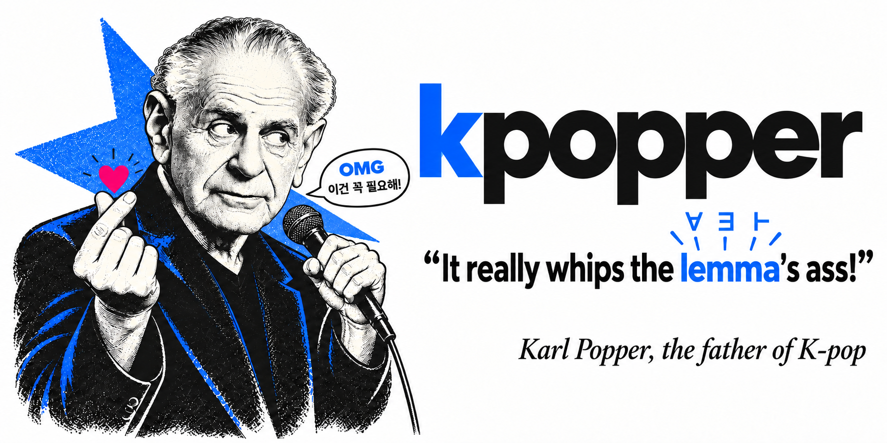
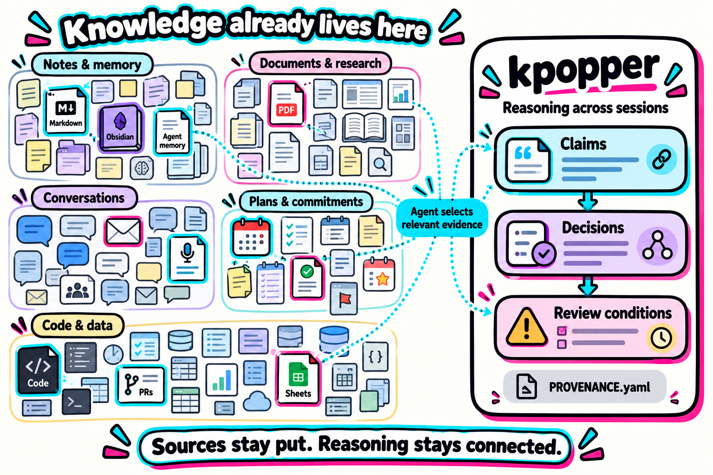
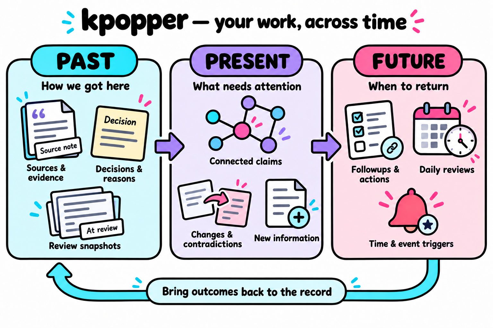
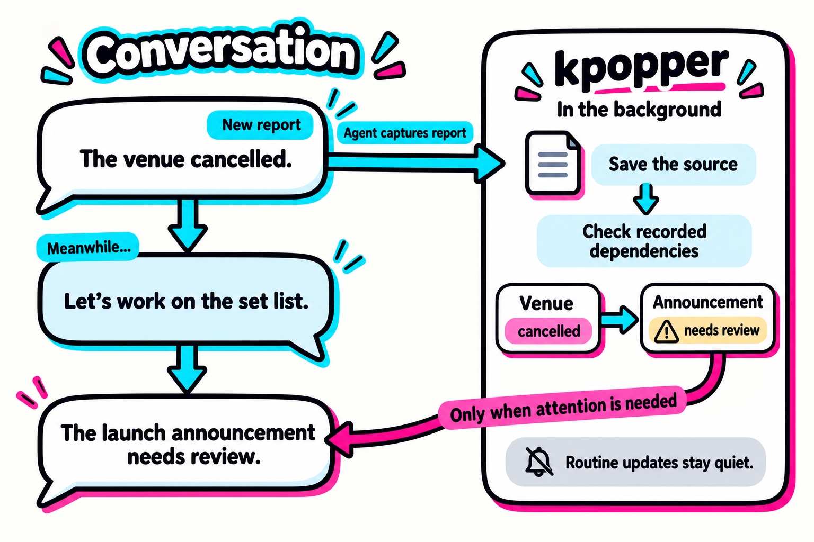
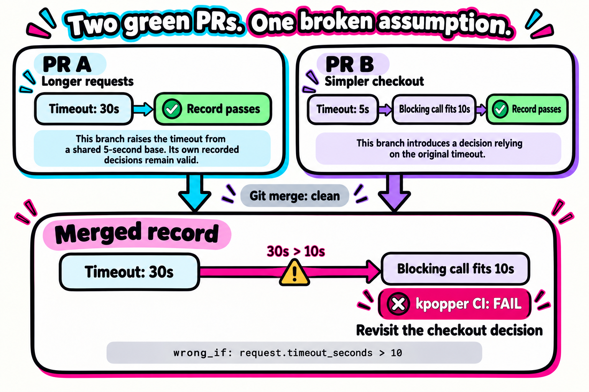
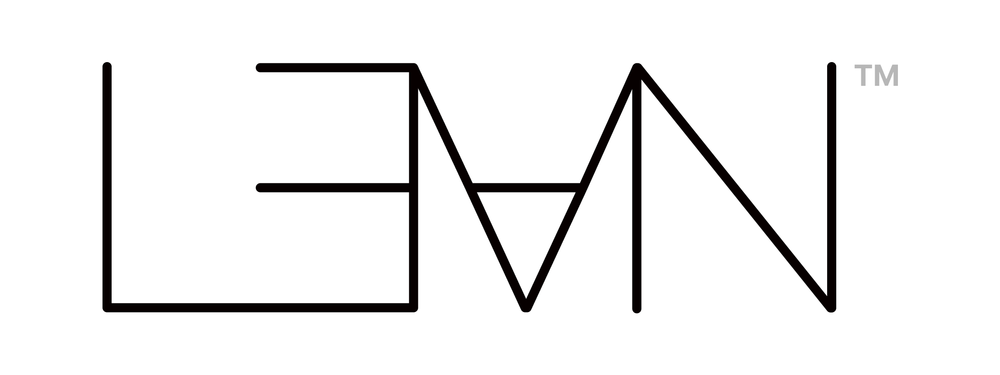
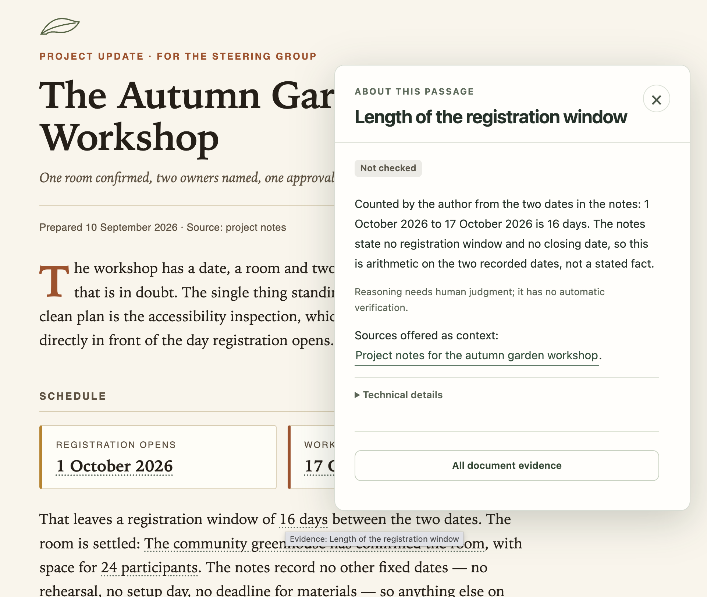

<p align="center">
  
</p>

# kpopper

**A <ins>third brain</ins>\* for agents, built on evidence and falsifiability.**

kpopper helps agents carry a project's reasoning across sessions. It records
what is known, where the evidence comes from, why decisions were made, and what would call
them into question. When recorded facts change, it traces the affected decisions and flags
conditions that no longer hold.

Use it for a software project in Codex or Claude Code, financial analysis in Claude Cowork,
or research an agent develops from an Obsidian vault. Product launches, weekly plans and
mortgage applications need the same continuity: a new session can pick up the goal, constraints
and earlier decisions, along with the reasons behind them. kpopper is available as an agent
plugin and through the command line.

It can also create an ordinary HTML report with its evidence built in. Read the document,
open an explanation beside a marked passage, and follow it back to the source—all in one
file you can keep or share.

<sub>*<ins>Third brain</ins>: a layer over a second brain's stored knowledge—how claims are
grounded, why decisions were made, and what would call them into question.</sub>

[Get started](#get-started) · [See an example](#ready-to-launch-had-a-condition) ·
[The third brain](#a-third-brain-for-work-in-progress) ·
[See a document](#share-a-document-with-its-reasons) ·
[Past, present, future](#past-present-future) · [How it works](#how-it-works) ·
[Coding & CI](#coding-check-the-reasoning-behind-a-merge) ·
[Why Lean](#the-lean-proof-assistant-from-fermat-to-agents) · [Command reference](docs/reference.md)

## A third brain for work in progress

The excitement around building an organizational **second brain** is well deserved. A team's
knowledge already lives across notes and agent memory, documents and research, conversations,
plans and commitments, code and data. An agent can connect the relevant pieces into a shared,
evolving picture of the work.

Andrej Karpathy's [LLM Wiki](https://gist.github.com/karpathy/442a6bf555914893e9891c11519de94f)
describes how an agent can maintain that picture as a persistent wiki: synthesizing sources,
surfacing contradictions and revisiting stale claims.

As that knowledge becomes a basis for action, its reasoning deserves an explicit record: why
a conclusion was accepted, which sources and assumptions support it, and what would call for
reconsideration.

kpopper gives that record structure. It connects conclusions to their grounds, preserves what
they were reviewed against, and checks declared conditions as recorded facts change. We call
this reasoning and review layer a **third brain**; the agent supplies the interpretation.

**Keep the knowledge system already in use.** A folder of Markdown files, an Obsidian vault,
a project wiki, or memory files used by Claude or Codex can stay where they are. The agent
reads relevant material through its available tools and records the claims it relies on,
with links back to those sources, in `GROUNDING.yaml`. There is no need to migrate the
existing notes or replace the agent's memory system.

<p align="center">
  <a href="assets/third-brain-sources.png">
    
  </a>
</p>

| Role | Question it helps answer |
|---|---|
| You | What matters, and what should we do? |
| Your second brain: notes, documents and saved knowledge | What have we learned and kept that can help? |
| kpopper, working with your agent | What supports this decision, what has changed, and what needs review? |

That distinction is useful when a perfectly retrievable note contains a decision whose
premises have expired. Finding the note is one job; noticing that its recommendation needs
another look is another.

There is a loose parallel with human memory: remembering can involve updating what was
previously learned. In a laboratory study of episodic memory, reminders led participants to
incorrectly include newly learned items when recalling an earlier list.
[Hupbach et al., 2007](https://pubmed.ncbi.nlm.nih.gov/17202429/) provide one concrete example.
This motivates an analogy, not a claim that kpopper models the brain or that neuroscience
validates the product.

Operationally, the analogy is straightforward: retrieve the relevant context, compare it
with new information, draw attention to a consequential mismatch, and review the conclusion.
In kpopper those steps are explicit records and checks. The person or agent supplies the
interpretation; the software follows the declared connections. You retain the decision.

## Start with the work

A project is **work around a goal**. Its materials may span documents, conversations,
calendars, task systems, files and earlier sessions. In software, they also include code,
commits and pull requests. One project can cross several tools; one source can serve several
projects.

kpopper keeps a *picture of the project's reasoning* in `GROUNDING.yaml`: a readable record
that connects claims to sources and decisions to their premises. Your documents and tools
keep their own content. The record makes the reasoning between them available to the next
person or agent working on the goal.

| When you return to… | The useful thing to recover |
|---|---|
| A software project in Codex or Claude Code | Why a design was chosen, the code or test supporting it, and the changes that could invalidate it. |
| Financial analysis in Claude Cowork | Which sources support a forecast's assumptions, when they were checked, and which decisions depend on them. |
| A product launch | Which commitments support the launch plan, and which assumptions changed. |
| Your weekly plan | Why a task has priority, the deadline behind it, and the availability it assumes. |
| Research with an agent and an Obsidian vault | The evidence for an explanation, competing accounts, and the observation that would challenge it. |
| A mortgage application | Which lender offer and documents support the plan, when the offer expires, and which conditions still need confirmation. |

The same five questions orient the work:

1. **What are we trying to achieve?** Goals, outcomes and priorities.
2. **What is known now?** Facts, commitments, deadlines and constraints.
3. **What was decided, and why?** Decisions, assumptions and alternatives.
4. **Where is the evidence?** Sources and enough detail to find the relevant passage again.
5. **What needs another look?** Open questions, conflicting reports and changed premises.

These questions guide what to record. Learn from findings during ordinary work, or ask
for an [initial map or deeper investigation](docs/first-use.md) of selected materials.
The agent uses the sources available in your context; access to a file alone does not
make it part of the project.

## Past, present, future

Keep the work connected across time: the sources and decisions behind it, what needs
attention now, and the checks or actions to return to later.

<p align="center">
  <a href="assets/work-across-time.png">
    
  </a>
</p>

The Future panel shows deferred work tracked by followups. The return arrow is the agent's
step of recording useful outcomes as evidence; marking a followup complete is a separate
operation and does not automatically rewrite the knowledge record.

## “Ready to launch” had a condition

Karl Popper is releasing his debut K-pop single.
An agent has prepared Friday's launch-party announcement. The venue has confirmed the
booking. The decision: **the announcement is ready, provided the booking stays confirmed.**

The next day, the venue cancels. A later session picks up the launch plan. The announcement
copy is unchanged; the reason it was ready to publish has disappeared.

kpopper preserves that connection:

```yaml
sources:
  booking:
    name: "Venue confirmation"
    quoted: "Your booking for Friday is confirmed."
    read: "2026-09-09"

known:
  venue.status: {v: confirmed, from: booking, as_of: "2026-09-09"}

judgments:
  launch.announcement:
    rests_on: [venue.status]
    verdict: "Friday's announcement is ready, provided the venue booking stays confirmed."
    because: "The announcement names the date and venue confirmed in the booking email."
    wrong_if: 'venue.status != "confirmed"'
    seen: {venue.status: confirmed}
```

After the session records the cancellation, the next check reports:

```text
launch.announcement: wrong_if holds (venue.status != "confirmed") - broken by its own condition
```

The next agent sees **which decision needs review, which premise changed, and what the
earlier decision was based on**. It knows to revisit the announcement before reusing
“ready to launch.”

[Try the example](docs/reference.md#try-it-from-the-command-line) ·
[See a PR and CI case](#coding-check-the-reasoning-behind-a-merge)

## Get started

Project work in **Claude Cowork and ChatGPT Work** is a natural fit for this method:
tasks share dependencies, decisions constrain later choices, and commitments unfold over
time. kpopper is designed to keep the reasoning connecting them available across sessions,
with sources, review snapshots and explicit conditions for reconsideration.

Install it in the environment where that work happens. The package includes the
[method](skills/kpopper/SKILL.md) with one skill per occasion beside it, record tools and host-specific hooks; setup depends on
the environment.

### Claude Cowork

Open **Customize → Plugins → Add marketplace**, enter `ilanbm/kpopper`, then install
**kpopper** from that marketplace. This uses the same Claude plugin package.
[Cowork's installation guide](https://claude.com/docs/cowork/guide/plugins) describes the
repository import and component controls.

### ChatGPT Work

**Workspace import is supported by the platform; kpopper's full Work runtime is not yet
validated.** A workspace administrator can open **Admin → Plugins → Add → Import marketplace**,
enter `https://github.com/ilanbm/kpopper` as the source and leave **Path** empty. Once the
plugin is available to the workspace, install it from **Plugins** and start a new Work
conversation. The repository uses a
[supported marketplace format](https://learn.chatgpt.com/docs/enterprise/plugin-management).

The scripts, Python dependencies and persistent project record must also be accessible in
Work's execution environment. Installing a plugin through the web does not deploy local
hook scripts. See [Work setup and current limits](docs/chatgpt-work.md) before relying on
automatic opening or background delivery.

### Claude Code

Run in a terminal with Claude Code installed:

```sh
claude plugin marketplace add ilanbm/kpopper
claude plugin install kpopper@kpopper --scope user
```

Or run these inside Claude Code:

```text
/plugin marketplace add ilanbm/kpopper
/plugin install kpopper@kpopper
```

Both install from this repository's marketplace. See
[Claude's plugin installation guide](https://code.claude.com/docs/en/discover-plugins).

### Codex

Run in a terminal on the machine where Codex runs:

```sh
codex plugin marketplace add ilanbm/kpopper
codex plugin add kpopper@kpopper
```

Start a new Codex task after installation. Review the plugin's hook definitions when
prompted; hook trust is separate from installation. The repository includes a native Codex
manifest and host-specific hooks. See [Codex setup and behavior](adapters/codex/README.md)
and [OpenAI's plugin guide](https://learn.chatgpt.com/docs/plugins).

### Other agents

Clone the repository to a location where it can remain available:

```sh
git clone https://github.com/ilanbm/kpopper.git
```

Then follow the adapter for the host:

| Agent | Install path |
|---|---|
| [Cursor](adapters/cursor/README.md#install) | Install the rule and hook wrappers in the project's `.cursor` directory. |
| [Gemini CLI](adapters/gemini/README.md#install) | Run `gemini extensions link ./kpopper/adapters/gemini` from the directory where the clone was created. |
| [Windsurf](adapters/windsurf/README.md#install) | Install the Cascade rule and optional write hook. |
| [GitHub Copilot](adapters/copilot/README.md#install) | Use the instructions and configuration for VS Code or the cloud agent. |

Keep existing host configuration when adding an adapter. Each guide describes its paths
and limitations; automatic opening and stop behavior differ by host. See the
[capability matrix](adapters/README.md#capability-matrix) for the comparison.

### Start working

The local scripts need **Python 3.9+** and the [package dependencies](pyproject.toml)
available in the environment used by the host's `python3`. A Python package installation
includes them. For a plugin-only installation, install them in that environment:

```sh
python3 -m pip install 'PyYAML>=5.1' 'html5lib>=1.1,<2' 'tinycss2>=1.2,<2' tzdata
```

Lean is optional; the ordinary reader and page work without it. In a new agent session
with the project open, start with:

> Use kpopper to keep this project's reasoning across sessions. If a record exists, open it
> and show what needs review. As we work, preserve the useful findings, sources, decisions
> and conditions that would make those decisions worth reconsidering.

Installation creates no record. Start with the first finding worth carrying into another
session. A one-off question may need no record at all.

For a standalone CLI installation and a walkthrough of the launch-party example, see
[Try it from the command line](docs/reference.md#try-it-from-the-command-line).

## Keep the conversation moving

New information often arrives halfway through another task. kpopper can retain an explicit
report and process a supported update in a separate worker. Routine results stay quiet;
important unresolved findings are available for delivery back to the conversation.

<p align="center">
  <a href="assets/conversation-flow-v2.png">
    
  </a>
</p>

Today, that worker can update an **existing stored scalar value in a single record file**,
using a supplied source quote, target, value and report date. It does not infer what an
ambiguous message refers to. Unresolved identity or meaning remains a question. Delivery
after an answer requires the host capabilities described in the
[background capture guide](skills/kpopper/INGESTION.md) and
[native delivery guide](skills/kpopper/DELIVERY.md).

**Captured, applied and checked are different states.** If the current answer depends on
an update, inspect its outcome before relying on it. Background work is useful precisely
where the conversation can safely continue without that result.

## How it works

### Return to work when it is ready

Followups connect deferred work to the knowledge behind it. A check can become ready on a
date, after a recorded value changes, when a threshold is crossed, or after another task
finishes. Missing evidence remains an open question. Keep the task in your existing system
or directory; kpopper has a private local fallback when you need one.

**A short daily review is strongly recommended for ongoing work.** It checks what is due,
what changed and which relevant piece of knowledge needs another look, with a small work
budget and notifications for meaningful results. During active Claude Code and Codex
sessions, event hooks also surface changed readiness. The daily schedule catches elapsed
dates and missed events.

**Catch branch conflicts while work is still in progress.** With local watch enabled,
changes to a worktree's graph are checked in the background against the selected main ref.
Only the changes authored on that branch are overlaid; neither graph is rewritten. New
contradictions return to the working session, and the daily review checks registered
worktrees as a fallback. Results name their exact versions; remote refs are not fetched
automatically.

External observations can also be shared immediately through one canonical record outside
the branches. Each needs a source, date and environment. Branch experiments remain local;
conflicting observations are retained for review. See [background watch and shared facts](skills/watch/references/compatibility.md).

Run **`/kpopper:watch`** in Claude Code, or **`$watch`** in Codex, to check and set
up local branch checks and the daily review. For live checks alone, ask watch to enable
only local compatibility. The command inspects existing schedules, creates or repairs one when
needed, and reads it back before confirming installation. Add `check` for inspection only,
or `resume` to enable a paused review. Existing schedule times are preserved unless you ask
to change them. The host performs scheduling within your authorization; a saved plan alone
is not an active automation. See [the setup command](skills/watch/SKILL.md).
Claims prevent duplicate work, and a check deferred until more evidence arrives stays open
with its history intact. Followup scans and outcomes never silently rewrite the knowledge
graph or mark its judgments reviewed. See the [followups guide](skills/kpopper/FOLLOWUPS.md)
for routing, supported conditions, daily setup and platform limits.

The scheduled host starts or resumes an agent session. That agent is instructed to claim
and perform up to three ready followups within the user's existing authorization, record
their outcomes, and surface decisions or blockers. There is no automatic dispatcher that
opens a separate session for every item. Work assigned to an external owner stays with it.

The review packet currently offers at most one flagged judgment as a graph-maintenance
candidate. The prompt also allows a relevant source refresh or open-question check, but
there is no general source-age scanner or sweep of every worktree graph. One review is
bound to the record selected at setup; that can be a worktree copy. Choose a durable record
and runtime for an ongoing schedule. See [record scope and retention](skills/kpopper/FOLLOWUPS.md#record-scope-and-retention).

### The knowledge record

The technical term is an **epistemic record**: a record of what is known and how it is
grounded. The main pieces are ordinary YAML:

| Piece | What it preserves |
|---|---|
| Source | The document, conversation, observation or other origin of a claim, with dates and locators. |
| Reading | A value or quotation taken from that source. |
| Derivation | The rule relating inputs to a result. The general reader stores rules and follows their references; it does not evaluate arbitrary formulas. |
| Judgment | A conclusion, its reasoning, declared dependencies and condition for reconsideration. |
| Review snapshot | What those dependencies held when the judgment was last reviewed: `seen`. |
| Open question | Something unresolved, retained without inventing an answer. |

**Change is compared with the last review.** When a recorded scalar differs from a judgment's
`seen` snapshot, the reader identifies the movement. A supported `wrong_if` comparison says
whether the change crosses the judgment's stated boundary. Movement can call for review
without refuting the conclusion; a movement inside its declared threshold can stay quiet.
`affects` traces the wider reach through declared judgments and rule references.

**The record does not observe the world on its own.** A changed document matters only after
someone or an authorized tool supplies a new reading. Optional measurement recipes can
re-read selected values when explicitly run. These are [reviewed commands](docs/reference.md#measurement),
not general source monitoring.

**History and the present belong together, with their dates intact.** An old conversation
can explain why a deadline was chosen; it does not establish that the deadline still holds.
A session's proposed action does not establish that anyone performed it. Reusing a
recommendation requires evidence for its conditions now.

**Competing claims can stay separate.** A conflicting write can become a hypothesis beside
the base record. Consolidation checks the proposed combination before an explicit fold;
it can also retain a refuted hypothesis as a negative finding. A signal never grants
permission to change a decision or act outside the record.

On return, `open` gives a bounded orientation and attention report; `pull` retrieves the
subject you need. The optional checked session mode below adds a complete, navigable view
within a token budget. In both cases, the aim is to spend the next session's context on the
work at hand.

## Coding: check the reasoning behind a merge

**Two branches can be sound on their own and undermine each other's decisions when merged.**
Git checks whether their text can be combined. kpopper adds a check on the recorded premises
and conditions behind the work.

Consider two pull requests in an example checkout service:

| Pull request | Change | Its record in isolation |
|---|---|---|
| PR A: support longer requests | Raise the request timeout from 5 to 30 seconds. | Passes. |
| PR B: simplify checkout | Use a blocking call because the current 5-second timeout fits a 10-second request budget. | Passes. |

<p align="center">
  <a href="assets/ci-merge.png">
    
  </a>
</p>

PR B records the reason for its choice:

```yaml
checkout.blocking_call:
  rests_on: [request.timeout_seconds]
  verdict: "A blocking call fits the checkout's 10-second request budget."
  wrong_if: "request.timeout_seconds > 10"
  seen: {request.timeout_seconds: 5}
```

Each branch's record passes separately. The YAML can merge without a text conflict. But
after PR A lands, PR B's proposed merge result has a timeout of 30. CI reports:

```text
checkout.blocking_call: wrong_if holds (request.timeout_seconds > 10) - broken by its own condition
```

The failure points to the checkout decision and the premise it used. That is a regression
in the recorded reasoning, even though the lines merged cleanly.

There are two ways to check the combination:

- **During work or before merging:** `kpopper consolidate --dry-run --from <branch-or-ref>` reads another
  branch's committed record as proposed changes and tests it against the current record.
- **On the proposed merge result in CI:** `kpopper check` checks the combined record;
  `kpopper consolidate --dry-run` also tests the hypotheses stored beside it.

The checks report fired conditions, structural gaps and conflicting claims. A changed
premise that needs review can be reported without failing CI; an affected hypothesis still
needs review before it can be folded. Decisions are revised explicitly.

**This already runs in kpopper's own [CI workflow](.github/workflows/check.yml)** on pull
requests and pushes to `main`, alongside the test suite, measurement recipes and page checks.
The merge checks use the Python reader and do not require the optional Lean core.
See [Add reasoning checks to CI](docs/coding-and-ci.md) for a workflow to copy.

The coverage is what the record declares. These checks do not infer intent from arbitrary
code or prove that all goals are mutually compatible. Keep relevant readings current;
reviewed measurement recipes can connect selected code facts to the record. A contradiction
expressed only in prose, or hidden behind unrelated IDs, can still require human review.

## Popper: give a conclusion a way to fail

Karl Popper was a philosopher of science who argued that scientific theories should expose
themselves to tests that could prove them wrong. Surviving a test does not make a theory
certain. [The Stanford Encyclopedia of Philosophy](https://plato.stanford.edu/entries/popper/)
explains the idea and its limits.

kpopper borrows that discipline for agent reasoning: **preserve the evidence, state what
would undermine a conclusion, and know when to reconsider it.** This is the idea behind
the name.

`wrong_if: 'venue.status != "confirmed"'` is an executable comparison. If it evaluates
to true, `check` fails. A green check means no failing condition was found by these checks;
it does not establish that the recommendation is true, wise, complete or authorized.

The predicate language is deliberately small: one supported comparison over declared
references and values. Free-form reasoning and compound logical expressions are outside
that evaluator. If a condition cannot yet be checked, `blocked_on` records why. A decision
that needs a person's judgment can instead carry `reopened_by`, describing the sign that
would bring it back for review. Preferences and open questions need no invented scientific
certainty. See [the checking rules](docs/reference.md#what-check-means).

This is a practical use of falsification, not an automated implementation of the scientific
method. Choosing good evidence and meaningful breaking conditions remains intellectual work.

## The Lean proof assistant: from Fermat to agents

<p>
  <a href="https://lean-lang.org/">
    
  </a>
</p>

In September 2026, Anthropic reported that Claude had formalized a proof of **Fermat's Last
Theorem** in the Lean programming language, producing a complete computer-checked proof.
The achievement was formalizing existing mathematics, building on Wiles's proof and
community work. See [Anthropic's account](https://www.anthropic.com/research/formalizing-fermats-last-theorem)
and the [published proof](https://github.com/anthropics/fermats-last-theorem).

> “If it's good enough for Claude, it's good enough for you.”
>
> — Karl Popper, father of K-pop.

**kpopper's optional, experimental session mode uses the Lean 4 programming language** for
a smaller, specific job: checking rules about an agent's view of the record. The language
is also a theorem prover: its kernel checks formal proofs against a precisely defined
type theory. [The Lean reference](https://lean-lang.org/doc/reference/latest/Elaboration-and-Compilation/)
explains how proof checking and compiled execution fit together.

In kpopper, Python reads the record and prepares a normalized snapshot. A local compiled
Lean core computes assessments and checks the proposed session view. Python then exposes
the result through CLI or MCP. Reads are bound to the revision returned at opening, so a
changed record rejects a request using the old revision.

The [Lean source](scripts/session/lean/Main.lean) contains formal proofs of specific properties:

| Property | Why it matters |
|---|---|
| A changed premise alone does not count as falsification when the falsifier is false. | “Something changed” and “the condition fired” stay distinct. |
| An unknown falsifier cannot satisfy an assertion that it is false. | Missing knowledge cannot pass as a negative result. |
| Every scan row contributes to either the success or error count. | An assessment error remains accounted for. |
| A view accepted by the core's acceptance predicate preserves declared conflict signals and accounts for every link index. | Folding a large record must retain the declared structure and conflicts. |

The [proof audit](scripts/session/lean/ProofAudit.lean) names these theorems and prints their
axiom dependencies. Other runtime checks cover such details as exact recovery references,
topic bindings and event values. The [session CI workflow](.github/workflows/session.yml)
builds the pinned Lean source and runs integration tests on Linux, macOS and Windows.

These are guarantees about **defined data structures and checks**. They do not prove that
a source is accurate, that `rests_on` logically implies a verdict, that an agent's prose
follows from the evidence, or that an action is permitted. The Python adapter, router,
renderer, compiler and runtime are outside an end-to-end formal proof. You do not need to
write Lean to maintain a record.

To use checked sessions, install `kpopper[session]` with Python 3.10+, make Lean **4.33.1**
available, then build and enable the local core. The complete instructions, CLI and MCP
examples, predicate subset and rollback are in [Checked sessions](docs/checked-sessions.md).
The ordinary commands remain available without it.

[Logo source and trademark information](assets/README.md#lean-logo).

## Share a document with its reasons

Ask for the document you want:

> Create an HTML project update from these notes, with a recommendation and a checklist.

With kpopper active, the agent writes the content, design and evidence mapping together.
You do not need to ask for the layer separately or prepare a knowledge record first.

**Open the explanation where you are reading.** Hover over a dotted passage to preview
its explanation; click to keep it open. The card focuses on that passage, with an explanation
in ordinary language and technical details collapsed. Click outside or use the close button
to return to the document.

<p align="center">
  <a href="assets/standalone-document-reasoning.png">
    
  </a>
</p>

<sub>The card distinguishes the author's interpretation from a fact stated in the source:
the notes give two dates, but do not define a registration window. Its reasoning,
**Not checked** status and source link remain visible alongside the document.
Click the image to inspect it at full size.</sub>

**Follow the source, then come back.** An internal source link opens only the relevant
reading in the same card. Back returns to the explanation without losing your place.
The card keeps its position while longer content scrolls inside it.

**Keep or share one file.** The HTML contains the document, selected source snapshots and
review choices. Open it offline in a browser with JavaScript enabled; no account, server
or neighboring files are needed to read the document and inspect its evidence.

Give the agent a changed source later and it can prepare a new copy with grouped
before-and-after corrections. A changed count and the percentage calculated from it stay
one decision. Accept or keep the original, then choose **Save document copy** to retain
your choice and the evidence behind it.

A match covers the stated comparison or calculation against a saved reading. Missing
evidence and unchecked interpretations remain explicit; unmarked text is not checked.
Opening an old file does not reread sources or discover later changes.
See [HTML documents with evidence](docs/documents.md) for the workflow and its limits.

<a id="regular-html-annotated-with-reasoning"></a>

## Explore the project's knowledge record

The project record also has its own HTML page. Its views bring together recorded facts,
decisions and open questions, and can arrange them as a report. See the
[Greenhouse example record](examples/greenhouse-report/GROUNDING.yaml) and its
[document layout](examples/greenhouse-report/.kpopper/view.yaml) for a report built from
recorded readings and a heating judgment.

`kpopper page --open` generates this self-contained HTML from the project's record and a
chosen layout. **Now** and other project tabs can present reports, plans or comparisons;
**Record** lists the entries directly, and **Tree** offers an optional graph view. The page
is a rendered snapshot—regenerate it after the record changes. For layouts, components,
localization and checks on stale explanatory text, see the [page reference](skills/kpopper/PAGE.md).

## What is available, and what is next

This table describes the current repository. Check the [changelog](CHANGELOG.md) when
updating an older installation; a merged feature may still be awaiting a release.

| Status | Capability |
|---|---|
| Available | YAML records, source references, judgment checks, dependency tracing, review snapshots, hypotheses and consolidation. |
| Available | CLI, HTML record page and agent integrations, with host-specific setup and limits. |
| Available | Standalone HTML authoring with contextual explanations, selected source snapshots and grouped corrections saved in the document copy. |
| Available | Checks on combined records and hypotheses in CI, including before-merge inspection of another branch's record. |
| Available within stated limits | Background processing of explicit reports and selective delivery of important findings. |
| Platform import route documented; runtime not yet validated | ChatGPT Work installation and execution of this plugin. |
| Experimental, opt-in | Lean-checked session views, revision-bound reads and a project-bound MCP server. |
| Available through the agent | Guided starting choices: learn during ordinary work, map selected existing materials, or investigate a defined subject and period in depth. |
| Available within host limits | Optional first-use explanations, workspace guidance and the ability to skip or turn guidance off. |

Mapping runs in the calling agent session, using its available tools and the sources you
authorize. It does not install connectors or scan accounts by itself. See
[starting a knowledge record](docs/first-use.md) for the workflow and host requirements.

## Make it earn its place

Try it on work you will revisit. After several sessions, ask whether returning takes less
reconstruction, whether a changed premise surfaced a useful question, and whether the
record costs less to maintain than it saves. Those are outcomes to measure in your work,
not established productivity results.

Keep the record as small as the work allows. Its purpose is to help you move the project
forward with reasons you can inspect and revise.

[Command and storage reference](docs/reference.md) · [Contributing and validation](CONTRIBUTING.md) ·
[Changelog](CHANGELOG.md) · [MIT license](LICENSE)
