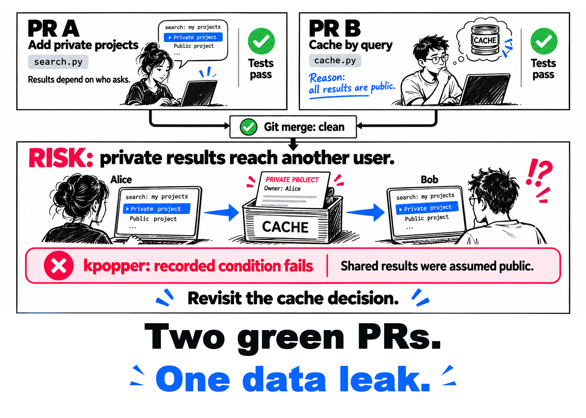
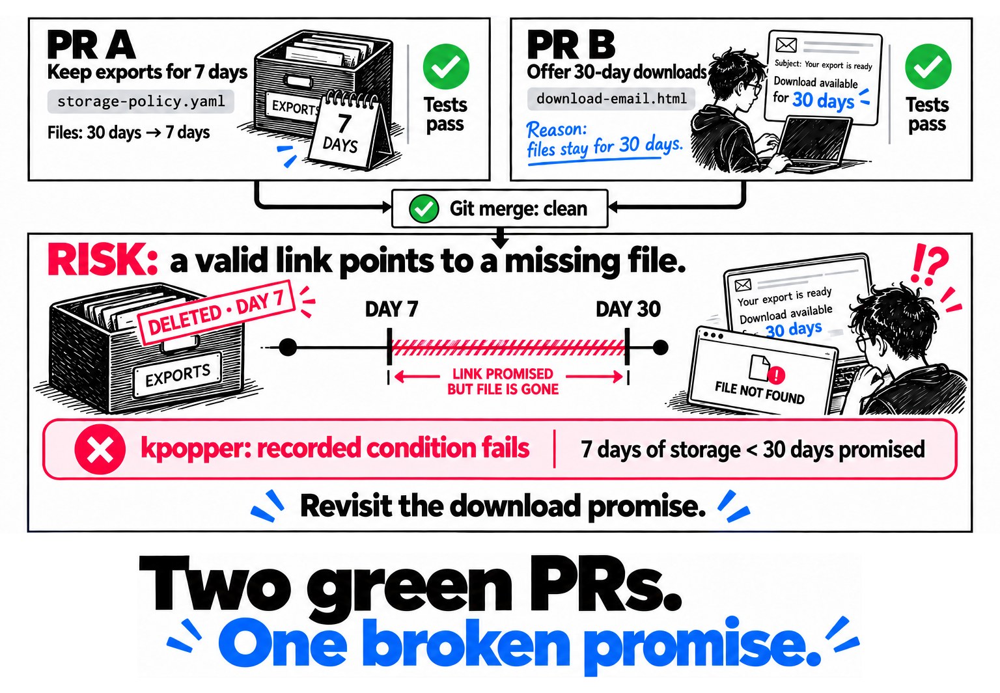
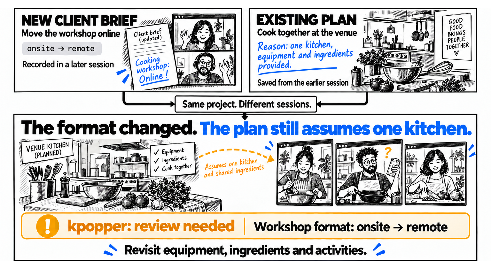
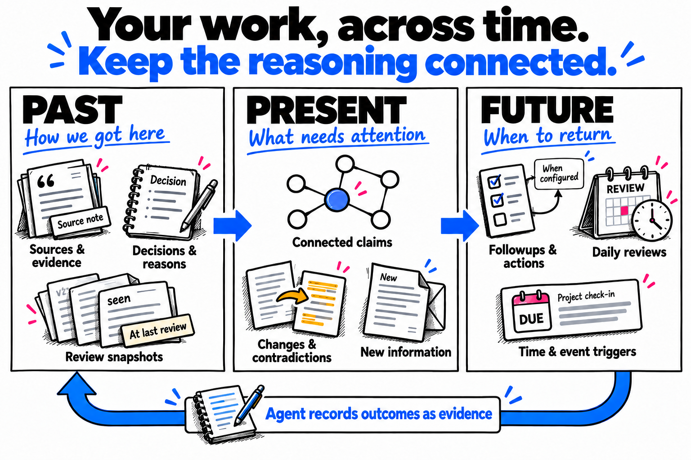
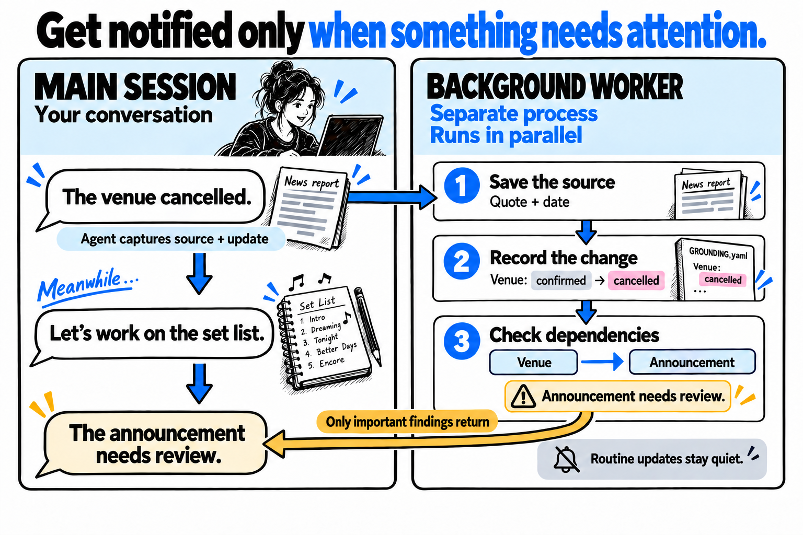
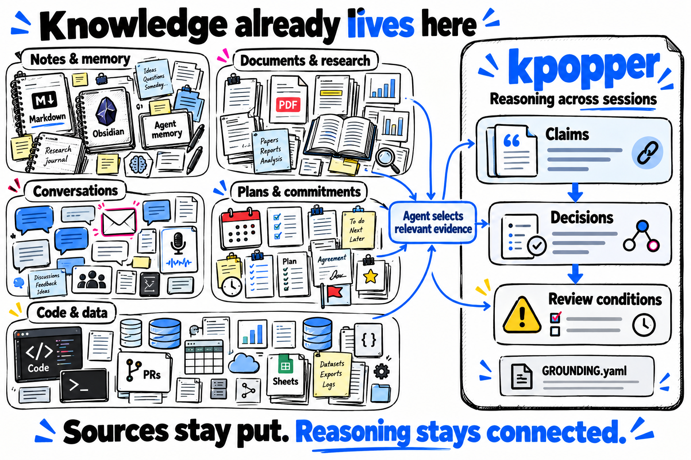

<p align="center">
  
</p>

<p align="center">
  <a href="#popper-give-a-conclusion-a-way-to-fail">What's going on? Who is this guy?</a>
</p>

<a id="keep-the-reasoning-move-the-work-forward"></a>

# Your project, more self-aware.

**Your agents reason. kpopper makes that reasoning explicit, persistent, and deterministically checkable.**

kpopper connects decisions to the evidence, assumptions and earlier decisions they
depend on, and records what would make them worth revisiting. When a recorded premise
changes, kpopper traces its reach through the record and surfaces what needs another look.

**[Get started](#get-started)** · [Examples](#example-1-private-data-exposure-assumption-checks) ·
[Capabilities](#what-you-can-do-with-kpopper) · [Record format](#the-knowledge-record) ·
[Why the name?](#popper-give-a-conclusion-a-way-to-fail)

<p align="center">
  <a href="assets/diagrams/reasoning-check.png">
    <picture>
      <source media="(max-width: 600px)" srcset="assets/diagrams/reasoning-check-mobile.png">
      
    </picture>
  </a>
</p>

<details>
<summary>Contents</summary>

- [Example 1: Private data exposure (assumption checks)](#example-1-private-data-exposure-assumption-checks)
- [Example 2: Premature file deletion (consistency)](#example-2-premature-file-deletion-consistency)
- [Example 3: Outdated planning assumptions (freshness)](#example-3-outdated-planning-assumptions-freshness)
- [Example 4: Dark matter across studies (evidence synthesis)](#example-4-dark-matter-across-studies-evidence-synthesis)
- [Installation and first use](#get-started)
- [What you can do with kpopper](#what-you-can-do-with-kpopper)
- [One project, across your existing tools](#one-project-across-your-existing-tools)
- [Past, present and future](#past-present-future)
- [Background capture during a conversation](#keep-the-conversation-moving)
- [The record and its evolving structure](#the-knowledge-record)
- [Review that needs judgment](#when-a-review-needs-judgment)
- [Followups and background checks](#followups-and-background-checks)
- [Checks across branches and in CI](#coding-check-the-reasoning-behind-a-merge)
- [Karl Popper, K-pop and the name](#popper-give-a-conclusion-a-way-to-fail)
- [The third-brain idea](#a-third-brain-for-work-in-progress)
- [The optional Lean core](#the-lean-proof-assistant-from-fermat-to-agents)
- [Documents with their evidence](#share-a-document-with-its-reasons)
- [The record's page and graph view](#explore-the-projects-knowledge-record)
- [Availability and limits](#what-is-available-and-what-is-next)
- [Try it, get help and contribute](#make-it-earn-its-place)

</details>

<a id="access-control-and-shared-caching"></a>

<a id="example-1-private-data-exposure"></a>

## Example 1: Private data exposure (assumption checks)

Two agents start from a search service whose results are all public. PR A adds
private projects and filters results for each user. PR B adds a shared cache keyed
only by the query, relying on those results being public and identical for everyone.

<p align="center">
  <a href="assets/stories/cache-privacy.png">
    <picture>
      <source media="(max-width: 600px)" srcset="assets/stories/cache-privacy-mobile.png">
      
    </picture>
  </a>
</p>

The files merge cleanly. **The reason for sharing the cache no longer holds.**

The relevant part of PR B's `GROUNDING.yaml`:

```yaml
known:
  search.results_public: {v: true, measure: search_results_public}

judgments:
  search.shared_cache:
    rests_on: [search.results_public]
    verdict: >-
      Search responses can share a cache keyed only by query
      because all results are public.
    wrong_if: "search.results_public == false"
    seen: {search.results_public: true}
```

`rests_on` names the premise. `seen` keeps its value at the last review. When the
measured value becomes `false`, `wrong_if` fires and identifies the cache decision.
Source locators and the complete record are in the
[example](examples/merge-assumptions/cache/pr-b/GROUNDING.yaml).

<details>
<summary>How the example measures the change</summary>

In the [runnable example](examples/merge-assumptions/README.md), a reviewed measurement
recipe reads the explicit visibility switch in `search.py`. After PR A enables private
projects, `kpopper remeasure --run` tests that new reading against the cache decision
and fails its condition. It leaves the canonical record unchanged; `check` alone
would still see the old recorded value.

The example creates two local Git branches, runs their tests, merges them and checks
the combination. A separate integration probe also catches the privacy problem.
kpopper preserves the declared reason and connects the change to it; it does not
infer arbitrary security properties from code or replace behavioral tests.

</details>

<a id="download-promises-and-storage-retention"></a>

<a id="example-2-unavailable-downloads"></a>

## Example 2: Premature file deletion (consistency)

Exports stay for 30 days; download emails currently promise seven. PR A reduces
storage retention to seven days. PR B extends the download promise to 30 days.
Each change fits the other policy on its own branch.

<p align="center">
  <a href="assets/stories/download-promise.png">
    <picture>
      <source media="(max-width: 600px)" srcset="assets/stories/download-promise-mobile.png">
      
    </picture>
  </a>
</p>

**The email still says the link is available. The storage policy has already deleted
the file.** The example's recipes read both the policy and the promise in the actual
email template. [Run both merge stories](examples/merge-assumptions/README.md).

PR B records the promise against the retention period it sees:

```yaml
known:
  exports.retention_days: {v: 30, measure: retention_days}
  downloads.promised_days: {v: 30, measure: promised_days}

judgments:
  downloads.availability:
    rests_on: [exports.retention_days, downloads.promised_days]
    verdict: "Keep exports available for the full promised download window."
    wrong_if: "exports.retention_days < downloads.promised_days"
    seen: {exports.retention_days: 30, downloads.promised_days: 30}
```

After the merge, the measured values are seven days of retention and 30 days promised.
The comparison fails. The [full record](examples/merge-assumptions/downloads/pr-b/GROUNDING.yaml)
and recipes connect both readings to their files.

These are fictional, executable examples. Checks cover the assumptions the record
declares and the inputs deliberately measured or recorded. A changed premise can also
prompt review without proving a decision wrong.

<a id="revisiting-plans-when-the-brief-changes"></a>

<a id="example-3-outdated-planning-assumptions"></a>

## Example 3: Outdated planning assumptions (freshness)

In Claude Cowork, you're planning a cooking workshop around the venue's shared kitchen,
equipment and ingredients. A later client brief moves the workshop entirely online.

<p align="center">
  <a href="assets/stories/cowork-workshop.png">
    <picture>
      <source media="(max-width: 600px)" srcset="assets/stories/cowork-workshop-mobile.png">
      
    </picture>
  </a>
</p>

Once the agent records the new format, kpopper flags the saved plan for review.
**It does not decide whether the activities can work remotely.** The next session can
recover the old reason, read the updated brief, and work out what participants need.
[Try the Cowork example](examples/cowork-workshop/README.md).

The after record retains the old decision and its review snapshot:

```yaml
known:
  workshop.format: {v: remote}

judgments:
  workshop.agenda:
    rests_on: [workshop.format]
    verdict: "Use the shared-kitchen agenda and provide ingredients at the venue."
    reopened_by: >-
      The workshop format or access to the kitchen changes; review the
      activities, equipment and ingredients participants need.
    seen: {workshop.format: onsite}
```

The current value is `remote`; the decision was reviewed against `onsite`. That is a
`MOVED` notice. The prose in `reopened_by` tells the agent what deserves attention;
it is not an executable predicate. [Read the complete after record](examples/cowork-workshop/after/GROUNDING.yaml).

**Keep your existing documents, notes and task tools.**
The record links back to relevant evidence; there is no need to migrate your knowledge system.
For another example that needs judgment, explore
[a replacement offer with an uncertain deadline](examples/offer-review/README.md).

## Example 4: Dark matter across studies (evidence synthesis)

Give three research agents different papers and the same knowledge record. One
reads [galaxy rotation](https://articles.adsabs.harvard.edu/pdf/1980ApJ...238..471R),
another [Bullet Cluster lensing](https://arxiv.org/abs/astro-ph/0608407v1), and a third
[Planck's CMB results](https://arxiv.org/abs/1807.06209v4). Each adds sourced findings.
A synthesis agent can follow all three contributions and build a connected argument,
with its assumptions and open questions attached.

<p align="center">
  <a href="assets/stories/dark-matter.png">
    <picture>
      <source media="(max-width: 600px)" srcset="assets/stories/dark-matter-mobile.png">
      
    </picture>
  </a>
</p>

**The next session inherits the argument, including how it could fail.** This
three-paper example connects different observations into a dark-matter account
under stated models. It keeps that synthesis separate from what each paper reports.
The illustration is schematic; the [guide](examples/dark-matter/README.md) links
the readings to their exact source locations and explains their limits.

The synthesis declares its dependencies and a condition for further judgment:

```yaml
synthesis.dark_matter:
  rests_on: [rotation.finding, lensing.finding, cmb.finding, research.framework]
  verdict: Under the stated models, these findings support a dark-matter account across scales.
  reopened_by: >-
    A finding or its model assumptions are revised, or a worked alternative
    accounts for these observations together. Reassess the synthesis and its scope.
```

The [full GROUNDING.yaml](examples/dark-matter/GROUNDING.yaml) includes the sources,
readings, open questions and tool-filled `seen`. Agents make the scientific judgment;
kpopper preserves and traces the declared reasoning. It does not turn agreement
between agents into proof.

[Run the shared-record example](examples/dark-matter/README.md#run-the-shared-record-example):
three concurrent CLI writers replay prepared readings, then a proposed change in
the review framework flags the synthesis. It uses real papers and real record
operations, without calling models or claiming a live research evaluation.

## Get started

Install kpopper where your agent works. The guides below cover coding agents and
project work in Claude Cowork and ChatGPT Work. The package includes the
[method](skills/kpopper/SKILL.md) with one skill per occasion beside it, record tools and host-specific hooks; setup depends on
the environment.

### Claude Code

Run in a terminal with Claude Code installed:

```sh
claude plugin marketplace add ilanbm/kpopper
claude plugin install kpopper@kpopper --scope user
```

Or run these inside Claude Code:

```text
/plugin marketplace add ilanbm/kpopper
/plugin install kpopper@kpopper
```

Both install from this repository's marketplace. See
[Claude's plugin installation guide](https://code.claude.com/docs/en/discover-plugins).

### Codex

Run in a terminal on the machine where Codex runs:

```sh
codex plugin marketplace add ilanbm/kpopper
codex plugin add kpopper@kpopper
```

Start a new Codex task after installation. Review the plugin's hook definitions when
prompted; hook trust is separate from installation. The repository includes a native Codex
manifest and host-specific hooks. See [Codex setup and behavior](adapters/codex/README.md)
and [OpenAI's plugin guide](https://learn.chatgpt.com/docs/plugins).

### Claude Cowork

Open **Customize → Plugins → Add marketplace**, enter `ilanbm/kpopper`, then install
**kpopper** from that marketplace. This uses the same Claude plugin package.
[Cowork's installation guide](https://claude.com/docs/cowork/guide/plugins) describes the
repository import and component controls.

### ChatGPT Work

**Workspace import is supported by the platform; kpopper's full Work runtime is not yet
validated.** A workspace administrator can open **Admin → Plugins → Add → Import marketplace**,
enter `https://github.com/ilanbm/kpopper` as the source and leave **Path** empty. Once the
plugin is available to the workspace, install it from **Plugins** and start a new Work
conversation. The repository uses a
[supported marketplace format](https://learn.chatgpt.com/docs/enterprise/plugin-management).

The scripts, Python dependencies and persistent project record must also be accessible in
Work's execution environment. Installing a plugin through the web does not deploy local
hook scripts. See [Work setup and current limits](docs/chatgpt-work.md) before relying on
automatic opening or background delivery.

### Other agents

Clone the repository to a location where it can remain available:

```sh
git clone https://github.com/ilanbm/kpopper.git
```

Then follow the adapter for the host:

| Agent | Install path |
|---|---|
| [Cursor](adapters/cursor/README.md#install) | Install the rule and hook wrappers in the project's `.cursor` directory. |
| [Gemini CLI](adapters/gemini/README.md#install) | Run `gemini extensions link ./kpopper/adapters/gemini` from the directory where the clone was created. |
| [Windsurf](adapters/windsurf/README.md#install) | Install the Cascade rule and optional write hook. |
| [GitHub Copilot](adapters/copilot/README.md#install) | Use the instructions and configuration for VS Code or the cloud agent. |

Keep existing host configuration when adding an adapter. Each guide describes its paths
and limitations; automatic opening and stop behavior differ by host. See the
[capability matrix](adapters/README.md#capability-matrix) for the comparison.

### Start working

The local scripts need **Python 3.9+** and the [package dependencies](pyproject.toml)
available in the environment used by the host's `python3`. A Python package installation
includes them. For a plugin-only installation, install them in that environment:

```sh
python3 -m pip install 'PyYAML>=5.1' 'html5lib>=1.1,<2' 'tinycss2>=1.2,<2' tzdata
```

Lean is optional; the ordinary reader and page work without it. In a new agent session
with the project open, start with:

> Use kpopper to keep this project's reasoning across sessions. If a record exists, open it
> and show what needs review. As we work, preserve the useful findings, sources, decisions
> and conditions that would make those decisions worth reconsidering.

Installation creates no record. Start with the first finding worth carrying into another
session. A one-off question may need no record at all.

For a standalone CLI installation and a walkthrough of the launch-party example, see
[Try it from the command line](docs/reference.md#try-it-from-the-command-line).

## What you can do with kpopper

| In your work | What kpopper keeps or connects |
|---|---|
| Pick up a project in a later session | Relevant facts, goals, decisions, reasons and open questions, with bounded orientation and focused retrieval. [Reading the record](docs/reference.md#find-and-read-the-record). |
| Trace a recommendation | Sources, their dates and locations, the premises used, and the values seen at the last review. [Record format](#the-knowledge-record). |
| Notice when a decision needs another look | Changed recorded premises and declared breaking conditions, including facts connected to reviewed measurement recipes. [Checking rules](docs/reference.md#what-check-means). |
| Keep competing claims in view | Hypotheses, explicit reconciliation and retained refutations. [Consolidation](skills/consolidate/SKILL.md). |
| Work across branches | Combined-record checks in CI and optional background compatibility checks while work continues. [Coding and CI](docs/coding-and-ci.md). |
| Return to deferred work | Followups tied to dates, recorded changes or preceding work, with configured host scheduling. [Followups](#followups-and-background-checks). |
| Share a result people can inspect | Standalone HTML with selected evidence and review choices, plus a separate navigable page for the project record. [Documents](#share-a-document-with-its-reasons). |
| Let the structure grow with the project | Domain-specific subjects and vocabulary within a small set of explicit relationships and checks. [Evolving structure](#a-structure-that-grows-with-the-project). |
| Bind a session's reads to a known version | An experimental, optional Lean-backed view checks selected session contracts and rejects reads against an outdated record revision. [Checked sessions](docs/checked-sessions.md). |

Use the parts your project needs. Existing documents, tools and memory remain where
they are; the agent records the relevant connections between them.

<a id="start-with-the-work"></a>

## One project, across your existing tools

A project is **work around a goal**. Its materials may span documents, conversations,
calendars, task systems, files and earlier sessions. In software, they also include code,
commits and pull requests. One project can cross several tools; one source can serve several
projects.

kpopper keeps a *picture of the project's reasoning* in `GROUNDING.yaml`: a readable record
that connects claims to sources and decisions to their premises. Your documents and tools
keep their own content. The record makes the reasoning between them available to the next
person or agent working on the goal.

| When you return to… | The useful thing to recover |
|---|---|
| A software project in Codex or Claude Code | Why a design was chosen, the code or test supporting it, and the changes that could invalidate it. |
| Financial analysis in Claude Cowork | Which sources support a forecast's assumptions, when they were checked, and which decisions depend on them. |
| A product launch | Which commitments support the launch plan, and which assumptions changed. |
| Your weekly plan | Why a task has priority, the deadline behind it, and the availability it assumes. |
| Research with an agent and an Obsidian vault | The evidence for an explanation, competing accounts, and the observation that would challenge it. |
| A mortgage application | Which lender offer and documents support the plan, when the offer expires, and which conditions still need confirmation. |

The same five questions orient the work:

1. **What are we trying to achieve?** Goals, outcomes and priorities.
2. **What is known now?** Facts, commitments, deadlines and constraints.
3. **What was decided, and why?** Decisions, assumptions and alternatives.
4. **Where is the evidence?** Sources and enough detail to find the relevant passage again.
5. **What needs another look?** Open questions, conflicting reports and changed premises.

These questions guide what to record. Learn from findings during ordinary work, or ask
for an [initial map or deeper investigation](docs/first-use.md) of selected materials.
The agent uses the sources available in your context; access to a file alone does not
make it part of the project.

## Past, present, future

Keep the work connected across time: the sources and decisions behind it, what needs
attention now, and the checks or actions to return to later.

<p align="center">
  <a href="assets/diagrams/work-across-time.png">
    <picture>
      <source media="(max-width: 600px)" srcset="assets/diagrams/work-across-time-mobile.png">
      
    </picture>
  </a>
</p>

The Future panel shows deferred work tracked by followups and scheduled reviews when
configured in the host. The return arrow is the agent's step of recording useful outcomes
as evidence; marking a followup complete is a separate operation and does not automatically
rewrite the knowledge record.

## Keep the conversation moving

New information often arrives halfway through another task. kpopper can retain an explicit
report and process a supported update in a separate worker. Routine results stay quiet;
important unresolved findings are available for delivery back to the conversation.

<p align="center">
  <a href="assets/diagrams/conversation-flow.png">
    <picture>
      <source media="(max-width: 600px)" srcset="assets/diagrams/conversation-flow-mobile.png">
      
    </picture>
  </a>
</p>

Today, that worker can update an **existing stored scalar value in a single record file**,
using a supplied source quote, target, value and report date. It does not infer what an
ambiguous message refers to. Unresolved identity or meaning remains a question. Delivery
after an answer requires the host capabilities described in the
[background capture guide](skills/kpopper/INGESTION.md) and
[native delivery guide](skills/kpopper/DELIVERY.md).

**Captured, applied and checked are different states.** If the current answer depends on
an update, inspect its outcome before relying on it. Background work is useful precisely
where the conversation can safely continue without that result.

## How it works

### The knowledge record

The technical term is an **epistemic record**: a record of what is known and how it is
grounded. These are roles in the method, not six mandatory YAML sections. Start with
what the work needs; a source and one finding can be enough.

| Piece | What it preserves |
|---|---|
| Source | The document, conversation, observation or other origin of a claim, with dates and locators. |
| Reading | A value or quotation taken from that source. |
| Derivation | A structured rule relating inputs to a result. Its references supply graph dependencies and the local Lean core computes its value. Legacy text rules remain readable and unevaluated until explicitly converted. |
| Judgment | A conclusion, its reasoning, declared dependencies and condition for reconsideration. |
| Review snapshot | What those dependencies held when the judgment was last reviewed: `seen`. |
| Open question | Something unresolved, retained without inventing an answer. |

The method is opinionated about grounding conclusions, declaring dependencies and
preserving a basis for review. A judgment needs the values it was reviewed against
to make drift detectable, and a meaningful condition for reconsideration. A record
with no judgments yet does not need invented conclusions, snapshots or derivations
just to fill a template. Field names and project-specific categories are described
[below](#a-structure-that-grows-with-the-project).

**Change is compared with the last review.** When a recorded scalar differs from a judgment's
`seen` snapshot, the reader identifies the movement. A supported `wrong_if` comparison says
whether the change crosses the judgment's stated boundary. Movement can call for review
without refuting the conclusion; a movement inside its declared threshold can stay quiet.
`affects` traces the wider reach through declared judgments and rule references.

**The record does not observe the world on its own.** A changed document matters only after
someone or an authorized tool supplies a new reading. Optional measurement recipes can
re-read selected values when explicitly run. These are [reviewed commands](docs/reference.md#measurement),
not general source monitoring.

**History and the present belong together, with their dates intact.** An old conversation
can explain why a deadline was chosen; it does not establish that the deadline still holds.
A session's proposed action does not establish that anyone performed it. Reusing a
recommendation requires evidence for its conditions now.

**Competing claims can stay separate.** A conflicting write can become a hypothesis beside
the base record. Consolidation checks the proposed combination before an explicit fold;
it can also retain a refuted hypothesis as a negative finding. A signal never grants
permission to change a decision or act outside the record.

On return, `open` gives a bounded orientation and attention report; `pull` retrieves the
subject you need. The optional checked session mode below adds a complete, navigable view
within a token budget. In both cases, the aim is to spend the next session's context on the
work at hand.

### A structure that grows with the project

**Start with a finding, not a database design.** A research project can name claims
and experiments; a workshop can name participants and supplies; a codebase can name
interfaces and deployment assumptions. Add subjects, categories and views when the
work creates a reason for them.

The record is ordinary YAML, and Git is optional. Keep it with the project or in a
deliberately configured external location; your source documents stay in their
existing tools. [Storage and location](docs/reference.md#record-location-and-shape).

The vocabulary is flexible. The ordinary reader recognizes dependency, predicate
and snapshot roles by their shape; `facts`/`claims` can serve the same purpose as
`known`/`judgments`. The documented names are the easiest starting point. When two
fields fit the same role, an explicit `schema` mapping resolves the ambiguity.
Some control fields, including `reopened_by` and `blocked_on`, are recognized by
name; flexible vocabulary does not mean every keyword can be renamed.

The relationships stay explicit: where a reading came from, what a decision depends
on, what it was reviewed against, and what would bring it back for review. Supported
checks enforce their structural and comparison rules; arbitrary prose still needs
interpretation.

This is the useful sense of an **evolving record**: the person or agent can adapt its
structure as needs emerge, and later checks recompute what moved from the current
values and saved snapshots. Conclusions are not silently rewritten, and a structural
change should migrate the existing record and pass its checks in the same change.
See [the shape](skills/kpopper/references/shape.md) and
[how structure grows](skills/kpopper/references/method.md#add-structure-only-when-something-forces-it).

### When a review needs judgment

Some conditions can be compared mechanically; others require reading a source and
making a judgment. `reopened_by` preserves a prose condition for reconsideration.
`blocked_on` records why a condition cannot currently be checked. Neither field
calls a model or schedules work.

When a declared, comparable premise changes, the write response and subsequent
`open` or `check` can surface the affected decision. During the task, the agent
reads the relevant sources and decides whether to retain, revise or question it.
A review explicitly updates `seen`; the checker never does that on its own.

For a review that must happen later, attach a followup to a date or recorded change
and connect it to an available host schedule. The optional daily review can also
select one flagged decision for attention. A prose condition alone is not an
automatic background review of every judgment. See [followups](skills/kpopper/FOLLOWUPS.md)
for triggers, work budgets and scheduling.

## Followups and background checks

Deferred work can become ready on a date, after a recorded value changes, when a
threshold is crossed, or after another task finishes. Keep the task in your existing
system; kpopper connects it to the knowledge it depends on and has a private local
fallback when needed.

A configured daily review can revisit due work and a flagged decision within a small
budget, surfacing meaningful results. During active sessions, supported host hooks
also surface changed readiness. A saved followup alone does not start an agent or
create a schedule.

With local watch enabled, worktree graph changes are checked in a separate background
process against the selected main ref. Results identify the exact versions checked;
comparison rewrites neither graph. Scoped external observations can live in one
canonical record outside the branches, while branch experiments remain local.

Run **`/kpopper:watch`** in Claude Code or **`$watch`** in Codex to inspect and configure
these routines. The host supplies scheduling within your authorization. Recording a
followup's outcome and reviewing a decision are explicit actions.

See [setup and host limits](skills/watch/SKILL.md),
[followup routing and review budgets](skills/kpopper/FOLLOWUPS.md), and
[branch compatibility and shared observations](skills/watch/references/compatibility.md).

## “Ready to launch” had a condition

Karl Popper is releasing his debut K-pop single.
An agent has prepared Friday's launch-party announcement. The venue has confirmed the
booking. The decision: **the announcement is ready, provided the booking stays confirmed.**

The next day, the venue cancels. A later session picks up the launch plan. The announcement
copy is unchanged; the reason it was ready to publish has disappeared.

kpopper preserves that connection:

```yaml
sources:
  booking:
    name: "Venue confirmation"
    quoted: "Your booking for Friday is confirmed."
    read: "2026-09-09"

known:
  venue.status: {v: confirmed, from: booking, as_of: "2026-09-09"}

judgments:
  launch.announcement:
    rests_on: [venue.status]
    verdict: "Friday's announcement is ready, provided the venue booking stays confirmed."
    because: "The announcement names the date and venue confirmed in the booking email."
    wrong_if: 'venue.status != "confirmed"'
    seen: {venue.status: confirmed}
```

After the session records the cancellation, the next check reports:

```text
launch.announcement: wrong_if holds (venue.status != "confirmed") - broken by its own condition
```

The next agent sees **which decision needs review, which premise changed, and what the
earlier decision was based on**. It knows to revisit the announcement before reusing
“ready to launch.”

[Try the example](docs/reference.md#try-it-from-the-command-line) ·
[See a PR and CI case](#coding-check-the-reasoning-behind-a-merge)

## Coding: check the reasoning behind a merge

**Two branches can pass their own tests and undermine each other's decisions when merged.**
Git checks whether their text can be combined. kpopper adds a check on the recorded premises
and conditions behind the work.

The [two executable merge stories](examples/merge-assumptions/README.md) reproduce the
opening illustrations in disposable local Git repositories:

| Story | Independent changes | The declared condition that fails together |
|---|---|---|
| Search cache | Add private projects; cache results by query because all results are public. | `search.results_public == false` |
| Download promise | Retain files for seven days; promise downloads for 30 days. | `exports.retention_days < downloads.promised_days` |

Run them with Git and the package's Python dependencies installed:

```sh
python3 examples/merge-assumptions/run.py
```

Each branch's tests and measurement checks pass. Git merges the branches without a text
conflict, and the combined branch tests still pass. Measurement then fails the recorded
condition. The runner also uses a separate integration probe that detects each problem;
these examples show a gap in those branch tests, not a limit on what tests can express.

The recipes connect explicit inputs in the merged tree to the record: the search visibility
switch, the storage policy and the promise in an email template. `remeasure --run` tests
changed readings as a hypothesis without silently rewriting the canonical record. A plain
`check` cannot see a tree change while its recorded input remains unchanged.

There are three useful checks:

- **Across branches during work:** `kpopper consolidate --dry-run --from <branch-or-ref>` reads
  another branch's committed record as proposed changes and tests it against the current record.
- **On the proposed merge result in CI:** `kpopper check` checks the combined record;
  `kpopper consolidate --dry-run` also tests the hypotheses stored beside it.
- **Against the actual tree:** `kpopper remeasure --run` runs the deliberately configured recipes
  and tests their readings against the declared conditions.

A changed premise that needs review can be reported without failing CI; an affected hypothesis
still needs review before it can be folded. Decisions are revised explicitly.

**These commands already run in kpopper's own [CI workflow](.github/workflows/check.yml)** on
pull requests and pushes to `main`, alongside the test suite and page checks. They use the
Python reader and do not require the optional Lean core. See
[Add reasoning checks to CI](docs/coding-and-ci.md) for setup, including measurement recipes.

The coverage is what the record declares. These checks do not infer intent from arbitrary
code or prove that all goals are mutually compatible. Keep relevant readings current and
review measurement recipes as code. A contradiction expressed only in prose, or hidden behind
unrelated IDs, can still require human review.

## Popper: give a conclusion a way to fail

The man in the banner is **Karl Popper**, cast here as an unlikely K-pop star.

Karl Popper was a philosopher of science who argued that scientific theories should expose
themselves to tests that could prove them wrong. Surviving a test does not make a theory
certain. [The Stanford Encyclopedia of Philosophy](https://plato.stanford.edu/entries/popper/)
explains the idea and its limits.

kpopper borrows that discipline for agent reasoning: **preserve the evidence, state what
would undermine a conclusion, and know when to reconsider it.** This is the idea behind
the name.

**Now prove that Karl Popper isn't the father of K-pop.**

Our imaginary announcement, **“Popper's K-pop debut is out,”** has a more concrete test:

```yaml
wrong_if: 'popper.single_status != "released"'
```

If the recorded status is `planned`, that condition fires and `check` fails.
A green check means no failing condition was found by these checks;
it does not establish that the recommendation is true, wise, complete or authorized.

The predicate language is deliberately small: one supported comparison over declared
references and values. Free-form reasoning and compound logical expressions are outside
that evaluator. If a condition cannot yet be checked, `blocked_on` records why. A decision
that needs a person's judgment can instead carry `reopened_by`, describing the sign that
would bring it back for review. Preferences and open questions need no invented scientific
certainty. See [the checking rules](docs/reference.md#what-check-means).

This is a practical use of falsification, not an automated implementation of the scientific
method. Choosing good evidence and meaningful breaking conditions remains intellectual work.

## A third brain for work in progress

An agent's working instructions and the work it produces serve different readers.
Plan section numbers can leak into code comments; a website can start describing the
prompt that produced it. The useful boundary resembles the **fourth wall**: keep
production instructions in the working context, and put what the audience needs in
the finished work. A report may still need its assumptions, evidence and sources.

kpopper provides a separate place to preserve decisions and their reasons across
sessions. The agent still has to respect that boundary; the record does not enforce it.

The excitement around building an organizational **second brain** is well deserved. A team's
knowledge already lives across notes and agent memory, documents and research, conversations,
plans and commitments, code and data. An agent can connect the relevant pieces into a shared,
evolving picture of the work.

Andrej Karpathy's [LLM Wiki](https://gist.github.com/karpathy/442a6bf555914893e9891c11519de94f)
describes how an agent can maintain that picture as a persistent wiki: synthesizing sources,
surfacing contradictions and revisiting stale claims.

As that knowledge becomes a basis for action, its reasoning deserves an explicit record: why
a conclusion was accepted, which sources and assumptions support it, and what would call for
reconsideration.

kpopper gives that record structure. It connects conclusions to their grounds, preserves what
they were reviewed against, and checks declared conditions as recorded facts change. We call
this reasoning and review layer a **third brain**; the agent supplies the interpretation.

**Keep the knowledge system already in use.** A folder of Markdown files, an Obsidian vault,
a project wiki, or memory files used by Claude or Codex can stay where they are. The agent
reads relevant material through its available tools and records the claims it relies on,
with links back to those sources, in `GROUNDING.yaml`. There is no need to migrate the
existing notes or replace the agent's memory system.

<p align="center">
  <a href="assets/knowledge-sources.png">
    
  </a>
</p>

| Role | Question it helps answer |
|---|---|
| You | What matters, and what should we do? |
| Your second brain: notes, documents and saved knowledge | What have we learned and kept that can help? |
| kpopper, working with your agent | What supports this decision, what has changed, and what needs review? |

That distinction is useful when a perfectly retrievable note contains a decision whose
premises have expired. Finding the note is one job; noticing that its recommendation needs
another look is another.

There is a loose parallel with human memory: remembering can involve updating what was
previously learned. In a laboratory study of episodic memory, reminders led participants to
incorrectly include newly learned items when recalling an earlier list.
[Hupbach et al., 2007](https://pubmed.ncbi.nlm.nih.gov/17202429/) provide one concrete example.
This motivates an analogy, not a claim that kpopper models the brain or that neuroscience
validates the product.

Operationally, the analogy is straightforward: retrieve the relevant context, compare it
with new information, draw attention to a consequential mismatch, and review the conclusion.
In kpopper those steps are explicit records and checks. The person or agent supplies the
interpretation; the software follows the declared connections. You retain the decision.

## The Lean proof assistant: from Fermat to agents

<p>
  <a href="https://lean-lang.org/">
    
  </a>
</p>

In September 2026, Anthropic reported that Claude had formalized a proof of **Fermat's Last
Theorem** in the Lean programming language, producing a complete computer-checked proof.
The achievement was formalizing existing mathematics, building on Wiles's proof and
community work. See [Anthropic's account](https://www.anthropic.com/research/formalizing-fermats-last-theorem)
and the [published proof](https://github.com/anthropics/fermats-last-theorem).

> “If it's good enough for Claude, it's good enough for you.”
>
> — Karl Popper, father of K-pop.

**kpopper's optional, experimental session mode uses the Lean 4 programming language** for
a smaller, specific job: checking rules about an agent's view of the record. The language
is also a theorem prover: its kernel checks formal proofs against a precisely defined
type theory. [The Lean reference](https://lean-lang.org/doc/reference/latest/Elaboration-and-Compilation/)
explains how proof checking and compiled execution fit together.

In kpopper, Python reads the record and prepares a normalized snapshot. A local compiled
Lean core computes assessments and checks the proposed session view. Python then exposes
the result through CLI or MCP. Reads are bound to the revision returned at opening, so a
changed record rejects a request using the old revision.

The [Lean source](scripts/session/lean/Main.lean) contains formal proofs of specific properties:

| Property | Why it matters |
|---|---|
| A changed premise alone does not count as falsification when the falsifier is false. | “Something changed” and “the condition fired” stay distinct. |
| An unknown falsifier cannot satisfy an assertion that it is false. | Missing knowledge cannot pass as a negative result. |
| Every scan row contributes to either the success or error count. | An assessment error remains accounted for. |
| A view accepted by the core's acceptance predicate preserves declared conflict signals and accounts for every link index. | Folding a large record must retain the declared structure and conflicts. |

The [proof audit](scripts/session/lean/ProofAudit.lean) names these theorems and prints their
axiom dependencies. Other runtime checks cover such details as exact recovery references,
topic bindings and event values. The [session CI workflow](.github/workflows/session.yml)
builds the pinned Lean source and runs integration tests on Linux, macOS and Windows.

These are guarantees about **defined data structures and checks**. They do not prove that
a source is accurate, that `rests_on` logically implies a verdict, that an agent's prose
follows from the evidence, or that an action is permitted. The Python adapter, router,
renderer, compiler and runtime are outside an end-to-end formal proof. You do not need to
write Lean to maintain a record.

To use checked sessions, install `kpopper[session]` with Python 3.10+, make Lean **4.33.1**
available, then build and enable the local core. The complete instructions, CLI and MCP
examples, predicate subset and rollback are in [Checked sessions](docs/checked-sessions.md).
The ordinary commands remain available without it.

[Logo source and trademark information](assets/README.md#lean-logo).

## Share a document with its reasons

Ask for the document you want:

> Create an HTML project update from these notes, with a recommendation and a checklist.

With kpopper active, the agent writes the content, design and evidence mapping together.
You do not need to ask for the layer separately or prepare a knowledge record first.

**Open the explanation where you are reading.** Hover over a dotted passage to preview
its explanation; click to keep it open. The card focuses on that passage, with an explanation
in ordinary language and technical details collapsed. Click outside or use the close button
to return to the document.

<p align="center">
  <a href="assets/standalone-document-reasoning.png">
    
  </a>
</p>

<sub>The card distinguishes the author's interpretation from a fact stated in the source:
the notes give two dates, but do not define a registration window. Its reasoning,
**Not checked** status and source link remain visible alongside the document.
Click the image to inspect it at full size.</sub>

**Follow the source, then come back.** An internal source link opens only the relevant
reading in the same card. Back returns to the explanation without losing your place.
The card keeps its position while longer content scrolls inside it.

**Keep or share one file.** The HTML contains the document, selected source snapshots and
review choices. Open it offline in a browser with JavaScript enabled; no account, server
or neighboring files are needed to read the document and inspect its evidence.

Give the agent a changed source later and it can prepare a new copy with grouped
before-and-after corrections. A changed count and the percentage calculated from it stay
one decision. Accept or keep the original, then choose **Save document copy** to retain
your choice and the evidence behind it.

A match covers the stated comparison or calculation against a saved reading. Missing
evidence and unchecked interpretations remain explicit; unmarked text is not checked.
Opening an old file does not reread sources or discover later changes.
See [HTML documents with evidence](docs/documents.md) for the workflow and its limits.

<a id="regular-html-annotated-with-reasoning"></a>

## Explore the project's knowledge record

The project record also has its own HTML page. Its views bring together recorded facts,
decisions and open questions, and can arrange them as a report. See the
[Greenhouse example record](examples/greenhouse-report/GROUNDING.yaml) and its
[document layout](examples/greenhouse-report/.kpopper/view.yaml) for a report built from
recorded readings and a heating judgment.

`kpopper page --open` generates this self-contained HTML from the project's record and a
chosen layout. **Now** and other project tabs can present reports, plans or comparisons;
**Record** lists the entries directly, and **Tree** offers an optional graph view. The page
is a rendered snapshot—regenerate it after the record changes. For layouts, components,
localization and checks on stale explanatory text, see the [page reference](skills/kpopper/PAGE.md).

## What is available, and what is next

This table describes the current repository. Check the [changelog](CHANGELOG.md) when
updating an older installation; a merged feature may still be awaiting a release.

| Status | Capability |
|---|---|
| Available | YAML records, source references, judgment checks, dependency tracing, review snapshots, hypotheses and consolidation. |
| Available | CLI, HTML record page and agent integrations, with host-specific setup and limits. |
| Available | Standalone HTML authoring with contextual explanations, selected source snapshots and grouped corrections saved in the document copy. |
| Available | Checks on combined records and hypotheses in CI, including before-merge inspection of another branch's record. |
| Available within stated limits | Background processing of explicit reports and selective delivery of important findings. |
| Platform import route documented; runtime not yet validated | ChatGPT Work installation and execution of this plugin. |
| Experimental, opt-in | Lean-checked session views, revision-bound reads and a project-bound MCP server. |
| Available through the agent | Guided starting choices: learn during ordinary work, map selected existing materials, or investigate a defined subject and period in depth. |
| Available within host limits | Optional first-use explanations, workspace guidance and the ability to skip or turn guidance off. |

Mapping runs in the calling agent session, using its available tools and the sources you
authorize. It does not install connectors or scan accounts by itself. See
[starting a knowledge record](docs/first-use.md) for the workflow and host requirements.

## Make it earn its place

Try it on work you will revisit. After several sessions, ask whether returning takes less
reconstruction, whether a changed premise surfaced a useful question, and whether the
record costs less to maintain than it saves. Those are outcomes to measure in your work,
not established productivity results.

Keep the record as small as the work allows. Its purpose is to help you move the project
forward with reasons you can inspect and revise.

**Try it on one project you will return to.** [Install kpopper](#get-started), or
[run the merge examples](examples/merge-assumptions/README.md) before installing a plugin.
If it helps, star the repository and [tell us what changed in your work](https://github.com/ilanbm/kpopper/issues).
Questions and reproducible problems belong in [Issues](https://github.com/ilanbm/kpopper/issues);
see [Contributing](CONTRIBUTING.md) to improve the project.

[Command and storage reference](docs/reference.md) · [Contributing and validation](CONTRIBUTING.md) ·
[Changelog](CHANGELOG.md) · [MIT license](LICENSE)
