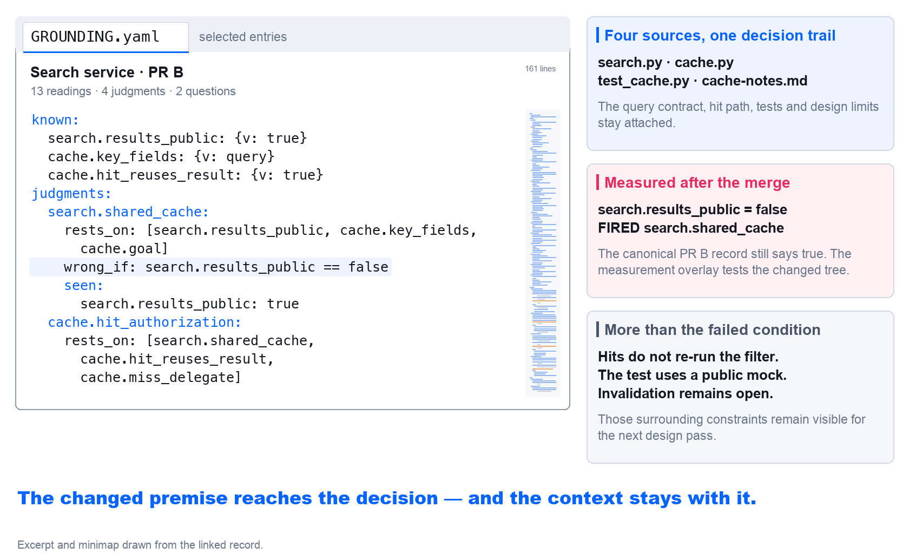
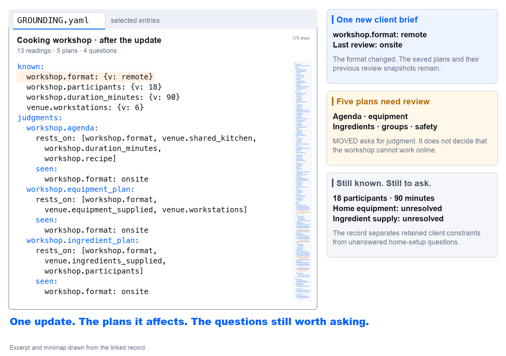
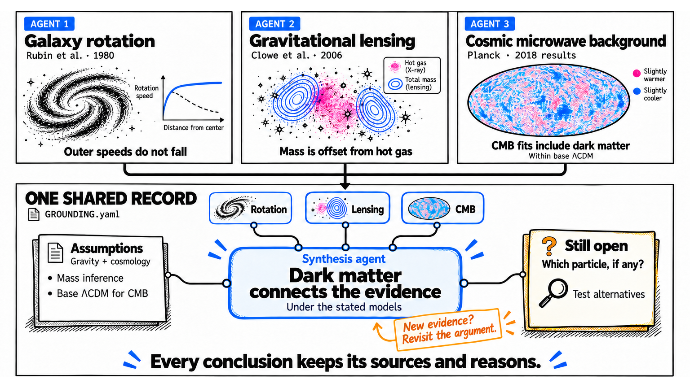
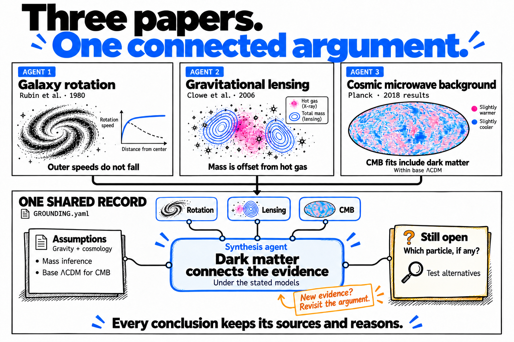
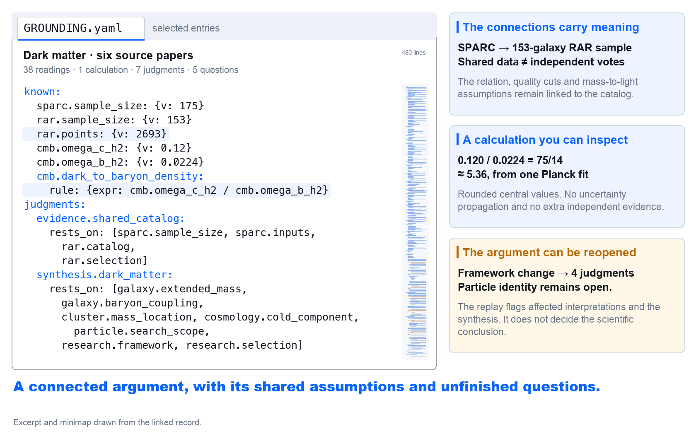

[](assets/kpopper-hero.png)

[](https://github.com/ilanbm/kpopper/actions/workflows/check.yml) [](https://github.com/ilanbm/kpopper/releases/latest) [](LICENSE) [](docs/reasoning-core.md) [](docs/history-contract.md)

<p align="center">
  <a href="#popper-give-a-conclusion-a-way-to-fail">What's going on? Who is this guy?</a>
</p>

<a id="keep-the-reasoning-move-the-work-forward"></a>

# Your project, more self-aware.

**Your agents reason. kpopper makes that reasoning explicit, persistent, and [deterministically checkable](#what-deterministic-reasoning-means-here).**

kpopper connects decisions to the evidence, assumptions and earlier decisions they
depend on, and records what would make them worth revisiting. When a recorded premise
changes, kpopper traces its reach through the record and surfaces what needs another look.

> [!IMPORTANT]
> **TL;DR: Add kpopper to make your work easier to pick up, easier to check, and harder to lose track of.**

**[Get started](#get-started)** · [Examples](#example-1-coding-agent) ·
[Capabilities](#what-you-can-do-with-kpopper) · [Record format](#the-knowledge-record) ·
[Contributing](CONTRIBUTING.md) · [Why the name?](#popper-give-a-conclusion-a-way-to-fail)

[![Meet GROUNDING.yaml, with a handwritten your new friend note. An earlier conversation creates an email with a 30-day promise and records the supporting reason; a later conversation updates a draft retention policy and its recorded value to seven days. Blue arrows connect the conversations to the saved conclusion and changed reading. The YAML retains its 30/30 review snapshot. A pink arrow follows wrong_if to the deterministic check: seven is less than thirty, so the promise is no longer supported. Actual CLI output returns FAIL downloads.availability to the agent, with a caller-measured 0.24-second local-run badge. The closing line reads Deterministic Reasoning that outlives the conversation, with a blue underline pointing to the returned result. The phone layout presents consecutive excerpts from the same file.](assets/diagrams/reasoning-check.png)](assets/diagrams/reasoning-check.png)

[Phone layout](assets/diagrams/reasoning-check-mobile.png)

<details>
<summary>Contents</summary>

- [Example 1: Coding Agent (assumption checks)](#example-1-coding-agent)
  - [Two working modes](#two-working-modes)
- [Example 2: Claude Cowork / ChatGPT Work (freshness)](#example-2-claude-cowork-and-chatgpt-work)
- [Example 3: Research (evidence synthesis)](#example-3-research)
- [Installation and first use](#get-started)
- [What you can do with kpopper](#what-you-can-do-with-kpopper)
- [One project, across your existing tools](#one-project-across-your-existing-tools)
- [Past, present and future](#past-present-future)
- [Background capture during a conversation](#keep-the-conversation-moving)
- [What deterministic reasoning means here](#what-deterministic-reasoning-means-here)
- [The record and its evolving structure](#the-knowledge-record)
- [Review that needs judgment](#when-a-review-needs-judgment)
- [Followups and background checks](#followups-and-background-checks)
- [Checks across branches and in CI](#coding-check-the-reasoning-behind-a-merge)
- [Karl Popper, K-pop and the name](#popper-give-a-conclusion-a-way-to-fail)
- [The third-brain idea](#a-third-brain-for-work-in-progress)
- [Lean and deterministic reasoning](#the-lean-proof-assistant-from-fermat-to-agents)
- [Experimental applications](#experimental-applications)
- [Availability and limits](#what-is-available-and-what-is-next)
- [Try it, get help and contribute](#make-it-earn-its-place)

</details>

<a id="access-control-and-shared-caching"></a>

<a id="example-1-private-data-exposure"></a>

<a id="example-1-private-data-exposure-assumption-checks"></a>
<a id="example-1-coding-agent"></a>

## Example 1: Coding Agent (assumption checks)

### Private data exposure

Two agents start from a search service whose results are all public. PR A adds
private projects and filters results for each user. PR B adds a shared cache keyed
only by the query, relying on those results being public and identical for everyone.

[](assets/stories/cache-privacy.png)

[Phone layout](assets/stories/cache-privacy-mobile.png)

The files merge cleanly. **The reason for sharing the cache no longer holds.**

The same record retains the surrounding design: query matching, cache behavior,
test coverage, operational limits and open questions.

[](assets/stories/cache-privacy-record.png)

[Phone layout](assets/stories/cache-privacy-record-mobile.png) · [Full design record](examples/merge-assumptions/cache/pr-b/GROUNDING.yaml)

A selected excerpt from PR B:

```yaml
known:
  search.results_public:
    v: true
    from: s.search
    at: INCLUDE_PRIVATE_PROJECTS is false
    measure: search_results_public
  cache.key_fields:
    v: query
    from: s.cache
    at: 'lookup: query not in _CACHE; _CACHE[query]'
  cache.hit_reuses_result:
    v: true
    from: s.cache
    at: 'lookup: return _CACHE[query]'
  cache.test_data:
    v: One mocked public project; no private-result fixture in that test.
    from: s.cache_tests
    at: test_public_query_is_served_once_across_users
judgments:
  search.shared_cache:
    rests_on:
    - search.results_public
    - cache.key_fields
    - cache.goal
    verdict: Search responses can share a cache keyed only by query because all results are public.
    wrong_if: search.results_public == false
    seen:
      search.results_public: true
      cache.key_fields: query
      cache.goal: Avoid a second search for the same public query across users.
  cache.hit_authorization:
    rests_on:
    - search.shared_cache
    - cache.hit_reuses_result
    - cache.miss_delegate
    verdict: Treat cross-user cache hits as depending on the public-results decision, not as a fresh
      authorization check.
    reopened_by: The hit path, key scope or public-results decision changes; review the combined
      path.
```

`rests_on` names the premise. `seen` keeps its value at the last review. When the
measured value becomes `false`, `wrong_if` fires and identifies the cache decision.
Source locators and the complete record are in the
[example](examples/merge-assumptions/cache/pr-b/GROUNDING.yaml).

<details>
<summary>How the example measures the change</summary>

In the [runnable example](examples/merge-assumptions/README.md), a reviewed measurement
recipe reads the explicit visibility switch in `search.py`. After PR A enables private
projects, `kpop remeasure --run` tests that new reading against the cache decision
and fails its condition. It leaves the canonical record unchanged; `check` alone
would still see the old recorded value.

The example creates two local Git branches, runs their tests, merges them and checks
the combination. A separate integration probe also catches the privacy problem.
kpopper preserves the declared reason and connects the change to it; it does not
infer arbitrary security properties from code or replace behavioral tests.

</details>

<a id="download-promises-and-storage-retention"></a>
<a id="example-2-unavailable-downloads"></a>
<a id="example-2-premature-file-deletion-consistency"></a>

The opening overview uses a download promise and a retention policy. The
[complete merge example](examples/merge-assumptions/README.md#premature-file-deletion-consistency)
shows the same 7-versus-30-day conflict across two branches, with executable code,
measurement recipes and a separate integration probe.

These are executable examples. Checks cover the assumptions the record
declares and the inputs deliberately measured or recorded. The examples on this page
retain their compact legacy records, which kpopper 1.7 continues to read without
migration. [New records also preserve immutable history](#the-knowledge-record).

### Two working modes

The difference is **whether sessions share one project context or work against different
versions of the code**. Both modes support several sessions and competing hypotheses.

**`GROUNDING.yaml` is the readable project record shown below:** one shared context in
Simple, and a version kept with each branch, including `main`, in Advanced. New
history-backed records also keep their supporting history in `.kpopper/`; carry
that directory with the YAML when sharing or versioning the record.

[![Simple: sessions share one sourced project record labeled GROUNDING.yaml, with competing hypotheses beside it; consolidation compares and checks proposals, then folds them into the record, refutes them with a reason, or leaves them pending. Advanced: Branch A, Branch B and main each have a GROUNDING.yaml record for their version of the code. Branch records pass through consolidation before integration into main. A continuing Shared findings, pending review path captures feature-independent findings with their source, scope and status. Dashed arrows show local reading before merge. With permission, findings enter a knowledge PR, where consolidation reconciles them with the target record before acceptance. Both paths reach the same main record; the shared path continues for the next batch.](assets/diagrams/two-working-modes.png)](assets/diagrams/two-working-modes.png)

[Phone layout](assets/diagrams/two-working-modes-mobile.png)

[View the full-size illustration](assets/diagrams/two-working-modes.png) ·
[View the vertical version](assets/diagrams/two-working-modes-mobile.png)

**Simple — one shared context.** Sessions read and contribute to the same project graph.
Competing ideas are named hypotheses beside it: several sessions can examine the same
proposal, and one session can work on several. For a research project, for example, sessions
can read different papers and compare explanations against the same sourced record.
**Consolidation** is how those proposals become part of the shared record: compare them
with what it already holds, check the combined dependencies and resolve conflicting claims.
A proposal can be folded in, refuted with its reason retained, or left pending.

**Advanced — branch contexts and shared findings.** Each branch's record describes its
version of the code. A cache decision on one branch may depend on results being public,
while another branch introduces private results. Keeping those premises with their branches
lets review check whether the reasoning still holds when the changes are combined.
Consolidation reconciles those records: it identifies overlapping subjects and conflicting
claims, and checks which decisions need another look under the combined premises. Resolve
what needs judgment before folding a proposal in; unresolved hypotheses remain explicit.

Knowledge then follows two paths:

- **Feature knowledge travels with its branch.** Its assumptions, measurements and
  hypotheses stay attached to the code they describe. Consolidation tests their combination
  with the target record as part of reviewing the change.
- **Shared findings have a continuing path of their own.** Shareable findings that apply
  independently of the feature enter `pending_grounding`, with their sources and scope.
  They remain available even if the originating session closes or its worktree is removed.

Suppose a session building an integration discovers a documented change to the vendor's
API limit. **The feature may be abandoned; the finding can still help the project.** Other
local worktrees can read it immediately, marked as pending, without waiting for the feature
to merge. It appears alongside their branch record; reading it does not adopt it or replace
their recorded premises.

With the project's publication permission, shared findings accumulate in one knowledge PR.
Consolidation reconciles the proposed knowledge with the target record before acceptance;
conflicts and changed premises need resolution. Accepted contributions are then verified
in the target branch, shown as `main` above. The same publication branch is reused for
the next batch, while the local contribution history persists across review cycles. Local
capture and reading also work without publication.

A measurement of an unmerged commit can be a fact about that commit. A proposed conclusion
remains a hypothesis. Merging means the team accepted the contribution; it does not prove
the claim, increase confidence or refresh its last review. Private material and information
whose sharing permission is unclear stay in a structured private draft.

Projects without Git start in Simple; new Git projects start in Advanced, including those
with only one checkout. Simple can also be configured for a Git project with one external
shared record. Existing registered shared records keep their current location and behavior;
changing mode requires explicit reconciliation.

See [project modes and publication](docs/project-modes.md) for routing, reproducible reads
and the publication lifecycle, and [consolidation](skills/consolidate/SKILL.md) for the
dry run, folding and refutation commands.

These project modes also apply to document and research work.

<a id="revisiting-plans-when-the-brief-changes"></a>

<a id="example-3-outdated-planning-assumptions"></a>

<a id="example-3-outdated-planning-assumptions-freshness"></a>

<a id="example-2-outdated-planning-assumptions-freshness"></a>
<a id="example-2-claude-cowork-and-chatgpt-work"></a>

## Example 2: Claude Cowork / ChatGPT Work (freshness)

### Outdated planning assumptions

A cooking workshop is planned around the venue's shared kitchen, equipment and
ingredients. A later client brief moves it entirely online. For ChatGPT Work, see
the [runtime requirements and current limits](docs/chatgpt-work.md).

[](assets/stories/cowork-workshop.png)

[Phone layout](assets/stories/cowork-workshop-mobile.png)

Once the agent records the new format, kpopper flags the saved plan for review.
**It does not decide whether the activities can work remotely.** The next session can
recover the old reason, read the updated brief, and work out what participants need.
[Try the Cowork example](examples/cowork-workshop/README.md).

The planning record connects 13 readings to five saved plans and four open questions.
The format change reaches the agenda, equipment, ingredients, group arrangement and
supervision; the earlier review snapshots remain visible.

[](assets/stories/cowork-workshop-record.png)

[Phone layout](assets/stories/cowork-workshop-record-mobile.png) · [Full planning record](examples/cowork-workshop/after/GROUNDING.yaml)

Selected entries from the after record:

```yaml
known:
  workshop.format:
    v: remote
    from: s.updated_brief
    at: Participants join online from home
  workshop.participants:
    v: 18
    from: s.session_plan
    at: Client constraints
  workshop.duration_minutes:
    v: 90
    from: s.session_plan
    at: Client constraints
  venue.workstations:
    v: 6
    from: s.logistics_plan
    at: Venue provision
judgments:
  workshop.agenda:
    rests_on:
    - workshop.format
    - venue.shared_kitchen
    - workshop.duration_minutes
    - workshop.recipe
    verdict: Use the shared-kitchen agenda and provide ingredients at the venue.
    reopened_by: The format or access to the shared kitchen changes; review activities, equipment
      and preparation.
    seen:
      workshop.format: onsite
      venue.shared_kitchen: true
      workshop.duration_minutes: 90
      workshop.recipe: Fresh pasta with tomato sauce.
  workshop.equipment_plan:
    rests_on:
    - workshop.format
    - venue.equipment_supplied
    - venue.workstations
    verdict: Plan equipment around the six venue workstations.
    reopened_by: The format, supplied equipment or access to the workstations changes.
    seen:
      workshop.format: onsite
      venue.equipment_supplied: true
      venue.workstations: 6
  workshop.ingredient_plan:
    rests_on:
    - workshop.format
    - venue.ingredients_supplied
    - workshop.participants
    verdict: Prepare ingredient portions at the venue for the 18 participants.
    reopened_by: The format, ingredient provision or participant count changes; review purchasing,
      portions and distribution.
    seen:
      workshop.format: onsite
      venue.ingredients_supplied: true
      workshop.participants: 18
```

The current value is `remote`; the decision was reviewed against `onsite`. That is a
`MOVED` notice. The prose in `reopened_by` tells the agent what deserves attention;
it is not an executable predicate. [Read the complete after record](examples/cowork-workshop/after/GROUNDING.yaml).

### Before the first answer

The next session opens with the saved context: all five plans need review because
`workshop.format` changed from `onsite` to `remote`. Then the user asks:

> Prepare the ingredient portions for the 18 participants.

On a host with the prompt hook enabled, this matching prompt produces a focused
pointer (actual hook output, shown here with Codex skill syntax):

```text
kpopper: the record holds workshop.ingredient_plan on this - $ground workshop.ingredient_plan before answering from memory.
```

The agent follows that pointer with `pull workshop.ingredient_plan`. It retrieves
`remote`, the old venue-based plan and its `onsite` review snapshot before answering.
The next decision is how ingredients will reach participants at home.
[See the opening and retrieval output](examples/cowork-workshop/README.md#before-the-first-answer).

**Keep your existing documents, notes and task tools.**
The record links back to relevant evidence; there is no need to migrate your knowledge system.
For another example that needs judgment, explore
[a replacement offer with an uncertain deadline](examples/offer-review/README.md).

<a id="example-4-dark-matter-across-studies-evidence-synthesis"></a>

<a id="example-3-dark-matter-across-studies-evidence-synthesis"></a>
<a id="example-3-research"></a>

## Example 3: Research (evidence synthesis)

### Dark matter across studies

The original three-paper view shows the shared-record idea:

[](assets/stories/dark-matter-intro.png)

[Phone layout](assets/stories/dark-matter-intro-mobile.png)

A research record can connect observations across scales and retain the tensions
between them. This worked example follows **six papers**: Rubin's galaxy rotation,
SPARC's galaxy catalog, the radial acceleration relation, Bullet Cluster lensing,
Planck's cosmological fit and the first LZ particle search.

[](assets/stories/dark-matter.png)

[Phone layout](assets/stories/dark-matter-mobile.png)

The argument includes **36 source readings, two scope readings, one calculation,
seven linked judgments and five open questions**. Its depth comes from the links:
SPARC and the acceleration paper share data; the Planck density ratio comes from
one model fit; a null WIMP search constrains specific interactions without settling
the identity of the astronomical mass component.

[](assets/stories/dark-matter-record.png)

[Phone layout](assets/stories/dark-matter-record-mobile.png) · [Complete research record](examples/dark-matter/GROUNDING.yaml) · [Sources and exact locations](examples/dark-matter/README.md#the-six-sources)

A source-grounded excerpt:

```yaml
known:
  sparc.sample_size:
    v: 175
    from: paper.sparc
    at: Abstract
    unit: galaxies
  rar.sample_size:
    v: 153
    from: paper.rar
    at: p. 1, Data / Galaxy Sample
    unit: galaxies
  rar.points:
    v: 2693
    from: paper.rar
    at: 'p. 1, Galaxy Sample: velocity-precision cut'
    unit: points
  cmb.omega_c_h2:
    v: 0.12
    from: paper.cmb
    at: Abstract, combined analysis
    uncertainty: 0.001
    confidence: 68%
  cmb.omega_b_h2:
    v: 0.0224
    from: paper.cmb
    at: Abstract, combined analysis
    uncertainty: 0.0001
    confidence: 68%
  lz.si_limit:
    v: 9.2e-48
    from: paper.lz
    at: 'Abstract, version 4: limit at 36 GeV/c^2'
    unit: cm^2
    confidence: 90%
  lz.mass_at_limit:
    v: 36
    from: paper.lz
    at: Abstract, version 4
    unit: GeV/c^2
  cmb.dark_to_baryon_density:
    rule:
      expr: cmb.omega_c_h2 / cmb.omega_b_h2
judgments:
  evidence.shared_catalog:
    rests_on:
    - sparc.sample_size
    - sparc.inputs
    - rar.catalog
    - rar.selection
    verdict: Treat SPARC and the RAR analysis as related evidence, not two independent observational
      votes.
    reopened_by: A different catalog, sample selection or independently calibrated replication changes
      the dependence between these findings.
  synthesis.dark_matter:
    rests_on:
    - galaxy.extended_mass
    - galaxy.baryon_coupling
    - cluster.mass_location
    - cosmology.cold_component
    - particle.search_scope
    - research.framework
    - research.selection
    verdict: Under the stated models, the selected evidence supports a dark-matter account across
      scales, while baryonic regularities and direct-search limits constrain its explanation.
    reopened_by: A source finding or shared assumption is revised, or a worked alternative jointly
      addresses the galaxy, cluster, cosmological and particle-search constraints. Reassess the
      affected paths and the synthesis.
```

**The next session inherits the argument, including its unresolved questions.**

Run the checker on that same record:

```sh
kpop check examples/dark-matter/GROUNDING.yaml
```

Its final summary (exit `0`; the full response also lists the seven prose review
conditions):

```text
7 judgments, 58 entries, 0 problems, 7 declared
```

For a starting overview use `open`; to inspect a subject use `pull`; to trace a
premise use `affects`. The `ground` skill guides that workflow for an agent.

<details>
<summary>Read the context, inspect the calculation, and trace a change</summary>

**Current context** — selected lines from the actual `open` response:

```sh
kpop open examples/dark-matter/GROUNDING.yaml --chars 1000
```

```text
Six-paper worked example; selected source readings and an authored synthesis, not a complete review or live research-agent evaluation.
holds: rar (8) · research (8) · cmb (7) · lz (6) · paper (6) · sparc (6) · lensing (5) · rotation (5)
58 entries, 7 judgments, 5 open questions, updated 2026-09-19
```

**A computed reading and the judgment that uses it:**

```sh
kpop pull cmb.dark_to_baryon_density examples/dark-matter/GROUNDING.yaml --budget 1100
```

```text
cmb.dark_to_baryon_density: 75/14 = cmb.omega_c_h2 / cmb.omega_b_h2 (Ratio of the abstract central physical de ...
+ cosmology.cold_component: Within base Lambda-CDM, the fitted physical cold-dark-matter density exceeds the b ...
    holds
    because: The density ratio connects two central values from the same fit. The model assumptions and
             retained lensing-amplitude tension limit the interpretation.
    reopened by: The likelihood, data combination or cosmological model changes enough to alter the inferred c ...

affects <entry> shows what a change reaches
```

**The reach of the adopted framework:**

```sh
kpop affects research.framework examples/dark-matter/GROUNDING.yaml
```

```text
cluster.mass_location
    via research.framework -> flagged only
cosmology.cold_component
    via research.framework -> flagged only
galaxy.extended_mass
    via research.framework -> flagged only
synthesis.dark_matter
    via research.framework -> flagged only

4 judgments reached
```

</details>

[See all captured commands and responses](examples/dark-matter/cli-examples.md),
including `pull synthesis.dark_matter`. Here `check` reports record consistency;
the scientific review conditions still require judgment.

The illustrations are schematics drawn from the record. The
[full example](examples/dark-matter/README.md) distinguishes source readings,
authored interpretations, shared assumptions and the computed `75/14` density ratio.
That arithmetic does not establish the scientific synthesis.

[Run the shared-record example](examples/dark-matter/README.md#run-the-shared-record-example):
three concurrent CLI writers retain the prepared six-paper contributions, and the
writer records each judgment's review snapshot. A proposed change of framework
then reopens several interpretations and the synthesis. No model call or claim of
live independent research is part of that replay.

### The collection changes; the answer stays five

The [advanced continuation](examples/dark-matter/advanced/README.md) starts with
the five astronomical papers and an explicit selection rule: include a study
when it is in this review and classified as astronomy. Adding the existing LZ
laboratory paper grows the captured collection while leaving that selection equal.

| Reading | Before LZ | After LZ | Replay of the earlier Snapshot |
|---|---:|---:|---:|
| Papers in the scope | 5 | 6 | 5 |
| Selected astronomical papers | 5 | 5 | 5 |
| Query basis | Earlier basis | Changed basis | Earlier basis recovered |
| Particle identities | Unknown | Unknown | Unknown |

The `core/v1` record uses `composition/v1` for the inclusion condition and
`query/v1` for selection. Its basis includes nonmatching members, so an equal
numeric answer does not hide a changed collection. The retained Snapshot
recovers the earlier inputs and result even with the source files unavailable.

These are scripted CLI and public API results, checked without model calls.
The [runnable exercise and captured output](examples/dark-matter/advanced/README.md#run-it)
also preserve the exact `75/14` density ratio and an unchanged qualitative
review judgment. Five papers is a coverage count: RAR still reuses SPARC, model
assumptions remain explicit, and neither the count nor replay proves the synthesis.

## Get started

Install kpopper where your agent works. The guides below cover coding agents and
project work in Claude Cowork and ChatGPT Work. The package includes the
[method](skills/kpopper/SKILL.md) with one skill per occasion beside it, record tools and host-specific hooks; setup depends on
the environment.

### Prepare Python for Claude Code and Codex

On macOS or Linux, install **Python 3.9+ with `venv` support**, then run this once
on the machine where the hooks execute, under the same OS account as the host:

```sh
git clone https://github.com/ilanbm/kpopper.git "$HOME/kpopper"
python3 "$HOME/kpopper/scripts/plugin_runtime.py" setup
python3 "$HOME/kpopper/scripts/plugin_runtime.py" doctor
```

If you already have a checkout, use its absolute path instead. `setup` explicitly
downloads the four [package dependencies](pyproject.toml) from PyPI into a private
virtualenv under `~/.local/share/kpopper/runtimes/`. It works with externally managed
Python installations: system packages are not modified. On Linux distributions that
package `venv` separately, install that Python's `venv` support first.

The Claude Code and Codex hooks automatically select this runtime, including after
a plugin cache update. No activation or PATH change is needed. The hooks run code
from their own installed plugin; this checkout only prepares dependencies. Hooks
never create environments or install packages. A standalone `pipx` or `uv tool`
installation supplies its own CLI environment and does not by itself repair hooks.

`doctor` prints both the bootstrap Python and the selected hook Python. After installing
the plugin below, confirm the opening's `KPOPPER_AGENT_CONTEXT.command` names that same
hook Python and the active plugin's `scripts/cli.py`. Use that command for plugin work.
If dependencies are missing or the private environment breaks, the opener prints the
exact Python it tried and a quoted `setup` command for the active plugin. Run it in a
terminal and start a new session. See [runtime troubleshooting](docs/plugin-runtime.md).

### Claude Code

After the Python setup above, run in a terminal with Claude Code installed:

```sh
claude plugin marketplace add ilanbm/kpopper
claude plugin install kpopper@kpopper --scope user
```

Or run these inside Claude Code:

```text
/plugin marketplace add ilanbm/kpopper
/plugin install kpopper@kpopper
```

Both install from this repository's marketplace. See
[Claude's plugin installation guide](https://code.claude.com/docs/en/discover-plugins).

### Codex

After the Python setup above, run in a terminal on the machine where Codex runs:

```sh
codex plugin marketplace add ilanbm/kpopper
codex plugin add kpopper@kpopper
```

Start a new Codex task after installation. Review the plugin's hook definitions when
prompted; hook trust is separate from installation. The repository includes a native Codex
manifest and host-specific hooks. See [Codex setup and behavior](adapters/codex/README.md)
and [OpenAI's plugin guide](https://learn.chatgpt.com/docs/plugins).

### Claude Cowork

Open **Customize → Plugins → Add marketplace**, enter `ilanbm/kpopper`, then install
**kpopper** from that marketplace. This uses the same Claude plugin package.
[Cowork's installation guide](https://claude.com/docs/cowork/guide/plugins) describes the
repository import and component controls.

### ChatGPT Work

**Workspace import is supported by the platform; kpopper's full Work runtime is not yet
validated.** A workspace administrator can open **Admin → Plugins → Add → Import marketplace**,
enter `https://github.com/ilanbm/kpopper` as the source and leave **Path** empty. Once the
plugin is available to the workspace, install it from **Plugins** and start a new Work
conversation. The repository uses a
[supported marketplace format](https://learn.chatgpt.com/docs/enterprise/plugin-management).

The scripts, Python dependencies and persistent project record must also be accessible in
Work's execution environment. Installing a plugin through the web does not deploy local
hook scripts. See [Work setup and current limits](docs/chatgpt-work.md) before relying on
automatic opening or background delivery.

### Other agents

Clone the repository to a location where it can remain available:

```sh
git clone https://github.com/ilanbm/kpopper.git
```

Then follow the adapter for the host:

| Agent | Install path |
|---|---|
| [Cursor](adapters/cursor/README.md#install-the-project-adapter) | Install the rule and hook wrappers in the project's `.cursor` directory. |
| [Gemini CLI](adapters/gemini/README.md#install) | Run `gemini extensions link ./kpopper/adapters/gemini` from the directory where the clone was created. |
| [Windsurf](adapters/windsurf/README.md#install) | Install the Cascade rule and optional write hook. |
| [GitHub Copilot](adapters/copilot/README.md#install) | Use the CLI hook bridge, or the separate instructions for VS Code and the cloud agent. |
| [OpenClaw](adapters/openclaw/README.md#install) | Link the full repository as a bundle and install the Python runtime; skills load, while opening and checking use explicit commands. |
| [OpenCode](adapters/opencode/README.md#install) | Load the canonical skills through `skills.paths` and the shared method through `instructions`. |

Keep existing host configuration when adding an adapter. Each guide describes its paths
and limitations; automatic opening and stop behavior differ by host. See the
[capability matrix](adapters/README.md#capability-matrix) and
[verification status](docs/compatibility.md) for the comparison.

### Start working

The local scripts need **Python 3.9+** and the [package dependencies](pyproject.toml).
For Claude Code and Codex use the [private runtime setup above](#prepare-python-for-claude-code-and-codex).
Other adapters describe their own interpreter configuration. A Python package installation
includes dependencies in its own environment; do not run pip against an externally managed
system Python to repair plugin hooks.

New records use the packaged reasoning runtime; you do not need to install the Lean
development toolchain. The optional [checked-session mode](docs/checked-sessions.md)
and [HTML applications](#experimental-applications) have their own setup.
In a new agent session with the project open, start with:

> Use kpopper to keep this project's reasoning across sessions. If a record exists, open it
> and show what needs review. As we work, preserve the useful findings, sources, decisions
> and conditions that would make those decisions worth reconsidering.

Installation creates no record. Start with the first finding worth carrying into another
session. On macOS/Linux or WSL, the first `kpop add` creates a record with `core/v1`
reasoning and immutable history. Existing legacy records keep their interpretation
until explicitly adopted. A one-off question may need no record at all.

Keep useful findings within the existing schema and your write permissions. The
[recording guidance](skills/record/SKILL.md#record-what-the-work-calls-for) includes an
internal check before implementation or handoff, reusing existing entries and respecting
explicit read-only instructions.

For a standalone CLI installation and a walkthrough of the launch-party example, see
[Try it from the command line](docs/reference.md#try-it-from-the-command-line).

## What you can do with kpopper

| In your work | What kpopper keeps or connects |
|---|---|
| Pick up a project in a later session | Relevant facts, goals, decisions, reasons and open questions, with bounded orientation and focused retrieval. [Reading the record](docs/reference.md#find-and-read-the-record). |
| Trace a recommendation | Sources, their dates and locations, the premises used, and the values seen at the last review. [Record format](#the-knowledge-record). |
| Notice when a decision needs another look | Changed recorded premises and declared breaking conditions, including facts connected to reviewed measurement recipes. [Checking rules](docs/reference.md#what-check-means). |
| Keep competing claims in view | Hypotheses, explicit reconciliation and retained refutations. [Consolidation](skills/consolidate/SKILL.md). |
| Work across branches | Combined-record checks in CI and optional background compatibility checks while work continues. [Coding and CI](docs/coding-and-ci.md). |
| Return to deferred work | Followups tied to dates, recorded changes or preceding work, with configured host scheduling. [Followups](#followups-and-background-checks). |
| Try an HTML application | Optional, experimental kpopper Hub and Annotated Documents. [Applications](#experimental-applications). |
| Share part of the record | A bounded Markdown excerpt with historical and current readings, omitted values marked, and optional Mermaid diagrams. [Focused exports](docs/graph-export.md). |
| Let the structure grow with the project | Domain-specific subjects and vocabulary within a small set of explicit relationships and checks. [Evolving structure](#a-structure-that-grows-with-the-project). |
| Build a tool on the record | Versioned assessment JSON with independent findings, explicit scope and task-specific attention policies. [Assessment contract](docs/assessment.md). |
| Bind a session's reads to a known version | An experimental, optional Lean-backed view checks selected session contracts and rejects reads against an outdated record revision. [Checked sessions](docs/checked-sessions.md). |

Use the parts your project needs. Existing documents, tools and memory remain where
they are; the agent records the relevant connections between them.

<a id="start-with-the-work"></a>

## One project, across your existing tools

A project is **work around a goal**. Its materials may span documents, conversations,
calendars, task systems, files and earlier sessions. In software, they also include code,
commits and pull requests. One project can cross several tools; one source can serve several
projects.

kpopper presents a *picture of the project's reasoning* in `GROUNDING.yaml`: a readable
record that connects claims to sources and decisions to their premises, backed by
immutable history in `.kpopper/` for new records. Your documents and tools
keep their own content. The record makes the reasoning between them available to the next
person or agent working on the goal.

| When you return to… | The useful thing to recover |
|---|---|
| A software project in Codex or Claude Code | Why a design was chosen, the code or test supporting it, and the changes that could invalidate it. |
| Financial analysis in Claude Cowork | Which sources support a forecast's assumptions, when they were checked, and which decisions depend on them. |
| A product launch | Which commitments support the launch plan, and which assumptions changed. |
| Your weekly plan | Why a task has priority, the deadline behind it, and the availability it assumes. |
| Research with an agent and an Obsidian vault | The evidence for an explanation, competing accounts, and the observation that would challenge it. |
| A mortgage application | Which lender offer and documents support the plan, when the offer expires, and which conditions still need confirmation. |

The same five questions orient the work:

1. **What are we trying to achieve?** Goals, outcomes and priorities.
2. **What is known now?** Facts, commitments, deadlines and constraints.
3. **What was decided, and why?** Decisions, assumptions and alternatives.
4. **Where is the evidence?** Sources and enough detail to find the relevant passage again.
5. **What needs another look?** Open questions, conflicting reports and changed premises.

These questions guide what to record. Learn from findings during ordinary work, or ask
for an [initial map or deeper investigation](docs/first-use.md) of selected materials.
The agent uses the sources available in your context; access to a file alone does not
make it part of the project.

## Past, present, future

Keep the work connected across time: the sources and decisions behind it, what needs
attention now, and the checks or actions to return to later.

[](assets/diagrams/work-across-time.png)

[Phone layout](assets/diagrams/work-across-time-mobile.png)

The Future panel shows deferred work tracked by followups and scheduled reviews when
configured in the host. The return arrow is the agent's step of recording useful outcomes
as evidence; marking a followup complete is a separate operation and does not automatically
rewrite the knowledge record.

## Keep the conversation moving

New information often arrives halfway through another task. kpopper can retain an explicit
report and process a supported update in a separate worker. Routine results stay quiet;
important unresolved findings are available for delivery back to the conversation.

[](assets/diagrams/conversation-flow.png)

[Phone layout](assets/diagrams/conversation-flow-mobile.png)

Today, that worker can update an **existing stored scalar value in a single record file**,
using a supplied source quote, target, value and report date. It does not infer what an
ambiguous message refers to. Unresolved identity or meaning remains a question. Delivery
after an answer requires the host capabilities described in the
[background capture guide](skills/kpopper/INGESTION.md) and
[native delivery guide](skills/kpopper/DELIVERY.md).

**Captured, applied and checked are different states.** If the current answer depends on
an update, inspect its outcome before relying on it. Background work is useful precisely
where the conversation can safely continue without that result.

## How it works

### What deterministic reasoning means here

**Deterministic reasoning applies fixed rules to explicit inputs. A completed
evaluation of the same inputs and rules gives the same result.**

In kpopper, this means:

- **Repeatable checks.** With seven days of retention and a 30-day promise,
  `files.days < link.days` evaluates to `true` each time those values are checked.
  No fresh model response is needed to decide that comparison.
- **Explicit assumptions.** The record names what a conclusion depends on and
  the condition that would make it fail or deserve another look.
- **Traceable support.** Follow a result through its recorded inputs, rule,
  source references and last-review snapshot.

Agents still interpret sources, choose which assumptions to record and make
judgments. The reliability of a conclusion depends on that evidence and those
choices. A free-text review condition remains a prompt for judgment; it is not
silently treated as an executable rule.

See the [supported calculations and conditions](skills/kpopper/EXPRESSIONS.md)
and the [reasoning core's formal scope](docs/reasoning-core.md).

### The knowledge record

The technical term is an **epistemic record**: a record of what is known and how it is
grounded. These are roles in the method, not six mandatory YAML sections. Start with
what the work needs; a source and one finding can be enough.

**Since 1.7, new records preserve immutable versions of their claims and recorded acts.**
`GROUNDING.yaml` presents the current readable record; `.kpopper/` holds the history
and its authority metadata. Retain both together. Supported CLI writes update the
record through that history, and ordinary reads automatically use `core/v1`. An
existing legacy YAML record is not migrated by reading it. See the
[history contract](docs/history-contract.md) for adoption and editing rules.

| Piece | What it preserves |
|---|---|
| Source | The document, conversation, observation or other origin of a claim, with dates and locators. |
| Reading | A value or quotation taken from that source. |
| Derivation | A structured rule relating inputs to a result. Its references supply graph dependencies and the local Lean core computes its value. Legacy text rules remain readable and unevaluated until explicitly converted. |
| Judgment | A conclusion, its reasoning, declared dependencies and condition for reconsideration. |
| Review snapshot | What those dependencies held when the judgment was last reviewed: `seen`. |
| Open question | Something unresolved, retained without inventing an answer. |

The method is opinionated about grounding conclusions, declaring dependencies and
preserving a basis for review. A judgment needs the values it was reviewed against
to make drift detectable, and a meaningful condition for reconsideration. A record
with no judgments yet does not need invented conclusions, snapshots or derivations
just to fill a template. Field names and project-specific categories are described
[below](#a-structure-that-grows-with-the-project).

**Change is compared with the last review.** When a recorded scalar differs from a judgment's
`seen` snapshot, the reader identifies the movement. A supported `wrong_if` comparison says
whether the change crosses the judgment's stated boundary. Movement can call for review
without refuting the conclusion; a movement inside its declared threshold can stay quiet.
`affects` traces the wider reach through declared judgments and rule references.

**The record does not observe the world on its own.** A changed document matters only after
someone or an authorized tool supplies a new reading. Optional measurement recipes can
re-read selected values when explicitly run. These are [reviewed commands](docs/reference.md#measurement),
not general source monitoring.

**History and the present belong together, with their dates intact.** An old conversation
can explain why a deadline was chosen; it does not establish that the deadline still holds.
A session's proposed action does not establish that anyone performed it. Reusing a
recommendation requires evidence for its conditions now.

**Competing claims can stay separate.** A conflicting write can become a hypothesis beside
the base record. Consolidation checks the proposed combination before an explicit fold;
it can also retain a refuted hypothesis as a negative finding. A signal never grants
permission to change a decision or act outside the record.

On return, `open` gives a bounded orientation and attention report; `pull` retrieves the
subject you need. The optional checked session mode below adds a complete, navigable view
within a token budget. In both cases, the aim is to spend the next session's context on the
work at hand.

### A structure that grows with the project

**Start with a finding, not a database design.** A research project can name claims
and experiments; a workshop can name participants and supplies; a codebase can name
interfaces and deployment assumptions. Add subjects, categories and views when the
work creates a reason for them.

The readable record is YAML, and Git is optional. Keep it and its `.kpopper/`
directory with the project or in a deliberately configured external location;
your source documents stay in their existing tools. [Storage and location](docs/reference.md#record-location-and-shape).

The vocabulary is flexible. The ordinary reader recognizes dependency, predicate
and snapshot roles by their shape; `facts`/`claims` can serve the same purpose as
`known`/`judgments`. The documented names are the easiest starting point. When two
fields fit the same role, an explicit `schema` mapping resolves the ambiguity.
Some control fields, including `reopened_by` and `blocked_on`, are recognized by
name; flexible vocabulary does not mean every keyword can be renamed.

The relationships stay explicit: where a reading came from, what a decision depends
on, what it was reviewed against, and what would bring it back for review. Supported
checks enforce their structural and comparison rules; arbitrary prose still needs
interpretation.

This is the useful sense of an **evolving record**: the person or agent can adapt its
structure as needs emerge, and later checks recompute what moved from the current
values and saved snapshots. Conclusions are not silently rewritten, and a structural
change should migrate the existing record and pass its checks in the same change.
See [the shape](skills/kpopper/references/shape.md) and
[how structure grows](skills/kpopper/references/method.md#add-structure-only-when-something-forces-it).

### When a review needs judgment

Some conditions can be compared mechanically; others require reading a source and
making a judgment. `reopened_by` preserves a prose condition for reconsideration.
`blocked_on` records why a condition cannot currently be checked. Neither field
calls a model or schedules work.

When a declared, comparable premise changes, the write response and subsequent
`open` or `check` can surface the affected decision. During the task, the agent
reads the relevant sources and decides whether to retain, revise or question it.
A review explicitly updates `seen`; the checker never does that on its own.

For a review that must happen later, attach a followup to a date or recorded change
and connect it to an available host schedule. The optional daily review can also
select one flagged decision for attention. A prose condition alone is not an
automatic background review of every judgment. See [followups](skills/kpopper/FOLLOWUPS.md)
for triggers, work budgets and scheduling.

## Followups and background checks

Deferred work can become ready on a date, after a recorded value changes, when a
threshold is crossed, or after another task finishes. Keep the task in your existing
system; kpopper connects it to the knowledge it depends on and has a private local
fallback when needed.

A configured daily review can revisit due work and a flagged decision within a small
budget, surfacing meaningful results. During active sessions, supported host hooks
also surface changed readiness. A saved followup alone does not start an agent or
create a schedule.

With local watch enabled, worktree graph changes are checked in a separate background
process against the selected main ref. Results identify the exact versions checked;
comparison rewrites neither graph. Scoped external observations can live in one
canonical record outside the branches, while branch experiments remain local.

Run **`/kpopper:watch`** in Claude Code or **`$watch`** in Codex to inspect and configure
these routines. The host supplies scheduling within your authorization. Recording a
followup's outcome and reviewing a decision are explicit actions.

See [setup and host limits](skills/watch/SKILL.md),
[followup routing and review budgets](skills/kpopper/FOLLOWUPS.md), and
[branch compatibility and shared observations](skills/watch/references/compatibility.md).

## “Ready to launch” had a condition

Karl Popper is releasing his debut K-pop single.
An agent has prepared Friday's launch-party announcement. The venue has confirmed the
booking. The decision: **the announcement is ready, provided the booking stays confirmed.**

The next day, the venue cancels. A later session picks up the launch plan. The announcement
copy is unchanged; the reason it was ready to publish has disappeared.

kpopper preserves that connection:

```yaml
sources:
  booking:
    name: "Venue confirmation"
    quoted: "Your booking for Friday is confirmed."
    read: "2026-09-09"

known:
  venue.status: {v: confirmed, from: booking, as_of: "2026-09-09"}

judgments:
  launch.announcement:
    rests_on: [venue.status]
    verdict: "Friday's announcement is ready, provided the venue booking stays confirmed."
    because: "The announcement names the date and venue confirmed in the booking email."
    wrong_if: 'venue.status != "confirmed"'
    seen: {venue.status: confirmed}
```

After the session records the cancellation, the next check reports:

```text
launch.announcement: wrong_if holds (venue.status != "confirmed") - broken by its own condition
```

The next agent sees **which decision needs review, which premise changed, and what the
earlier decision was based on**. It knows to revisit the announcement before reusing
“ready to launch.”

[Try the example](docs/reference.md#try-it-from-the-command-line) ·
[See a PR and CI case](#coding-check-the-reasoning-behind-a-merge)

## Coding: check the reasoning behind a merge

**Two branches can pass their own tests and undermine each other's decisions when merged.**
Git checks whether their text can be combined. kpopper adds a check on the recorded premises
and conditions behind the work.

The [two executable merge stories](examples/merge-assumptions/README.md) reproduce the
opening illustrations in disposable local Git repositories:

| Story | Independent changes | The declared condition that fails together |
|---|---|---|
| Search cache | Add private projects; cache results by query because all results are public. | `search.results_public == false` |
| Download promise | Retain files for seven days; promise downloads for 30 days. | `exports.retention_days < downloads.promised_days` |

Run them with Git and the package's Python dependencies installed:

```sh
python3 examples/merge-assumptions/run.py
```

Each branch's tests and measurement checks pass. Git merges the branches without a text
conflict, and the combined branch tests still pass. Measurement then fails the recorded
condition. The runner also uses a separate integration probe that detects each problem;
these examples show a gap in those branch tests, not a limit on what tests can express.

The recipes connect explicit inputs in the merged tree to the record: the search visibility
switch, the storage policy and the promise in an email template. `remeasure --run` tests
changed readings as a hypothesis without silently rewriting the canonical record. A plain
`check` cannot see a tree change while its recorded input remains unchanged.

There are three useful checks:

- **Across branches during work:** `kpop consolidate --dry-run --from <branch-or-ref>` reads
  another branch's committed record as proposed changes and tests it against the current record.
- **On the proposed merge result in CI:** `kpop check` checks the combined record;
  `kpop consolidate --dry-run` also tests the hypotheses stored beside it.
- **Against the actual tree:** `kpop remeasure --run` runs the deliberately configured recipes
  and tests their readings against the declared conditions.

A changed premise that needs review can be reported without failing CI; an affected hypothesis
still needs review before it can be folded. Decisions are revised explicitly: a verdict laid over a
standing judgment folds only when the record's own condition has broken it, or when a person names
it (`--take`), and what it replaced stays beside the record.

**These commands already run in kpopper's own [CI workflow](.github/workflows/check.yml)** on
pull requests and pushes to `main`, alongside the test suite. Record checks use the
record's declared interpretation; the experimental Hub has a separate HTML verification
step. See
[Add reasoning checks to CI](docs/coding-and-ci.md) for setup, including measurement recipes.

The coverage is what the record declares. These checks do not infer intent from arbitrary
code or prove that all goals are mutually compatible. Keep relevant readings current and
review measurement recipes as code. A contradiction expressed only in prose, or hidden behind
unrelated IDs, can still require human review.

## Popper: give a conclusion a way to fail

The man in the banner is **Karl Popper**, cast here as an unlikely K-pop star.

Karl Popper was a philosopher of science who argued that scientific theories should expose
themselves to tests that could prove them wrong. Surviving a test does not make a theory
certain. [The Stanford Encyclopedia of Philosophy](https://plato.stanford.edu/entries/popper/)
explains the idea and its limits.

kpopper borrows that discipline for agent reasoning: **preserve the evidence, state what
would undermine a conclusion, and know when to reconsider it.** This is the idea behind
the name.

**Now prove that Karl Popper isn't the father of K-pop.**

Our imaginary announcement, **“Popper's K-pop debut is out,”** has a more concrete test:

```yaml
wrong_if: 'popper.single_status != "released"'
```

If the recorded status is `planned`, that condition fires and `check` fails.
A green check means no failing condition was found by these checks;
it does not establish that the recommendation is true, wise, complete or authorized.

The predicate language is deliberately small: one supported comparison over declared
references and values. Free-form reasoning and compound logical expressions are outside
that evaluator. If a condition cannot yet be checked, `blocked_on` records why. A decision
that needs a person's judgment can instead carry `reopened_by`, describing the sign that
would bring it back for review. Preferences and open questions need no invented scientific
certainty. See [the checking rules](docs/reference.md#what-check-means).

This is a practical use of falsification, not an automated implementation of the scientific
method. Choosing good evidence and meaningful breaking conditions remains intellectual work.

## A third brain for work in progress

An agent's working instructions and the work it produces serve different readers.
Plan section numbers can leak into code comments; a website can start describing the
prompt that produced it. The useful boundary resembles the **fourth wall**: keep
production instructions in the working context, and put what the audience needs in
the finished work. A report may still need its assumptions, evidence and sources.

kpopper provides a separate place to preserve decisions and their reasons across
sessions. The agent still has to respect that boundary; the record does not enforce it.

The excitement around building an organizational **second brain** is well deserved. A team's
knowledge already lives across notes and agent memory, documents and research, conversations,
plans and commitments, code and data. An agent can connect the relevant pieces into a shared,
evolving picture of the work.

Andrej Karpathy's [LLM Wiki](https://gist.github.com/karpathy/442a6bf555914893e9891c11519de94f)
describes how an agent can maintain that picture as a persistent wiki: synthesizing sources,
surfacing contradictions and revisiting stale claims.

As that knowledge becomes a basis for action, its reasoning deserves an explicit record: why
a conclusion was accepted, which sources and assumptions support it, and what would call for
reconsideration.

kpopper gives that record structure. It connects conclusions to their grounds, preserves what
they were reviewed against, and checks declared conditions as recorded facts change. We call
this reasoning and review layer a **third brain**; the agent supplies the interpretation.

**Keep the knowledge system already in use.** A folder of Markdown files, an Obsidian vault,
a project wiki, or memory files used by Claude or Codex can stay where they are. The agent
reads relevant material through its available tools and records the claims it relies on,
with links back to those sources, in the [project record](#the-knowledge-record).
`GROUNDING.yaml` presents those claims; new records retain their history in `.kpopper/`.
There is no need to migrate the
existing notes or replace the agent's memory system.

[](assets/knowledge-sources.png)

| Role | Question it helps answer |
|---|---|
| You | What matters, and what should we do? |
| Your second brain: notes, documents and saved knowledge | What have we learned and kept that can help? |
| kpopper, working with your agent | What supports this decision, what has changed, and what needs review? |

That distinction is useful when a perfectly retrievable note contains a decision whose
premises have expired. Finding the note is one job; noticing that its recommendation needs
another look is another.

There is a loose parallel with human memory: remembering can involve updating what was
previously learned. In a laboratory study of episodic memory, reminders led participants to
incorrectly include newly learned items when recalling an earlier list.
[Hupbach et al., 2007](https://pubmed.ncbi.nlm.nih.gov/17202429/) provide one concrete example.
This motivates an analogy, not a claim that kpopper models the brain or that neuroscience
validates the product.

Operationally, the analogy is straightforward: retrieve the relevant context, compare it
with new information, draw attention to a consequential mismatch, and review the conclusion.
In kpopper those steps are explicit records and checks. The person or agent supplies the
interpretation; the software follows the declared connections. You retain the decision.

## The Lean proof assistant: from Fermat to agents

<p>
  <a href="https://lean-lang.org/">
    
  </a>
</p>

In September 2026, Anthropic reported that Claude had formalized a proof of **Fermat's Last
Theorem** in the Lean programming language, producing a complete computer-checked proof.
The achievement was formalizing existing mathematics, building on Wiles's proof and
community work. See [Anthropic's account](https://www.anthropic.com/research/formalizing-fermats-last-theorem)
and the [published proof](https://github.com/anthropics/fermats-last-theorem).

> “If it's good enough for Claude, it's good enough for you.”
>
> — Karl Popper, father of K-pop.

**kpopper uses a compiled Lean 4 runtime for deterministic reasoning in new records.**
It evaluates supported calculations and conditions from explicit inputs. The
optional, experimental checked-session mode also uses Lean to check rules about
an agent's view of the record. The language is a theorem prover: its kernel checks
formal proofs against a precisely defined type theory. [The Lean reference](https://lean-lang.org/doc/reference/latest/Elaboration-and-Compilation/)
explains how proof checking and compiled execution fit together.

For the default reasoning core, Python captures the record and the packaged Lean
runtime evaluates supported rules. [Reasoning and history](docs/reasoning-core.md)
describes its scope, supported platforms and formal guarantees.

In checked-session mode, Python prepares a normalized snapshot, a separate local Lean
core checks the proposed session view, and CLI or MCP exposes the result. Reads are
bound to the revision returned at opening, so a changed record rejects a request
using the old revision.

The [checked-session Lean source](scripts/session/lean/Main.lean) contains formal proofs
of specific properties:

| Property | Why it matters |
|---|---|
| A changed premise alone does not count as falsification when the falsifier is false. | “Something changed” and “the condition fired” stay distinct. |
| An unknown falsifier cannot satisfy an assertion that it is false. | Missing knowledge cannot pass as a negative result. |
| Every scan row contributes to either the success or error count. | An assessment error remains accounted for. |
| A view accepted by the core's acceptance predicate preserves declared conflict signals and accounts for every link index. | Folding a large record must retain the declared structure and conflicts. |

The [proof audit](scripts/session/lean/ProofAudit.lean) names these theorems and prints their
axiom dependencies. Other runtime checks cover such details as exact recovery references,
topic bindings and event values. The [session CI workflow](.github/workflows/session.yml)
builds the pinned Lean source and runs integration tests on Linux, macOS and Windows.

These are guarantees about **defined data structures and checks**. They do not prove that
a source is accurate, that `rests_on` logically implies a verdict, that an agent's prose
follows from the evidence, or that an action is permitted. The Python adapter, router,
renderer, compiler and runtime are outside an end-to-end formal proof. You do not need to
write Lean to maintain a record.

To use checked sessions, install `kpopper[session]` with Python 3.10+, make Lean **4.33.1**
available, then build and enable the local core. The complete instructions, CLI and MCP
examples, predicate subset and rollback are in [Checked sessions](docs/checked-sessions.md).
The ordinary commands remain available without it.

[Logo source and trademark information](assets/README.md#lean-logo).

<a id="share-a-document-with-its-reasons"></a>
<a id="explore-the-projects-knowledge-record"></a>
<a id="regular-html-annotated-with-reasoning"></a>

## Experimental applications

kpopper's core keeps claims, their sources and dependencies, and the conditions that
make decisions worth revisiting. Optional applications build on that core:

| Application | What it produces | Status |
|---|---|---|
| kpopper Hub (`hub`) | A browsable snapshot of the record, with layouts and an interactive graph. | Experimental |
| Annotated Documents (`annotated-doc`) | A standalone document with selected evidence and reviewable copy updates. | Experimental |

From a source checkout, install the optional HTML dependencies:

```sh
python -m pip install '.[html]'
kpop experimental hub --open
kpop experimental annotated-doc guide
```

For a release that includes these applications, use `kpopper[html]` instead of
`.[html]`; check the [changelog](CHANGELOG.md) when using an older installation.
Request these applications explicitly or give the agent a standing preference. Their
interfaces and artifact formats may change. Ordinary installation, record checks and
session hooks work without the HTML runtime. Plugin users can add it with
`plugin_runtime.py setup --applications html` at their active plugin path.

[](assets/standalone-document-reasoning.png)

See [installation, boundaries and maturity](docs/applications.md),
[Annotated Documents](docs/documents.md), and [kpopper Hub](skills/kpopper/PAGE.md).

## Share a focused excerpt

To share a small part of the record in a task, document or pull request, use
`kpop export`. The excerpt separates readings captured at review from current recorded
readings and marks values omitted from the selection. From a source checkout:

```sh
python3 scripts/cli.py export launch.announcement \
  --record examples/launch-party/GROUNDING.yaml
```

Add `--format markdown-mermaid` to keep the text and append a diagram for destinations
that support Mermaid. See [focused exports](docs/graph-export.md) for selection limits,
original-field details and output options.

## What is available, and what is next

This table describes the current repository. Check the [changelog](CHANGELOG.md) when
updating an older installation; a merged feature may still be awaiting a release.

Use kpopper **1.7 or later** across the CLI, plugins and CI for the new default
history-backed records. The [reasoning runtime is packaged](docs/reasoning-core.md);
existing legacy records require explicit adoption.

Legacy records with structured expressions and computed snapshots require at least
1.6.0 and their [documented Lean setup](skills/kpopper/EXPRESSIONS.md#reader-compatibility).
Upgrade every reader and writer together. On native Windows, legacy records support
individual `add`/`set` writes and deliberate reviews; durable report batching requires
POSIX file locking.

New history-backed records also require POSIX locking for creation and writes.
On native Windows, create and author history on a POSIX host such as WSL;
read-only assessment and the packaged Windows reasoning runtime remain available.

| Layer | Status | Capability |
|---|---|---|
| Core | Available | YAML records, source references, judgment checks, dependency tracing, review snapshots, hypotheses and consolidation. |
| Core | Available | CLI and focused Markdown exports with optional Mermaid. |
| Application | Experimental, optional | kpopper Hub and Annotated Documents, with selected evidence and copy updates. |
| Core | Available | Checks on combined records and hypotheses in CI, including before-merge inspection of another branch's record. |
| Integration | Available within stated limits | Background processing of explicit reports and selective delivery of important findings. |
| Integration | Platform import route documented; runtime not yet validated | ChatGPT Work installation and execution of this plugin. |
| Integration | Experimental, opt-in | Lean-checked session views, revision-bound reads and a project-bound MCP server. |
| Core | Default for new records | [Deterministic `core/v1` assessment](docs/reasoning-core.md) and [immutable history](docs/history-contract.md), with a packaged arithmetic runtime and automatic reader selection. Existing legacy records require explicit adoption. |
| Integration | Available through the agent | Guided starting choices: learn during ordinary work, map selected existing materials, or investigate a defined subject and period in depth. |
| Integration | Available within host limits | Optional first-use explanations, workspace guidance and the ability to skip or turn guidance off. |

Mapping runs in the calling agent session, using its available tools and the sources you
authorize. It does not install connectors or scan accounts by itself. See
[starting a knowledge record](docs/first-use.md) for the workflow and host requirements.

## Make it earn its place

Try it on work you will revisit. After several sessions, ask whether returning takes less
reconstruction, whether a changed premise surfaced a useful question, and whether the
record costs less to maintain than it saves. Those are outcomes to measure in your work,
not established productivity results.

Keep the record as small as the work allows. Its purpose is to help you move the project
forward with reasons you can inspect and revise.

**Try it on one project you will return to.** [Install kpopper](#get-started), or
[run the merge examples](examples/merge-assumptions/README.md) before installing a plugin.
If it helps, star the repository and [tell us what changed in your work](https://github.com/ilanbm/kpopper/issues).
Use the [issue chooser](https://github.com/ilanbm/kpopper/issues/new/choose) to report a bug,
suggest an improvement or ask a question. Documentation fixes, small reproducible examples
and reports from different agent hosts are useful contributions; see
[Contributing](CONTRIBUTING.md) for setup and checks.

kpopper is maintained by [Ilan Bar Magen](https://github.com/ilanbm). The package is marked
beta; the [availability table](#what-is-available-and-what-is-next) describes current limits.
Support and reviews depend on maintainer availability. Community participation follows the
[Code of Conduct](CODE_OF_CONDUCT.md); use the [security policy](SECURITY.md) for private
vulnerability reports.

kpopper's own code is MIT-licensed. The packaged native runtime includes components
with their own [license notices](scripts/reasoning/third_party/THIRD_PARTY_NOTICES.txt)
and [source and replacement instructions](scripts/reasoning/native/README.md).

[Command and storage reference](docs/reference.md) · [Contributing and validation](CONTRIBUTING.md) ·
[Changelog](CHANGELOG.md) · [Security](SECURITY.md) · [MIT license](LICENSE)
