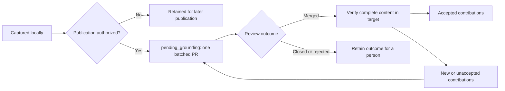

# Two working modes

The mode belongs to the project. Sessions do not choose different storage rules or create
a new graph whenever they start.

| | Simple | Advanced (experimental) |
|---|---|---|
| Knowledge context | One shared project graph | A graph for the branch's code world, with shared project contributions |
| Concurrent proposals | Named hypotheses beside the shared graph | Named hypotheses within the branch context |
| Session ownership | Several sessions can work on one proposal | Several sessions can work on one proposal in the same context |
| Default | Projects without Git; existing registered shared records | New Git projects, including a single checkout |
| Review | Reconcile proposals against the shared graph | Reconcile branch changes and pending project contributions |

Checkout count is not a mode. Simple can be explicitly configured for a Git project with
an external shared record; all sessions then use that same record. Switching modes never
silently copies or removes records. Different branch records, unresolved hypotheses or
unsettled publication obligations must be reconciled first. Original record bytes and
the previous policy are retained as rollback evidence.

## Choose a mode, then connect the Board

**Advanced is experimental.** Independent entries can collide in `GROUNDING.yaml` when
parallel PRs merge; resolving a record conflict can lead to another CI run. The readable
record and existing history formats remain unchanged. The problem and alternatives remain
an [open design question](advanced-mode-merging.md).

The first meaningful user session offers **Simple (recommended)** or **Advanced
(experimental)** with the existing README illustration. `kpop board` reports the mode,
whether it was explicitly selected, and a suggested external Simple record path. Advanced
remains the low-level fallback for an unconfigured Git project; detection does not count
as consent and onboarding never silently switches modes or moves existing records.

Simple uses one shared record outside all checkouts, at a location chosen by the owner.
For a new project, prepare its parent directory and use `config --mode simple --record PATH
--expected-generation N`; no empty record is created. The first useful sourced write creates
it. Existing records, history and pending contributions need reconciliation before changing
mode. A gitignored file inside the primary checkout is not a supported Simple destination.

Advanced keeps the record with each branch and includes **kpopper Board** for shared findings.
The Board can remain local or connect to an exact remote repository and target. Mode selection
alone does not grant publication permission; if that same user choice explicitly included
remote publication, setup reuses it. Choosing Board-local does not choose Simple. The mode
and Board choices are remembered across worktrees and never repeated on every session.

`kpop board` reports local state without contacting a remote. `kpop board inspect --remote
origin` verifies repository access and discovers the actual default target without granting
permission. After the owner chooses shared publication, connect the exact inspected scope:

```sh
kpop board connect --remote origin --repository https://github.com/OWNER/REPO.git \
  --target main --generation N --grant
```

Use the URL, target and generation returned by inspection. Connect verifies access again,
refuses a changed destination or policy, and reads the saved grant back. It reports verified
connection separately from completed publication. An empty Board has no PR yet; the first
shared finding starts one. There is one open knowledge PR per review cycle, titled
`kpopper Board: shared findings`; after acceptance, new findings start the next cycle.
`kpop board local` remembers local-only work and revokes standing publication permission.
The Board choice does not change the project's mode, install a timer or authorize merging.

Pending local reading is shared by worktrees in the same repository. Publishing the review
branch does not automatically import its pending ledger into a separate clone. Permission
is local to the configured repository; a new clone must be connected explicitly.

## Record a finding in its scope

Inspect the project and its current obligations:

```sh
kpop config --json
kpop knowledge status
kpop pending status
```

`knowledge status` includes local routing, conflicts, retained private drafts and cached
publication state. `pending status --verify` checks current incorporation in the configured
target without publishing. Both identify unverified state explicitly.

To change modes, first prepare the intended destination with the reconciled record:

```sh
kpop config --mode simple --record /path/to/shared/GROUNDING.yaml --check
kpop config --mode simple --record /path/to/shared/GROUNDING.yaml
```

The check is read-only. The actual change rechecks its evidence; a new arrival between
the two commands can require reconciliation again. Use `--expected-generation N` when
applying a previously inspected configuration.

Start with the source and sharing permission. A private source or unclear permission goes
into a structured private draft outside publishable Git objects. Declaring an enclosing
contribution shareable cannot override a private source inside it. No publication grant
turns private material into project material.

In Simple, shareable findings extend the shared record. Name a hypothesis for its proposal,
such as `reduce-cache-lifetime`, rather than for the session. Other sessions can contribute
to that hypothesis, while a competing proposal remains visible under its own name.

In Advanced, a shareable finding independent of the feature is captured in
`pending_grounding`. The capture preserves the complete source and dependency closure,
the exact entry bodies and permitted evidence. It succeeds only once the contribution is
durable in the common repository. Capture does not edit every checkout's YAML file.
Feature-dependent knowledge stays with its feature record. Unclear feature applicability
does not become a project-wide claim.

An observed result at an exact unmerged commit is a scoped fact. Preserve its environment
and commit in the entry; do not describe it as a result for current main. An untested
assumption or proposed conclusion stays a hypothesis. Neither a successful check nor a
merge silently rewrites `seen`, raises confidence or establishes truth.

Existing explicit local-record writes retain their file-writing behavior when no routing
fields are supplied. They never become remote project contributions automatically.
Explicit private or unclear sharing declarations take priority on every write path.

For example, this authorized external observation is independent of the current feature:

```sh
kpop add vendor.limit v=25 'from=Approved vendor bulletin, account A row' \
  --scope external --environment 'Vendor API v2, account A' \
  --shareability project --event-id vendor-bulletin-2026-09-14
```

Keep an event ID stable when retrying the same capture. Reusing it with different content
is refused. Use `--evidence-root DIR` to explicitly supply the permitted files referenced
by a contribution; the complete closure must be portable. For private input use
`--shareability private`; an explicitly routed write without sharing permission is kept
as a private draft. `--scope code --commit COMMIT --environment ENVIRONMENT` retains an
exact measured code scope. Feature-only knowledge uses `--scope feature`.

Scope stays in the portable root entry body in every mode. Direct store callers and
explicit imports must supply complete root bodies with that exact `scope`; a manifest
alone cannot make an unscoped target count as accepted. Referenced source bodies are
retained unchanged. Source-only snapshots may keep their parent's explicit schema without
inventing downstream judgments; real missing dependency declarations still fail checks.

## Read what is known here

Ordinary `open`, `pull` and `check`, and checked session views, include relevant pending
project contributions with their scope and state. The current branch still supplies the
code-world context. A pending claim is not silently substituted for a same-ID branch
claim. Different bodies, sources, schemas and hypotheses remain visible as conflicts;
unrelated extra branch entries are allowed.

`kpop consolidate --dry-run` tests the same contributions against the branch record, after
its hypotheses. Each active contribution is laid over the record alone, then all of them
together; the report names IDs two contributions hold differently, what accepting each
would change, and the falsifiers, gaps and moved premises that would follow. The run is red
when accepting one would break something, or when the record cannot read one as it was
written, or would read its own judgments differently beside it. It adopts nothing:
rejecting or withdrawing a contribution with its reason retires it from the next run, and
accepting one stays with the knowledge PR. A frozen run has no pending part.

Use an explicit frozen read for a committed PR or CI artifact. Frozen reads depend on the
selected record and its portable evidence, without another user's private files or a
moving local pending ref. Materializing a contribution into a branch is a separate,
validated operation that copies its required closure and evidence. This allows a feature
PR to carry a contribution without waiting for a separate knowledge PR first.

```sh
kpop --frozen check
kpop knowledge materialize REVISION --out snapshots/vendor-bulletin
kpop --frozen pull vendor.limit snapshots/vendor-bulletin/GROUNDING.yaml
```

Materialization writes a new snapshot directory and refuses an existing destination. Review
the exported record and evidence before including it in a feature's committed record.

## One publication branch, repeated review cycles

`kpop update --file REPORT.json` follows the same project policy. Add explicit
`shareability: "project"` and a `scope` mapping to the report to capture a project-wide
batch in Advanced mode. The result is `project_captured` with a complete pending receipt;
the branch YAML stays unchanged. In Simple, the report updates the shared record and
retains the declared scope. Ordinary unannotated reports keep their local-record behavior.
Private or unclear input, including an original source's permission, retains the whole
report for review and applies none of its operations. Retrying an event returns its
existing receipt. Changing modes after intake requires reviewing the retained report.

Search resolves sources in the selected context. Live pending evidence comes from its
immutable contribution, even if a checkout has a file with the same name. Frozen search
excludes live contributions and private capture caches. Page measurements are bound to
the selected mode and graph version. A focused export and the base page disclose when
pending contribution bodies are not expanded; use `pull` or `search` to inspect them.



Configuration records the exact remote repository, target branch and publication branch.
A standing project permission authorizes managed push and PR creation/update for that
scope. Capture and local reads work without it. Permission is never inferred from a
successful login or an existing Git remote.

For a project whose owner authorizes this scope:

```sh
kpop pending configure --remote team --target trunk --grant
kpop pending publish
```

The first command grants standing push and PR creation/update authority to that exact
destination; it does not publish immediately. Omit `--grant` to retain the destination
without standing permission, then use `pending publish --authorize` for one authorized
attempt. `pending configure --revoke` removes standing permission. `pending pause` pauses
attempts and `pending resume` resumes them subject to existing authority. Terminal actions
name immutable revisions: for example `pending withdraw REVISION --reason "Reason"`.

With permission, capture starts a nonblocking publication attempt. Active session openings
retry with bounded backoff. A stopped host is not a running service; background queues do
not install a schedule or wake a computer.

The publisher keeps one cumulative PR. It checks the remote head before updating it and
stops for an unexpected writer instead of overwriting their work. Network uncertainty
remains unknown until the actual remote outcome is reconciled. A local publisher lock
coordinates worktrees in this repository, not other machines.

After a merge, acceptance is checked against the complete contribution and evidence in
the configured target. This works across squash, rebase and cherry-pick: commit ancestry
alone is insufficient. Newly arriving and unaccepted contributions survive the merge.
The next batch starts from the current target and reuses `pending_grounding`, including
when the provider deleted that branch. The local contribution history remains reachable
throughout these cycles.

| State | Meaning |
|---|---|
| Captured | Durable locally; no remote proposal is implied |
| Proposed | Included in the identified remote review proposal |
| Accepted | Equivalent complete content verified in the configured target |
| Paused | Publication deliberately suspended |
| Needs attention | A conflict, closed/rejected proposal or authority problem needs a decision |
| Unknown | Current remote outcome could not be established |

Closed, rejected, withdrawn and superseded contributions are not silently reopened or
republished. A cached receipt describes its last verified versions; it is not a fresh
assertion about the remote target. Merging follows the repository's existing review and
protection policy.

Publication currently stops with explicit attention for a target whose record is split
across pointer files; it does not publish from a partial graph. Ordinary target comparison
does follow the committed pointer and hypothesis closure. Prepare a reconciled single
publication record before authorizing publication for such a project.

## Existing shared observations

An older `watch --shared-record` configuration keeps its original record. Import is
explicit and non-destructive: review the selected entries, their sources, sharing rights
and portable evidence, then capture them as contributions. The original private record
is preserved. Private absolute paths are not copied into public contribution metadata.
