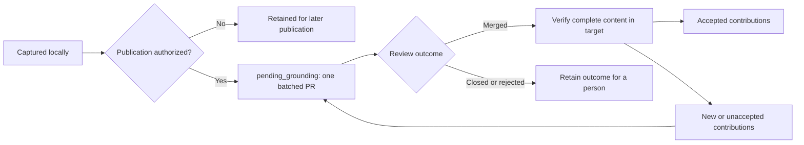

# Two working modes

The mode belongs to the project. Sessions do not choose different storage rules or create
a new graph whenever they start.

| | Simple | Advanced |
|---|---|---|
| Knowledge context | One shared project graph | A graph for the branch's code world, with shared project contributions |
| Concurrent proposals | Named hypotheses beside the shared graph | Named hypotheses within the branch context |
| Session ownership | Several sessions can work on one proposal | Several sessions can work on one proposal in the same context |
| Default | Projects without Git; existing registered shared records | New Git projects, including a single checkout |
| Review | Reconcile proposals against the shared graph | Reconcile branch changes and pending project contributions |

Checkout count is not a mode. Simple can be explicitly configured for a Git project with
an external shared record; all sessions then use that same record. Switching modes never
silently copies or removes records. Different branch records, unresolved hypotheses or
unsettled publication obligations must be reconciled first. Original record bytes and
the previous policy are retained as rollback evidence.

## Record a finding in its scope

Start with the source and sharing permission. A private source or unclear permission goes
into a structured private draft outside publishable Git objects. Declaring an enclosing
contribution shareable cannot override a private source inside it. No publication grant
turns private material into project material.

In Simple, shareable findings extend the shared record. Name a hypothesis for its proposal,
such as `reduce-cache-lifetime`, rather than for the session. Other sessions can contribute
to that hypothesis, while a competing proposal remains visible under its own name.

In Advanced, a shareable finding independent of the feature is captured in
`pending_grounding`. The capture preserves the complete source and dependency closure,
the exact entry bodies and permitted evidence. It succeeds only once the contribution is
durable in the common repository. Capture does not edit every checkout's YAML file.
Feature-dependent knowledge stays with its feature record. Unclear feature applicability
does not become a project-wide claim.

An observed result at an exact unmerged commit is a scoped fact. Preserve its environment
and commit in the entry; do not describe it as a result for current main. An untested
assumption or proposed conclusion stays a hypothesis. Neither a successful check nor a
merge silently rewrites `seen`, raises confidence or establishes truth.

Existing explicit local-record writes retain their file-writing behavior when no routing
fields are supplied. They never become remote project contributions automatically.
Explicit private or unclear sharing declarations take priority on every write path.

## Read what is known here

Ordinary `open`, `pull` and `check`, and checked session views, include relevant pending
project contributions with their scope and state. The current branch still supplies the
code-world context. A pending claim is not silently substituted for a same-ID branch
claim. Different bodies, sources, schemas and hypotheses remain visible as conflicts;
unrelated extra branch entries are allowed.

Use an explicit frozen read for a committed PR or CI artifact. Frozen reads depend on the
selected record and its portable evidence, without another user's private files or a
moving local pending ref. Materializing a contribution into a branch is a separate,
validated operation that copies its required closure and evidence. This allows a feature
PR to carry a contribution without waiting for a separate knowledge PR first.

## One publication branch, repeated review cycles

Configuration records the exact remote repository, target branch and publication branch.
A standing project permission authorizes managed push and PR creation/update for that
scope. Capture and local reads work without it. Permission is never inferred from a
successful login or an existing Git remote.

With permission, capture starts a nonblocking publication attempt. Active session openings
retry with bounded backoff. A stopped host is not a running service; background queues do
not install a schedule or wake a computer.

The publisher keeps one cumulative PR. It checks the remote head before updating it and
stops for an unexpected writer instead of overwriting their work. Network uncertainty
remains unknown until the actual remote outcome is reconciled. A local publisher lock
coordinates worktrees in this repository, not other machines.

After a merge, acceptance is checked against the complete contribution and evidence in
the configured target. This works across squash, rebase and cherry-pick: commit ancestry
alone is insufficient. Newly arriving and unaccepted contributions survive the merge.
The next batch starts from the current target and reuses `pending_grounding`, including
when the provider deleted that branch. The local contribution history remains reachable
throughout these cycles.

| State | Meaning |
|---|---|
| Captured | Durable locally; no remote proposal is implied |
| Proposed | Included in the identified remote review proposal |
| Accepted | Equivalent complete content verified in the configured target |
| Paused | Publication deliberately suspended |
| Needs attention | A conflict, closed/rejected proposal or authority problem needs a decision |
| Unknown | Current remote outcome could not be established |

Closed, rejected, withdrawn and superseded contributions are not silently reopened or
republished. A cached receipt describes its last verified versions; it is not a fresh
assertion about the remote target. Merging follows the repository's existing review and
protection policy.

## Existing shared observations

An older `watch --shared-record` configuration keeps its original record. Import is
explicit and non-destructive: review the selected entries, their sources, sharing rights
and portable evidence, then capture them as contributions. The original private record
is preserved. Private absolute paths are not copied into public contribution metadata.
