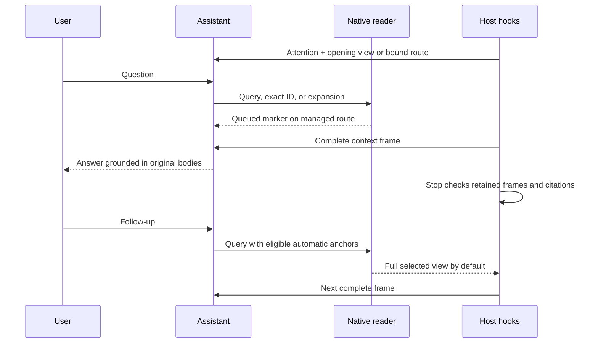

# A conversation from opening to the next session

This walkthrough describes the Codex managed route. The same record can be read
with ordinary CLI commands; see the [runnable shipping-policy example](../examples/context-conversation/README.md).
Commands are illustrative where they contain `REV` or `BINDING`: use the exact
values issued by the current startup route. Do not manufacture a binding.

The example record says standard delivery takes five working days, local express
delivery takes two, and dispatch does not happen on weekends. It does not contain
an actual dispatch receipt. Every example is fictional.



## 1. Opening the project

**User:** “What should I know before handling delivery questions?”

SessionStart captures the record and its revision. Attention items identify
pending or changed reasoning that deserves review. A small graph can arrive
inline; a larger opening supplies `KPOPPER_CANONICAL_VIEW_ROUTE` with
`complete_graph_in_hook=false`. The agent reads that route before relying on
unseen bodies.

An overview might show a `delivery` group and its count. This establishes a route,
not the contents of every policy. The model must read the relevant bodies before
claiming “express takes two days.” A missing record retains the ordinary
onboarding behavior; no fictional knowledge is created.

## 2. Asking the first question

**User:** “How long does standard delivery take?”

The agent adds `--query "standard delivery"` to the issued view command. Selection
searches the captured graph and follows declared source/dependency relations
within the requested token and byte budgets. It returns the exact
`policy.standard_days` body, the relevant source and a folded view of the remainder.
There is no fixed eight-entry or shallow dependency cutoff.

**Answer:** “The policy says five working days for standard delivery
(`policy.standard_days`, delivery policy §1).”

This is a statement about the recorded policy. It is not proof that an individual
order will arrive on a particular date. Search is lexical; another source-language
term may help if the query matches poorly.

## 3. What happens between the command and the answer

A managed command may print only `KPOPPER_CONTEXT_QUEUED`. The PostToolUse hook
adds the complete context frame. The agent answers from that frame, never from
the marker. If the frame is absent, it repeats the same command using
`--view-transport stdout`, preserving its selection and budgets.

The Stop hook later checks retained typed developer messages and answer citations.
It does not ask the model to acknowledge the packet, create a second assistant
turn or make an API call. A saved file, a command's full stdout and the portion
the model actually received can differ; the distinction matters for future reuse.

## 4. A short follow-up

**User:** “And express?”

The managed reader can infer an anchor from the previous answer's original ID,
provided the complete body frame is still retained. The last two completed answers
are eligible. This gives the short query useful context while still searching
the entire graph. It can discover `policy.express_days` even though that ID was
not cited before.

**Answer:** “Express is two working days in the local service region; the policy
does not offer it outside that region (`policy.express_days`,
`policy.express_region`).”

Anchors are ranking hints. Use `--anchor policy.standard_days` for an explicit
hint, `--id policy.standard_days` for an exact reread, or `--no-auto-anchors` for
an independent query. An invalid explicit anchor is reported rather than ignored.

## 5. A new topic and an unknown fact

**User:** “Can I claim the parcel was dispatched on Saturday?”

Global discovery still runs, so previous express anchors do not confine the read.
The weekend policy says no weekend dispatch. The record also lacks an actual
dispatch receipt. The correct response separates policy from evidence of action:

**Answer:** “The policy excludes weekend dispatch (`policy.weekend_dispatch`).
There is no dispatch receipt in this example record, so it does not establish
when this parcel left.”

A successful read cannot authorize a refund, send a customer message or mark an
order shipped. Those actions require the user's task authority and appropriate
operational evidence.

## 6. Asking for everything in a topic

**User:** “Show me all the delivery rules and their sources.”

The agent uses a group handle issued by the current view. The operations differ:

| Operation | What it provides |
|---|---|
| `--expand members:group:/…` | Exact membership IDs; no body-read claim |
| `--expand group:/…` | Requested member bodies, if they fit |
| `--expand children:HASH:group:/…` | Immediate navigation children using an issued revision-bound handle |
| `--id policy.express_days` | One original body |
| `session read --ref 'node:policy.express_days#/body/v'` | One exact original field |

Repeat previous expansions to keep them in the requested view. If complete
evidence exceeds the allowance, the reader refuses visibly. Narrow the request
or read exact fields. It does not truncate a rule until it appears to fit.

## 7. Recording a changed policy

**User:** “The revised policy now says seven working days for standard delivery.”

First read the revised source and its location. With authorization to record it,
update the existing ID through the normal writer. In a disposable copy of the
example this can be demonstrated with:

```sh
kpop set policy.standard_days 7 --as-of 2026-09-29 \
  --why "Fictional revised delivery policy, section 1"
kpop affects policy.standard_days
kpop check
```

The update and its reach are distinct from approving dependent judgments.
The previous captured revision is now stale. In a managed Codex conversation,
the next user prompt checks the inputs behind the last acknowledged view. If
they changed, it delivers a complete current view of previously received IDs
and their declared support, with a `KPOPPER_SOURCE_REFRESH` notice. This does not
require the model to request another read. Unchanged inputs add no context and
do not rebuild an assessment.

The refresh retains the original read configuration and scope. Deleted IDs are
named. A missing record, changed scope, read failure, or complete bodies that
exceed the budget produces explicit unavailable context; old evidence must not
be used as current. Delivery is acknowledged only after the complete frame is
present in the retained conversation. Stop remains passive.

For standalone commands or an unavailable refresh, reopen and use the new revision.
An old revision is refused, not silently redirected. A fresh full checkpoint is
required even when experimental delta delivery is enabled.

**Answer:** “The recorded standard-delivery policy is now seven working days.
Any promise based on the old five-day value needs review.”

## 8. Correction, disagreement and review

**User:** “Five days was a transcription error, not a policy change.”

That calls for the normal correction/review workflow, rather than inventing a
new source event. `correct` applies only where its existing edit rules permit;
landed or disputed knowledge can require a hypothesis and deliberate consolidation.
Canonical views preserve the source bodies and uncertainty; navigation descriptions
cannot settle the disagreement. See the [writer reference](reference.md) and
[knowledge method](../skills/kpopper/SKILL.md).

## 9. Compaction, rollback and interruption

**User:** “Continue where we left off” after compaction, a rollback or an interrupted read.

The system does not infer retained context from an old transcript line. Startup,
resume, context reset and unsupported history invalidate reuse; interrupted or
abandoned pending reads do not become accepted bases. The next usable read sends
a full checkpoint. A subsequent complete checkpoint can establish a new base.

The durable record remains unchanged by this reset. An answer's citations can
become automatic anchors only when their corresponding body frames are again
eligible in the current context. This is why delivery checks are product behavior,
not merely evaluation instrumentation.

## 10. Trying delta explicitly

An operator can set `KPOPPER_VIEW_DELTA=1` for an experimental session. If the
next target overlaps a retained compatible view, the runtime attempts an exact
delta. It uses the delta only when both byte and reference-token counts decrease;
otherwise it sends the full frame. Neither selection nor the evidence budget grows.

For example, a follow-up can retain the standard-delivery body while adding the
express policy. The base and target have exact revision/body identities. If the
base disappeared or the policy changed, the optimization is unavailable. Default
sessions always receive the complete selected view. Total conversation savings
must be measured separately from packet size.

## 11. Returning in a new session

**User:** “Remind me what changed in delivery.”

The new session opens the current record and its attention items. The seven-day
fact and its history survive because they were written to the record. Previous
private continuation state is not a substitute for that durable knowledge.
The agent reads the current bodies and reviews affected judgments as needed.
Reopening alone does not approve them or refresh their recorded snapshots.

## Maintainer reference

The managed command carries an opaque `--context-session` binding for the session,
workspace, cache and context epoch. Environment variables alone cannot turn a
standalone command into managed delivery. CLI/public-service calls keep returning
full views. Parallel or delegated work must preserve its own session identity.

The canonical schema records original IDs, typed bodies, relation kinds, revision
and scope. Group partitions and membership digests account for unread scope.
Descriptions are query-blind derived navigation, validated against their exact
basis; they cannot replace source evidence. Codex's tagged encoding changes the
wire representation, not the semantic packet.

Private continuation state is bounded to 2 MiB, 16 pending reads, 32 frames and an
eight-frame chain. Atomic writes and locks protect state. Capacity limits, damaged
state and ambiguous history produce a full fallback or recoverable refusal. The
host integration is tested, not formally proved end to end. For budgets, settings,
fallback precedence and detailed schemas, see [canonical views](canonical-view.md)
and [checked sessions](checked-sessions.md).
