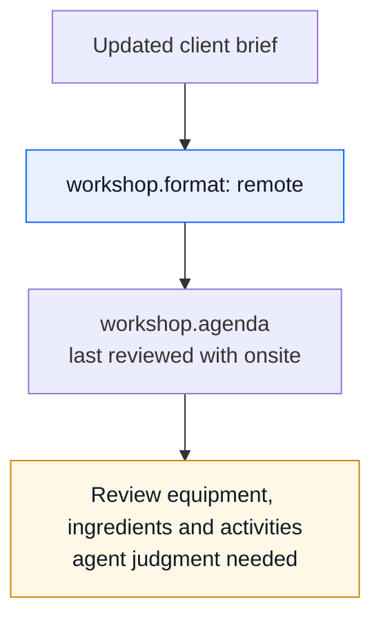

# New format. Old assumptions.

A cooking workshop was planned onsite, using the venue's shared kitchen, equipment
and ingredients. A later client brief moves it entirely online. The plan still
assumes participants can use the same kitchen.

This is a fictional project-planning example for Claude Cowork or another agent
working with documents. It illustrates a changed premise that needs judgment,
rather than a condition that mechanically proves the plan wrong.

<p align="center">
  <a href="../../assets/stories/cowork-workshop.png">
    <picture>
      <source media="(max-width: 600px)" srcset="../../assets/stories/cowork-workshop-mobile.png">
      
    </picture>
  </a>
</p>

| State | Current `workshop.format` | The agenda's `seen` | Result |
|---|---|---|---|
| Before | `onsite` | `onsite` | No moved premise |
| After the update is recorded | `remote` | `onsite` | **MOVED**, exit zero |



<details>
<summary>The complete after record</summary>

```yaml
meta:
  updated: 2025-01-02
  scope: Fictional cooking-workshop plan after the client changes the format; the saved plan awaits review.
sources:
  s.original_brief:
    name: Original workshop brief
    file: ../sources/original-brief.md
    read: '2025-01-01'
  s.updated_brief:
    name: "Updated client brief: online workshop"
    file: "../sources/updated-brief.md"
    read: "2025-01-02"
known:
  workshop.format:
    v: remote
    from: s.updated_brief
    at: "Participants join online from home"
    of: '2025-01-02'
judgments:
  workshop.agenda:
    rests_on: [workshop.format]
    verdict: "Use the shared-kitchen agenda and provide ingredients at the venue."
    because: "The onsite brief provides one kitchen, equipment and ingredients for participants to
              use together."
    reopened_by: "The workshop format or access to the kitchen changes; review the activities,
                  equipment and ingredients participants need."
    seen: {workshop.format: onsite}
```

</details>

## Read and run

- [Original brief](sources/original-brief.md): onsite, with equipment and ingredients supplied.
- [Updated brief](sources/updated-brief.md): participants join online from home; their
  equipment and ingredients are not specified.
- [Before](before/GROUNDING.yaml): the saved plan and the premise it was reviewed against.
- [After](after/GROUNDING.yaml): the new format is recorded with the updated source;
  the old plan and its review snapshot remain unchanged.

From the repository root:

```sh
python3 scripts/kpopper check examples/cowork-workshop/before/GROUNDING.yaml
python3 scripts/kpopper check examples/cowork-workshop/after/GROUNDING.yaml
python3 scripts/kpopper pull workshop.agenda examples/cowork-workshop/after/GROUNDING.yaml
```

Both checks exit zero. The second reports `MOVED workshop.agenda`: `workshop.format`
changed from `onsite` to `remote`. Pulling the plan exposes its reason and its prose
`reopened_by` condition. No model is called, and the commands do not read the briefs
to interpret them or rewrite the plan.

## Continue with an agent

Give the agent access to this directory and ask:

> Continue planning the cooking workshop from the after record. Read both briefs.
> What needs reconsidering, what can we still rely on, and what should we ask the
> client or participants before sending the agenda? Do not change files.

A supported response should revisit equipment, ingredients and activities. It
should distinguish what the original venue supplied from what participants have
at home, which the new brief leaves unknown. It should not assume equipment is
missing, declare the workshop impossible or present an adaptation as already approved.

The changed format becomes visible here because an agent has read and recorded the
update. The prose review condition does not schedule itself. An active session can
respond when it reads the notice; scheduled followups require configuration. See
[followups](../../skills/kpopper/FOLLOWUPS.md).

This is an inspectable illustration with a published expected response, not a blind
agent evaluation. Compare the [two merge examples](../merge-assumptions/README.md),
where measured inputs cross executable conditions and the combined check fails.
