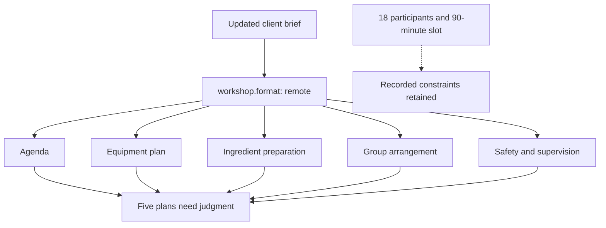

<a id="new-format-old-assumptions"></a>

# Outdated planning assumptions: one update, several plans to revisit

A cooking workshop was planned onsite around a shared kitchen, six workstations
and ingredients supplied at the venue. A later client brief moves it online.
The saved plan now spans an agenda, equipment, ingredient preparation, groups
and supervision, with the source of each assumption attached.

[](../../assets/stories/cowork-workshop.png)

[Phone layout](../../assets/stories/cowork-workshop-mobile.png)

## Inside the planning record

[](../../assets/stories/cowork-workshop-record.png)

[Phone layout](../../assets/stories/cowork-workshop-record-mobile.png) · [Before record](before/GROUNDING.yaml) · [After record](after/GROUNDING.yaml)

The current format is `remote`. The five saved plans were reviewed with `onsite`.
The checker reports five `MOVED` notices and exits zero. It does not decide whether
the recipe, group arrangement or activities can work online.

| Planning pass | What it contributes | What the later update changes |
|---|---|---|
| [Original brief](sources/original-brief.md) | Shared kitchen, equipment and ingredients at the venue. | The working format changes to remote. |
| [Session plan](sources/session-plan.md) | 18 participants, 90 minutes, recipe and six groups of three. | The group arrangement and agenda need review; client constraints retain their original source. |
| [Logistics and safety](sources/logistics-plan.md) | Six workstations, ingredient preparation and direct instructor visibility. | Equipment access, distribution and supervision need review. |
| [Updated brief](sources/updated-brief.md) | Participants join online from home. | Home equipment and ingredients remain unspecified. |

## The change reaches the plan



The retained venue facts describe the original venue. They do not become facts
about participants' homes. The record's open questions concern home equipment,
ingredient distribution, dietary restrictions and remote activities.

Selected entries from the after record:

```yaml
known:
  workshop.format:
    v: remote
    from: s.updated_brief
    at: Participants join online from home
  workshop.participants:
    v: 18
    from: s.session_plan
    at: Client constraints
  workshop.duration_minutes:
    v: 90
    from: s.session_plan
    at: Client constraints
  venue.workstations:
    v: 6
    from: s.logistics_plan
    at: Venue provision
judgments:
  workshop.agenda:
    rests_on:
    - workshop.format
    - venue.shared_kitchen
    - workshop.duration_minutes
    - workshop.recipe
    verdict: Use the shared-kitchen agenda and provide ingredients at the venue.
    reopened_by: The format or access to the shared kitchen changes; review activities, equipment
      and preparation.
    seen:
      workshop.format: onsite
      venue.shared_kitchen: true
      workshop.duration_minutes: 90
      workshop.recipe: Fresh pasta with tomato sauce.
  workshop.equipment_plan:
    rests_on:
    - workshop.format
    - venue.equipment_supplied
    - venue.workstations
    verdict: Plan equipment around the six venue workstations.
    reopened_by: The format, supplied equipment or access to the workstations changes.
    seen:
      workshop.format: onsite
      venue.equipment_supplied: true
      venue.workstations: 6
  workshop.ingredient_plan:
    rests_on:
    - workshop.format
    - venue.ingredients_supplied
    - workshop.participants
    verdict: Prepare ingredient portions at the venue for the 18 participants.
    reopened_by: The format, ingredient provision or participant count changes; review purchasing,
      portions and distribution.
    seen:
      workshop.format: onsite
      venue.ingredients_supplied: true
      workshop.participants: 18
```

## Read and run

```sh
python3 scripts/kpopper check examples/cowork-workshop/before/GROUNDING.yaml
python3 scripts/kpopper check examples/cowork-workshop/after/GROUNDING.yaml
python3 scripts/kpopper affects workshop.format examples/cowork-workshop/after/GROUNDING.yaml
```

Both checks exit zero. The after check reports `MOVED` for `workshop.agenda`,
`workshop.equipment_plan`, `workshop.ingredient_plan`, `workshop.group_plan` and
`workshop.safety_plan`. Their earlier review snapshots are preserved.
No model is called and the commands do not interpret the briefs or rewrite the plans.

## Continue with an agent

> Continue planning from the after record. Read the original brief, planning notes
> and updated brief. Which decisions need reconsidering? What remains supported,
> and what must we ask before sending participants an agenda? Do not change files.

A supported response should distinguish the venue's provision from unknown home
setups. It should not assume equipment is missing, declare the workshop impossible
or present an adaptation as approved. These are worked planning materials with a
published expected response, not a blind agent evaluation.

The update becomes visible after an agent reads and records it. Scheduled review
requires configuration; see [followups](../../skills/kpopper/FOLLOWUPS.md).
