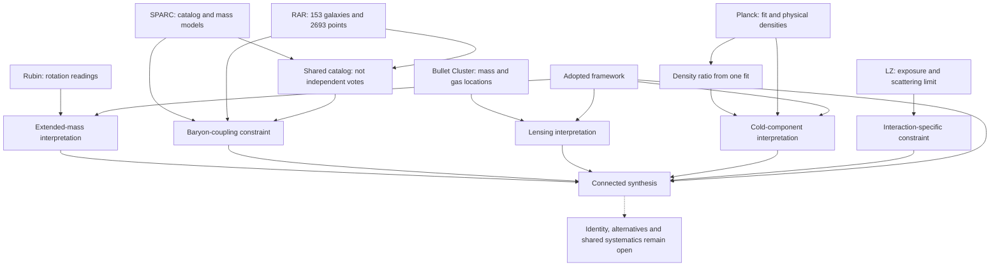

# Dark matter across studies: a connected research record

The same record connects galaxy rotation, a reusable galaxy catalog, the radial
acceleration relation, cluster lensing, a cosmological fit and a laboratory search.
Six papers contribute 36 source readings. Two declared scope readings, one exact
calculation, seven linked judgments and five open questions keep the interpretation
inspectable as the work grows.

The original rotation–lensing–CMB illustration introduces the shared-record workflow:

<p align="center">
  <a href="../../assets/stories/dark-matter-intro.png">
    <picture>
      <source media="(max-width: 600px)" srcset="../../assets/stories/dark-matter-intro-mobile.png">
      
    </picture>
  </a>
</p>

[Phone layout](../../assets/stories/dark-matter-intro-mobile.png)

The expanded six-paper view adds the surrounding constraints:

<p align="center">
  <a href="../../assets/stories/dark-matter.png">
    <picture>
      <source media="(max-width: 600px)" srcset="../../assets/stories/dark-matter-mobile.png">
      
    </picture>
  </a>
</p>

[Phone layout](../../assets/stories/dark-matter-mobile.png)

## Inside the working record

<p align="center">
  <a href="../../assets/stories/dark-matter-record.png">
    <picture>
      <source media="(max-width: 600px)" srcset="../../assets/stories/dark-matter-record-mobile.png">
      
    </picture>
  </a>
</p>

[Phone layout](../../assets/stories/dark-matter-record-mobile.png) · [Complete GROUNDING.yaml](GROUNDING.yaml) · [Prepared inputs](inputs.yaml)

The overview and close-up are drawn from this record. Their mini-map represents
its actual YAML lines; the visible excerpt selects the connections worth reading.
The astronomical drawings are schematics, not reproduced data plots. This is a
worked literature example with source readings and authored judgments, not a claim
that live agents independently performed a research study.

## The six sources

| Source | Readings retained | Exact locations and limits |
|---|---|---|
| [Rubin, Ford & Thonnard (1980)](https://articles.adsabs.harvard.edu/pdf/1980ApJ...238..471R) | 21 Sc galaxies; major-axis spectra; non-falling outer curves; the authors' extended-mass inference. | p. 471, abstract. The 4–122 kpc radius range uses the paper's H0 = 50 km/s/Mpc. Keep measured velocities separate from mass inference. |
| [SPARC — Lelli, McGaugh & Schombert (2016), v1](https://arxiv.org/abs/1606.09251v1) | 175 disk galaxies; 3.6-micrometre photometry; HI/H-alpha rotation curves; mass-to-light assumptions. | Abstract; the assumed disk M/L = 0.5 is a modeling choice, not an observed universal constant. |
| [Radial acceleration relation — McGaugh, Lelli & Schombert (2016), v1](https://arxiv.org/abs/1609.05917v1) | 153 selected galaxies; 2,693 points; quality cuts; the baryon-acceleration relation; 0.13 dex observed rms scatter. | p. 1, Galaxy Sample; p. 2, baryonic potentials and mass-to-light conversion; pp. 4–5, Results/Discussion. It reuses SPARC and is not an independent second catalog. Observed scatter is not intrinsic scatter. |
| [Clowe et al. (2006), v1](https://arxiv.org/abs/astro-ph/0608407v1) | Bullet Cluster at z = 0.296; weak-lensing inputs; mass peaks near galaxies rather than dominant hot gas; reported 8-sigma offset. | Abstract. The source's strong “proof” language is an author interpretation; this record retains the adopted lensing frame. |
| [Planck 2018 VI, v4](https://arxiv.org/abs/1807.06209v4) | Baseline CMB fit; physical cold and baryon densities; inferred H0 and matter density; the retained lensing-amplitude tension. | Abstract, rounded combined-analysis values and 68% intervals. The ratio uses those same rounded central values, not a different table's precision or a propagated uncertainty. |
| [LZ first search, v4](https://arxiv.org/abs/2207.03764v4) | 60 live days; 5.5-tonne fiducial mass; background-only consistency; strongest reported spin-independent limit of 9.2 × 10^-48 cm² at 36 GeV/c², 90% CL. | Abstract, version 4; p. 7, interpretation. This is the selected first-search result, not a current survey of later LZ limits or every dark-matter candidate. |

All locations, source versions, values and qualifications are in the record.
Numerical readings are transcribed; descriptive readings are marked as paraphrases.
The source PDFs were read for the locations above. Their plots are not redrawn as
new measurements in the illustration.

The explicit [SPARC v1 PDF](https://arxiv.org/pdf/1606.09251v1) carries both the
`arXiv:1606.09251v1` stamp dated 29 June 2016 and a “Draft version September 4, 2024”
header. The source identity here follows the version-stamped arXiv record; the
retained abstract readings were checked against that exact v1 download.

## Synthesis scope

The review adopts standard gravitational mass inference and base Lambda-CDM for
the CMB interpretation. Those are declared choices in `research.framework`, not
observations from a paper. The selected literature does not form a combined
likelihood, a complete review or a vote among papers.

The graph follows three distinct kinds of connection:

1. **Source → reading.** A count, method, parameter or observation has a paper and location.
2. **Reading → interpretation.** Intermediate judgments retain the gravitational,
   stellar mass-to-light and cosmological assumptions they use.
3. **Interpretation → synthesis.** The final account includes constraints and open
   alternatives, not just supportive observations.

SPARC and the radial-acceleration paper share an evidence base. Planck's two density
parameters come from the same fit. LZ's background-only result restricts particular
interactions; it does not establish the identity or nonexistence of all dark matter.
These relationships are part of the argument, rather than qualifications detached
from it.



## Read an excerpt

These are selected entries; their remaining dependencies and tool-filled review
snapshots are in the complete record.

```yaml
known:
  sparc.sample_size:
    v: 175
    from: paper.sparc
    at: Abstract
    unit: galaxies
  rar.sample_size:
    v: 153
    from: paper.rar
    at: p. 1, Data / Galaxy Sample
    unit: galaxies
  rar.points:
    v: 2693
    from: paper.rar
    at: 'p. 1, Galaxy Sample: velocity-precision cut'
    unit: points
  cmb.omega_c_h2:
    v: 0.12
    from: paper.cmb
    at: Abstract, combined analysis
    uncertainty: 0.001
    confidence: 68%
  cmb.omega_b_h2:
    v: 0.0224
    from: paper.cmb
    at: Abstract, combined analysis
    uncertainty: 0.0001
    confidence: 68%
  lz.si_limit:
    v: 9.2e-48
    from: paper.lz
    at: 'Abstract, version 4: limit at 36 GeV/c^2'
    unit: cm^2
    confidence: 90%
  lz.mass_at_limit:
    v: 36
    from: paper.lz
    at: Abstract, version 4
    unit: GeV/c^2
  cmb.dark_to_baryon_density:
    rule:
      expr: cmb.omega_c_h2 / cmb.omega_b_h2
judgments:
  evidence.shared_catalog:
    rests_on:
    - sparc.sample_size
    - sparc.inputs
    - rar.catalog
    - rar.selection
    verdict: Treat SPARC and the RAR analysis as related evidence, not two independent observational
      votes.
    reopened_by: A different catalog, sample selection or independently calibrated replication changes
      the dependence between these findings.
  synthesis.dark_matter:
    rests_on:
    - galaxy.extended_mass
    - galaxy.baryon_coupling
    - cluster.mass_location
    - cosmology.cold_component
    - particle.search_scope
    - research.framework
    - research.selection
    verdict: Under the stated models, the selected evidence supports a dark-matter account across
      scales, while baryonic regularities and direct-search limits constrain its explanation.
    reopened_by: A source finding or shared assumption is revised, or a worked alternative jointly
      addresses the galaxy, cluster, cosmological and particle-search constraints. Reassess the
      affected paths and the synthesis.
```

The calculated central-value ratio is exactly `75/14`, approximately `5.36`.
It is not an independent observation or an uncertainty estimate. A calculated
premise's review snapshot retains both its exact result and the rule that produced it.

A changed premise can reopen an interpretation even when every source quotation
is faithful. The open questions therefore include physical identity, a worked
comparison of alternatives, shared systematics, the acceleration relation, and
later direct-search results.

## Read the record with the CLI

For an overview use `kpop open`; for consistency and declared conditions use
`kpop check`. `kpop pull` retrieves a subject and its grounds, while `kpop affects`
traces which judgments depend on it. The `ground` skill guides those operations.

[The captured CLI walkthrough](cli-examples.md) shows actual `check`, `open`,
`pull` and `affects` calls on this file, including the exact density calculation
and the four judgments reached by `research.framework`.

## Run the shared-record example

From the repository root, with Python dependencies and the local reasoning core
ready for the density calculation:

```sh
python3 scripts/kpopper session status
python3 examples/dark-matter/run.py
```

This replay deliberately seeds a legacy-format YAML record, matching the checked-in
example and its CLI output. It does not exercise the 1.7 default for newly created
history-backed records. If the calculation core is not ready, follow the
[legacy expression setup](../../skills/kpopper/EXPRESSIONS.md#reader-compatibility).
The script replays [inputs.yaml](inputs.yaml) using three overlapping CLI writers,
then records the calculation and linked judgments in dependency order. It verifies
that all readings survive, every judgment snapshots its exact premises, and the
cosmology judgment retains the correct rational result and formula.

It makes no model calls and fetches no papers. Its prepared reading passes are
reproducible inputs, not simulated evidence of live agent performance. A writer
retries only the explicit pre-write conflict caused by a concurrent commit;
semantic refusals remain failures.

The second part proposes a different framework in a separate hypothesis: stop
adopting base Lambda-CDM for the CMB result. It reports affected interpretations
and `synthesis.dark_matter` as `MOVED`. The base record and paper readings remain
unchanged. This asks for review; it does not refute dark matter.

To keep a demonstration in a new directory:

```sh
python3 examples/dark-matter/run.py --output /tmp/kpopper-dark-matter-demo
python3 scripts/kpopper pull synthesis.dark_matter /tmp/kpopper-dark-matter-demo/GROUNDING.yaml
python3 scripts/kpopper affects research.framework /tmp/kpopper-dark-matter-demo/GROUNDING.yaml
```

## Continue the research

For a runnable continuation using the current reasoning and history interfaces,
see [The collection changes; the answer stays five](advanced/README.md).
It selects the five astronomical papers with an explicit finite query, adds the
existing LZ paper as a nonmatch, and verifies that the numeric result stays equal
while the computational basis changes. A retained Snapshot recovers the previous
scope and result; unrecorded particle identities remain unknown. This separate
`core/v1` fixture leaves the legacy worked record and its walkthrough intact.

Give research agents the same accessible record and the source links. Ask each to
read the relevant existing entries before adding, keep source versions and exact
locations, separate observation from interpretation, and identify shared inputs.
A synthesis pass should test a counterargument even if every extracted reading is
correct. New evidence matters after it is read, recorded and connected to the
argument; prose review conditions do not automatically fetch or judge new papers.

Agents in separate Git worktrees retain separate records unless a shared external
record is configured. Concurrent writes preserve bytes; they do not resolve a
scientific disagreement. See [consolidation](../../skills/consolidate/SKILL.md).
