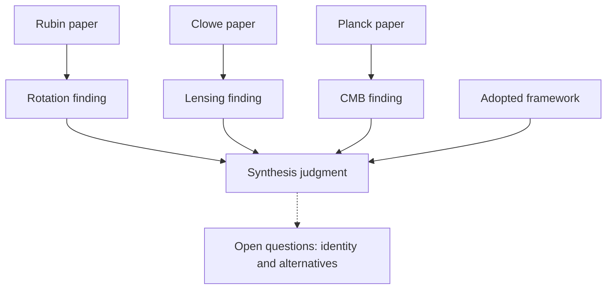

# Dark matter across studies (evidence synthesis)

Three paper-reading agents can contribute to one shared record. A synthesis agent
can then follow their evidence, connect findings and state what would reopen the
argument. The result is an inspectable account of the evidence that another session
can extend.

<p align="center">
  <a href="../../assets/stories/dark-matter.png">
    <picture>
      <source media="(max-width: 600px)" srcset="../../assets/stories/dark-matter-mobile.png">
      
    </picture>
  </a>
</p>

The astronomical drawings are schematics, not plots of the papers' data.

## The three readings

This teaching example uses selected findings from three real papers. These are
**paraphrases of their abstracts**, with precise source locators in the
[record](GROUNDING.yaml). They are a starting point for a literature review, not
a survey of all evidence or competing theories.

| Research task | Primary source | Finding retained | What interpretation must preserve |
|---|---|---|---|
| Galaxy rotation | [Rubin, Ford & Thonnard (1980)](https://articles.adsabs.harvard.edu/pdf/1980ApJ...238..471R), p. 471 | Non-falling outer rotation curves in the sampled Sc galaxies. | A particular sample and measured radial range; inferring mass requires a dynamical model. |
| Gravitational lensing | [Clowe et al. (2006)](https://arxiv.org/abs/astro-ph/0608407v1), abstract | The reconstructed mass peaks are offset from the hot gas, near the galaxies. | A lensing reconstruction in one merging cluster; keep the observation separate from the authors' broader interpretation. |
| Cosmic microwave background | [Planck 2018 VI (2020; corrected 2021)](https://arxiv.org/abs/1807.06209v4), abstract | CMB observations fit the baseline cosmology containing cold dark matter. | A result within base ΛCDM, with its fitted parameters and assumptions; not a direct particle detection. |

## Synthesis scope

The example adopts standard gravitational mass inference for the astronomical
readings and base ΛCDM for the Planck result. **This is the review's declared
framework**, recorded as `research.framework`; it is not an observation from a paper.

Our synthesis is that, within this frame, these different observations support a
dark-matter account across scales. That is a judgment made from the selected
readings. The graph does not calculate its truth or assign a combined probability.
Different observables are not automatically statistically independent evidence,
and three agents agreeing would not make three independent scientific results.

The open questions retain the work still to do: physical candidates and alternative
models that address the same observations. This selection does not establish the
identity of dark matter or evaluate those alternatives.



Arrows into the synthesis represent declared dependencies. They are not proofs.
The dashed line is a research question prompted by the synthesis, not a premise.

The synthesis entry, with `seen` filled by `kpop add` in the full record:

```yaml
synthesis.dark_matter:
  name: A dark-matter account across scales
  rests_on: [rotation.finding, lensing.finding, cmb.finding, research.framework]
  verdict: Under the stated models, these findings support a dark-matter account across scales.
  reopened_by: >-
    A finding or its model assumptions are revised, or a worked alternative
    accounts for these observations together. Reassess the synthesis and its scope.
```

`reopened_by` tells a researcher or agent what merits judgment. It is not a
machine-evaluated scientific falsifier. Recorded premise changes can yield `MOVED`;
new papers matter only after someone reads them, records the relevant findings and
connects them to the argument.

## Run the shared-record example

From the repository root, with kpopper's Python dependencies installed:

```sh
python3 examples/dark-matter/run.py
```

The script replays the **prepared contributions** in [inputs.yaml](inputs.yaml)
through three concurrent CLI writer processes. It then adds the prepared synthesis
through the same writer, which fills its review snapshot. It checks that all three
findings survived and that every declared premise is present in `seen`.

This is a runnable demonstration of sharing and retrieving the record. It makes
no model calls, accesses no network and does not measure agents' ability to read
papers or produce a correct scientific synthesis. Concurrent mutation uses the
supported POSIX file lock on macOS/Linux. Each write takes its turn; research tasks
can run concurrently.

The second part proposes **a different review framework as a hypothesis in a
separate copy**: what if the review stops adopting base ΛCDM? The write reports the
synthesis as `MOVED` under that hypothesis. The base record, its conclusion and the
three paper readings stay intact. A researcher must reconsider whether the argument
survives that different scope; the check has not refuted dark matter. The proposal
is not folded, and an ordinary `check` still reads the unchanged base.

To retain a fresh demonstration directory for inspection:

```sh
python3 examples/dark-matter/run.py --output /tmp/kpopper-dark-matter-demo
python3 scripts/kpopper pull synthesis.dark_matter /tmp/kpopper-dark-matter-demo/GROUNDING.yaml
python3 scripts/kpopper affects cmb.finding /tmp/kpopper-dark-matter-demo/GROUNDING.yaml
```

Choose a path that does not exist. The default run uses and removes a temporary
directory; it never updates this checkout's record.

## Use it with research agents

Give your host's research agents the same accessible record path and the three
paper links above. A task brief can be:

> Assign one paper to each reading agent. Read its existing subject before adding.
> Preserve the source version and exact location, distinguish quoted material from
> paraphrase and interpretation, and record methods, scope and unresolved objections.
> Use distinct IDs for distinct findings and the kpopper writer for every mutation.
> Then have a synthesis agent read the shared graph, connect the findings, expose
> common assumptions and record its conclusion with a meaningful review condition.
> Have it seek a counterargument, including ways the synthesis could fail even if
> every extracted finding is accurate.

The host runs and coordinates the agents. kpopper supplies the shared record,
retrieval, declared dependency checks and proposals for disagreements. A conflicting
write may need a hypothesis and deliberate consolidation; file locking does not
settle scientific disagreement. Agents in separate Git worktrees have separate
record copies unless a shared external record is configured. See
[consolidation](../../skills/consolidate/SKILL.md).
