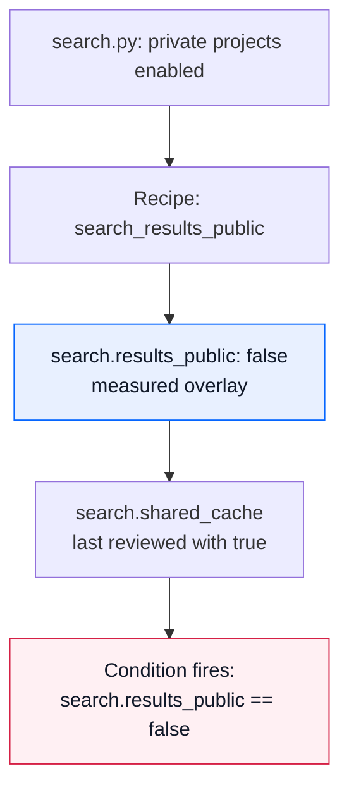
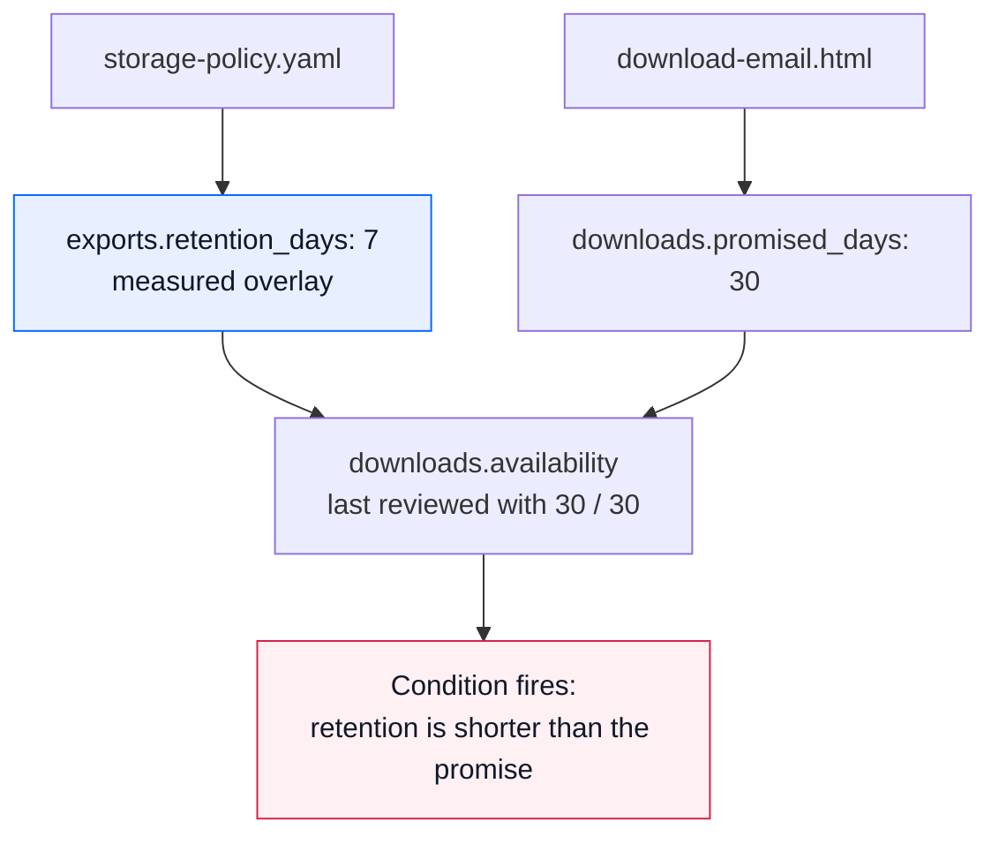

# Two green PRs, exercised

These fictional examples reproduce the README's search-cache and download-promise
illustrations. Each starts from one shared base. Two branches change different parts
of the project; their tests pass separately and after a clean Git merge. A recorded
decision's condition fails when the merged inputs are measured.

[Search cache](#search-cache-assumption-checks) · [Premature file deletion](#premature-file-deletion-consistency) · [Run both](#run)

## Run

With Git, a Python 3 interpreter for the example projects' own tests, and
a native `kpop` on PATH:

```sh
sh examples/merge-assumptions/run.sh
```

The runner creates disposable local Git repositories, commits the base and two
branches, runs their tests, merges them and invokes the real `kpop` CLI. It uses
no network and does not change this checkout. The temporary repositories are
removed when it finishes.

A successful run exits zero after confirming that both examples have:

1. Passing branch tests and measurement checks in PR A and PR B separately.
2. A Git merge without a text conflict, with both branch test suites still passing.
3. A failing `remeasure --run` result naming the recorded condition.
4. A separate integration probe that detects the same behavioral problem.

That last probe matters: an ordinary integration test can catch these problems too.
The examples expose gaps in their branch tests; they do not establish that tests
cannot express the dependency or that kpopper finds assumptions nobody recorded.

## Read the branches

Each case has a `base/` directory and `pr-a/` and `pr-b/` overlays. An overlay contains
only files that branch changes or adds. Paths inside records and recipes resolve
from the assembled example repository, not from the overlay directory alone.

<a id="search-cache"></a>

### Search cache (assumption checks)

<p align="center">
  <a href="../../assets/stories/cache-privacy.png">
    <picture>
      <source media="(max-width: 600px)" srcset="../../assets/stories/cache-privacy-mobile.png">
      
    </picture>
  </a>
</p>

[Phone layout](../../assets/stories/cache-privacy-mobile.png)

### The surrounding design record

<p align="center">
  <a href="../../assets/stories/cache-privacy-record.png">
    <picture>
      <source media="(max-width: 600px)" srcset="../../assets/stories/cache-privacy-record-mobile.png">
      
    </picture>
  </a>
</p>

[Phone layout](../../assets/stories/cache-privacy-record-mobile.png) · [Complete PR B record](cache/pr-b/GROUNDING.yaml) · [Design notes](cache/pr-b/cache-notes.md)

The record has 13 readings, four judgments and two open questions. Sources include
`search.py`, `cache.py`, the public-cache unit test and the design pass. They make
visible that a cache hit does not run the access filter again, that the unit test
uses a mocked public result, and that invalidation and multi-worker coordination
are outside this fixture. The sharing condition remains the same executable one.

The stored reading and the measured tree are deliberately separate:

| State | Public results: stored / measured | Cache decision's `seen` | `check` | `remeasure --run` |
|---|---|---|---|---|
| Base | `true` / `true` | No cache decision yet | Pass | Pass |
| PR A | `true` / `false` | No cache decision yet | Pass | Changed reading; no condition broken |
| PR B | `true` / `true` | `true` | Pass | Pass |
| Merged | `true` / `false` | `true` | Pass | **Condition fails** |

How the measured change reaches the decision:



<details>
<summary>The complete GROUNDING.yaml on PR B</summary>

```yaml
meta:
  updated: 2026-09-19
  scope: Fictional executable search-service design record on PR B, before private projects are
    enabled.
sources:
  s.search:
    name: Search implementation before private projects are enabled
    file: search.py
    read: '2025-01-01'
  s.cache:
    name: Query-keyed cache implementation
    file: cache.py
    read: '2025-01-01'
  s.cache_tests:
    name: Public cache unit test
    file: test_cache.py
    read: '2025-01-01'
  s.cache_design:
    name: Fictional cache design pass
    file: cache-notes.md
    read: '2025-01-01'
known:
  cache.goal:
    name: Why the cache was added
    v: Avoid a second search for the same public query across users.
    from: s.cache_design
    at: Goal
    fidelity: paraphrase
  cache.hit_reuses_result:
    name: A hit returns the previously stored result
    v: true
    from: s.cache
    at: 'lookup: return _CACHE[query]'
    fidelity: paraphrase
  cache.invalidation:
    name: Invalidation implemented in this fixture
    v: No expiration, invalidation or multi-worker coordination is implemented.
    from: s.cache_design
    at: Deliberate limits
    fidelity: paraphrase
  cache.key_fields:
    name: Inputs used by the cache key
    v: query
    from: s.cache
    at: 'lookup: query not in _CACHE; _CACHE[query]'
    fidelity: paraphrase
  cache.miss_delegate:
    name: Search still receives the user on a miss
    v: search(query, user)
    from: s.cache
    at: 'lookup: the cache-miss assignment'
    fidelity: paraphrase
  cache.release_scope:
    name: Scope of the design pass
    v: Small executable fixture; private-project use needs a separate combined-path review.
    from: s.cache_design
    at: Deliberate limits
    fidelity: paraphrase
  cache.scope:
    name: Cache storage lifetime
    v: A module-level in-memory dictionary.
    from: s.cache
    at: _CACHE = {}
    fidelity: paraphrase
  cache.test_call_count:
    name: Search call count asserted by the unit test
    v: 1
    from: s.cache_tests
    at: search.assert_called_once_with("public", "alice")
    fidelity: paraphrase
  cache.test_data:
    name: Data used by the cache unit test
    v: One mocked public project; no private-result fixture in that test.
    from: s.cache_tests
    at: test_public_query_is_served_once_across_users
    fidelity: paraphrase
  search.copies_rows:
    name: Search constructs a fresh row dictionary
    v: true
    from: s.search
    at: 'search: dict(project)'
    fidelity: paraphrase
  search.query_match:
    name: Query matching contract
    v: Case-sensitive substring matching on each project name.
    from: s.search
    at: 'search: query in project["name"]'
    fidelity: paraphrase
  search.result_fields:
    name: Fields retained in each returned project
    v: name; private; owner
    from: s.search
    at: PROJECTS and the dict(project) result copy
    fidelity: paraphrase
  search.results_public:
    name: All currently returned search results are public
    v: true
    from: s.search
    at: INCLUDE_PRIVATE_PROJECTS is false
    of: '2025-01-01'
    measure: search_results_public
judgments:
  cache.hit_authorization:
    name: The hit path inherits the sharing assumption
    rests_on:
    - search.shared_cache
    - cache.hit_reuses_result
    - cache.miss_delegate
    verdict: Treat cross-user cache hits as depending on the public-results decision, not as a fresh
      authorization check.
    because: The user reaches search on a miss; a hit returns saved data without repeating the search
      filter.
    reopened_by: The hit path, key scope or public-results decision changes; review the combined
      path.
    seen:
      search.shared_cache: Search responses can share a cache keyed only by query because all results
        are public.
      cache.hit_reuses_result: true
      cache.miss_delegate: search(query, user)
  cache.operational_scope:
    name: Keep production cache concerns visible
    rests_on:
    - cache.scope
    - cache.invalidation
    - cache.release_scope
    verdict: Do not infer invalidation or multi-worker coherence from this in-memory example.
    because: Those mechanisms are explicitly outside the fixture.
    reopened_by: The cache gains expiration, invalidation, shared storage or a production-readiness
      review.
    seen:
      cache.scope: A module-level in-memory dictionary.
      cache.invalidation: No expiration, invalidation or multi-worker coordination is implemented.
      cache.release_scope: Small executable fixture; private-project use needs a separate combined-path
        review.
  cache.test_boundary:
    name: What the isolated cache test establishes
    rests_on:
    - cache.test_data
    - cache.test_call_count
    - cache.key_fields
    verdict: The unit test establishes reuse for its mocked public case; it does not establish private-result
      isolation.
    because: The source test checks one call and equal results across two users against a public
      mock.
    reopened_by: The test adds real private-result cases or the combined search/cache behavior changes.
    seen:
      cache.test_data: One mocked public project; no private-result fixture in that test.
      cache.test_call_count: 1
      cache.key_fields: query
  search.shared_cache:
    name: Share a cache only while results are public
    rests_on:
    - search.results_public
    - cache.key_fields
    - cache.goal
    verdict: Search responses can share a cache keyed only by query because all results are public.
    because: The query-only key can be reused across users under the public-results premise. Private
      results require revisiting the key and access checks.
    wrong_if: search.results_public == false
    seen:
      search.results_public: true
      cache.key_fields: query
      cache.goal: Avoid a second search for the same public query across users.
open:
  cache.lifecycle_review:
    name: Review invalidation and deployment scope
    question: What invalidates a cached response, and how would multiple workers share or isolate
      it?
  cache.private_key:
    name: Choose a cache boundary for private results
    question: Should private results use a principal-scoped key, avoid shared caching, or re-check
      authorization on every hit?
```

</details>

The canonical merged record is still PR B's record. The `false` reading in the graph
is the measurement overlay tested against it, not a silent edit of the file.


- [Base search](cache/base/search.py) returns public projects only. In this example,
  everyone making the same query sees the same public results.
- [PR A](cache/pr-a/search.py) enables private projects, filtering them by owner.
  Its tests exercise the search function's owner and non-owner behavior.
- [PR B](cache/pr-b/cache.py) caches the result by query alone. Its test uses public
  results and checks that the same query is served once across users.
- [PR B's record](cache/pr-b/GROUNDING.yaml) preserves why sharing was acceptable:
  `search.results_public`. The condition is `search.results_public == false`.

The [measurement recipe](cache/base/.kpopper/measure.yaml) uses
[measure.py](cache/base/measure.py) to read the explicit visibility switch without
importing application code. That switch controls the example's search behavior;
the recipe is not a general analysis of access control or a proof of privacy.

After the merge, Alice's cached private result can be returned to Bob. The runner
reproduces that leak with a fresh process and the same query for both users. The
branch tests still pass because they exercise access control in the uncached search
function and cache reuse with public fixtures separately. The missing combined
test could be added to the application's suite.

<a id="download-promise"></a>

### Premature file deletion (consistency)

<p align="center">
  <a href="../../assets/stories/download-promise.png">
    <picture>
      <source media="(max-width: 600px)" srcset="../../assets/stories/download-promise-mobile.png">
      
    </picture>
  </a>
</p>

[Phone layout](../../assets/stories/download-promise-mobile.png)

Each pair below is **retention / promised download days**:

| State | Stored values | Measured values | Decision's `seen` | `remeasure --run` |
|---|---|---|---|---|
| Base | `30 / 7` | `30 / 7` | No new promise decision yet | Pass |
| PR A | `30 / 7` | `7 / 7` | No new promise decision yet | Changed reading; no condition broken |
| PR B | `30 / 30` | `30 / 30` | `30 / 30` | Pass |
| Merged | `30 / 30` | `7 / 30` | `30 / 30` | **Condition fails** |

The dependency comes from two different source formats:



<details>
<summary>The complete GROUNDING.yaml on PR B</summary>

```yaml
meta:
  updated: 2026-09-13
  scope: Fictional export service. File retention and the download promise are separate
    inputs.
sources:
  s.storage:
    name: Export retention policy
    file: storage-policy.yaml
    read: '2025-01-01'
  s.email:
    name: Download email template
    file: download-email.html
    read: '2025-01-01'
known:
  exports.retention_days:
    v: 30
    from: s.storage
    at: retention_days
    of: '2025-01-01'
    measure: retention_days
  downloads.promised_days:
    v: 30
    from: s.email
    at: Download available for 30 days
    of: '2025-01-01'
    measure: promised_days
judgments:
  downloads.availability:
    rests_on: [exports.retention_days, downloads.promised_days]
    verdict: "Keep exports available for the full promised download window."
    because: "A link that is still advertised as usable needs its exported file to remain
              available."
    wrong_if: "exports.retention_days < downloads.promised_days"
    seen: {exports.retention_days: 30, downloads.promised_days: 30}
```

</details>

Again, plain `check` still passes on the stored record. Measurement is the step that
brings the changed policy into the comparison.


- [The base policy](downloads/base/storage-policy.yaml) retains exports for 30 days;
  [the base email](downloads/base/download-email.html) promises seven days.
- [PR A's policy](downloads/pr-a/storage-policy.yaml) reduces retention to seven days.
- [PR B's email](downloads/pr-b/download-email.html) promises 30-day downloads.
- [PR B's record](downloads/pr-b/GROUNDING.yaml) requires
  `exports.retention_days >= downloads.promised_days`, expressed as the breaking
  condition `exports.retention_days < downloads.promised_days`.

The [recipes](downloads/base/.kpopper/measure.yaml) read both the YAML policy and the
duration written in the HTML email template. After merging, storage removes a file
while its email still promises availability. The runner checks that the file is
unavailable during that promised window. The branch tests validate storage behavior
and the email's link and duration separately; the integration probe connects them.

## Why measurement, rather than check alone?

PR A deliberately leaves the stored reading unchanged. On the merged tree, plain
`kpop check` therefore still passes: it evaluates the record it has.
`kpop remeasure --run` runs the declared recipes and tests their changed readings
as a hypothesis. The output includes:

```text
FIRED     search.shared_cache: wrong_if holds (search.results_public == false) - broken by its own condition
FIRED     downloads.availability: wrong_if holds (exports.retention_days < downloads.promised_days) - broken by its own condition
```

Measurement exits nonzero for each combined case. It does not silently refresh the
canonical record or decide how to fix the application. The runner verifies that the
record and checkout remain unchanged by these checks.

The dependency and recipe still have to be chosen and maintained. These are small,
published demonstrations, not blind evaluations of agent performance or reports of
real incidents. See [CI setup](../../docs/coding-and-ci.md), or try a
[Cowork example where the change needs judgment](../cowork-workshop/README.md).
